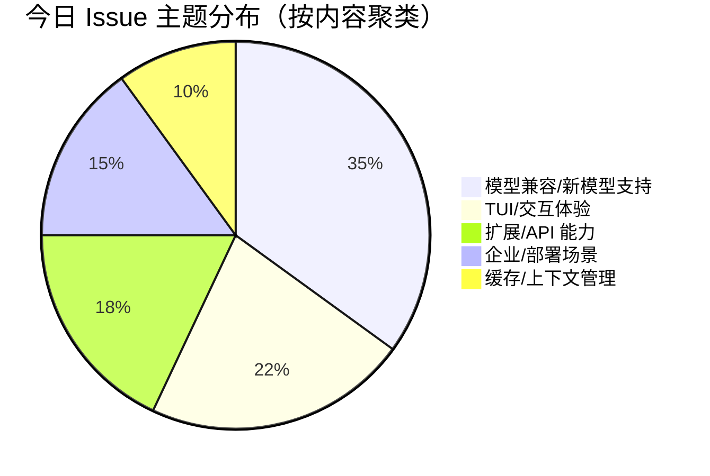

# AI CLI 工具社区动态日报 2026-04-25

> 生成时间: 2026-04-25 00:15 UTC | 覆盖工具: 8 个

- [Claude Code](https://github.com/anthropics/claude-code)
- [OpenAI Codex](https://github.com/openai/codex)
- [Gemini CLI](https://github.com/google-gemini/gemini-cli)
- [GitHub Copilot CLI](https://github.com/github/copilot-cli)
- [Kimi Code CLI](https://github.com/MoonshotAI/kimi-cli)
- [OpenCode](https://github.com/anomalyco/opencode)
- [Pi](https://github.com/badlogic/pi-mono)
- [Qwen Code](https://github.com/QwenLM/qwen-code)
- [Claude Code Skills](https://github.com/anthropics/skills)

---

## 横向对比

# AI CLI 工具生态横向对比分析报告 | 2026-04-25

---

## 1. 生态全景

当前 AI CLI 工具生态呈现**"功能趋同、体验分化"**的竞争格局：头部工具（Claude Code、OpenAI Codex）聚焦企业级长会话稳定性与上下文管理，中型工具（Gemini CLI、Kimi CLI）在终端体验与跨平台适配方面快速补课，新兴工具（OpenCode、Pi、Qwen Code）则以模型生态广度、本地优先架构和成本透明度寻求差异化。全行业共同面临**推理模型深度适配**（DeepSeek/GPT-5.5 的 reasoning_content 约束）和**从交互式助手向自动化节点演进**的架构转型压力。

---

## 2. 各工具活跃度对比

| 工具 | 今日 Issues | 今日 PRs | Release | 关键动态 |
|:---|:---:|:---:|:---|:---|
| **Claude Code** | 4+ 严重回归 + 多平台兼容 | 3（极低） | v2.1.120 | ⚠️ 会话恢复崩溃 regression，社区情绪紧张；PR 吞吐量异常低 |
| **OpenAI Codex** | 10+（含 5 个 🔥 热点） | 10+ | rust-v0.125.0 | 上下文管理危机（auto-compact 连环故障）；远程开发呼声最高（603👍） |
| **Gemini CLI** | 10（含 1 个 🆕 今日新增） | 10+ | v0.40.0-preview.3→4 | 紧急修复 Windows backspace 回归；备份/回滚、Ollama 压缩进入评审 |
| **GitHub Copilot CLI** | 2 个 🆕 | 1 | v1.0.36 系列×3 | 修复扩展路径与 .gitignore 指令加载；MCP 生态需求密集涌现 |
| **Kimi CLI** | 13 | 23 | v1.39.0 | **PR 吞吐量全场最高**；IDE 稳定性、大上下文连接修复活跃 |
| **OpenCode** | 3+ DeepSeek 相关 | 10+ | v1.14.24 紧急补丁 | DeepSeek reasoning_content 连锁修复；后台子 agent 架构创新 |
| **Pi** | 10（5+ DeepSeek 相关） | 10+ | v0.70.2 紧急补丁 | 内置 `pi update` 发布；DeepSeek V4 适配成今日核心议题 |
| **Qwen Code** | 10 | 10 | v0.15.2 + nightly | **119 评论热议 OAuth 免费额度政策**；性能优化 PR 削减 91% 同步 I/O |

> **活跃度排序**：Kimi CLI（23 PR）> OpenCode ≈ Pi ≈ Codex ≈ Gemini > Qwen Code > Copilot CLI > Claude Code（3 PR，异常低迷）

---

## 3. 共同关注的功能方向

| 功能方向 | 涉及工具 | 具体诉求 |
|:---|:---|:---|
| **🧠 推理模型深度适配** | Claude Code、Codex、OpenCode、Pi、Qwen Code、Kimi | DeepSeek/GPT-5.5 的 `reasoning_content` 回传、interleaved 能力、thinking 模式持久化 |
| **📋 会话生命周期管理** | Claude Code、Codex、Kimi、OpenCode、Copilot CLI | 恢复可靠性、重命名/删除、历史不丢失、分支/回溯（`/rewind`） |
| **🖥️ IDE/编辑器深度集成** | Claude Code、Codex、Kimi、Copilot CLI | VS Code 扩展能力、JetBrains 终端稳定性、会话管理同步 |
| **🔌 MCP 生态完善** | Copilot CLI、Kimi、Gemini、Qwen Code | 工具连接稳定性、stdio→HTTP/SSE 扩展、子 agent MCP 透传、JSON Schema 兼容 |
| **🪟 Windows 原生体验** | Claude Code、Codex、Gemini、Kimi、Copilot CLI | PowerShell 版本适配、路径解析、BOM 处理、输入法兼容 |
| **⚡ 大上下文稳定性** | Codex、Kimi、Claude Code、Pi | 1M token 支持、auto-compact 可靠性、连接超时、压缩质量 |
| **🤖 自动化/Headless 模式** | Claude Code (`ultrareview`)、Codex、Qwen Code、OpenCode | CI/CD 集成、JSON 结构化输出、非交互式运行、后台任务 |
| **💰 计费透明度与成本可控** | Claude Code (`/ultrareview`)、Qwen Code（OAuth 政策）、Kimi | 失败不扣费、额度可视化、本地优先降成本 |

---

## 4. 差异化定位分析

| 工具 | 核心侧重 | 目标用户 | 技术路线特征 |
|:---|:---|:---|:---|
| **Claude Code** | 企业级代码审查自动化、深度 IDE 集成 | 专业开发者、团队工程效能 | Anthropic 模型独占；Bun 打包；TUI 重交互；近期稳定性承压 |
| **OpenAI Codex** | 远程开发、1M 上下文长会话、Rust 性能底座 | 云原生开发者、Pro/Pro+ 付费用户 | Rust 核心 + TypeScript 前端；app-server 架构；GPT-5.5 首发适配 |
| **Gemini CLI** | 终端输入体验精细化、本地隐私优先、记忆架构 | 跨平台用户、隐私敏感场景 | Node.js 基础；Ollama 本地压缩实验；modifyOtherKeys 等终端协议深度适配 |
| **GitHub Copilot CLI** | GitHub 生态闭环、MCP 工具链、企业合规 | GitHub 重度用户、企业开发团队 | SEA 单二进制分发；与 GitHub 服务深度耦合；扩展架构待完善 |
| **Kimi CLI** | 极致工程效能、快速迭代、IDE 兼容性 | 中国及亚太开发者、JetBrains 用户 | Python 核心；PR 吞吐量领先；RalphFlow 等自研 agent 架构 |
| **OpenCode** | 模型生态广度、子 agent 编排、可嵌入部署 | 多模型用户、自托管需求、企业集成 | TypeScript/Node.js；后台任务、scout agent 等创新架构；iframe 嵌入企业门户 |
| **Pi** | 极简 TUI、内置自更新、开发者扩展 API | 个人开发者、效率工具爱好者 | 自研 `pi update` 分发机制；`runWhenIdle` 等事件循环创新；扩展生态治理待完善 |
| **Qwen Code** | 成本透明、本地部署友好、中文场景优化 | 预算敏感开发者、阿里云用户、中文社区 | 阿里云 OAuth 绑定；性能优化激进（91% I/O 削减）；多供应商配置复杂 |

---

## 5. 社区热度与成熟度

### 🔥 高活跃度·快速迭代期
| 工具 | 证据 | 成熟度评估 |
|:---|:---|:---|
| **Kimi CLI** | 23 PR/日，IDE 修复、大上下文、配置鲁棒性并行推进 | ⭐⭐⭐☆☆ 功能丰富但稳定性债务累积 |
| **OpenCode** | 后台子 agent、scout agent、远程控制等架构创新密集 | ⭐⭐⭐☆☆ 架构前瞻，生产可靠性待验证 |
| **Pi** | 内置更新、DeepSeek 连锁修复、扩展 API 演进 | ⭐⭐⭐☆☆ 分发机制成熟，生态治理初期 |

### ⚖️ 中等活跃度·稳定运营期
| 工具 | 证据 | 成熟度评估 |
|:---|:---|:---|
| **Gemini CLI** | 终端体验补丁频繁，备份/回滚、Ollama 压缩等基础设施进入评审 | ⭐⭐⭐⭐☆ 跨平台体验补课中，agent 安全架构领先 |
| **Qwen Code** | 性能优化激进，政策争议引发社区焦虑 | ⭐⭐⭐⭐☆ 工程能力强，商业化路径不确定性 |
| **Codex** | Rust 版本节奏稳定，但上下文危机暴露架构深层问题 | ⭐⭐⭐⭐☆ 基础设施厚重，配置-运行时一致性待重构 |

### ⚠️ 低活跃度·风险信号
| 工具 | 证据 | 成熟度评估 |
|:---|:---|:---|
| **Claude Code** | PR 吞吐量骤降至 3/日，严重 regression 无热修复 | ⭐⭐⭐⭐⭐ 功能成熟，**维护响应能力亮起红灯** |
| **Copilot CLI** | 仅 1 PR/日，长期痛点（Alpine、PowerShell 5.1）未解 | ⭐⭐⭐⭐⭐ 生态位稳固，**创新动能不足** |

---

## 6. 值得关注的趋势信号

| 信号 | 来源工具 | 行业含义 | 开发者行动建议 |
|:---|:---|:---|:---|
| **推理模型适配成为"合规性"门槛** | 全生态（DeepSeek 连锁修复） | `reasoning_content` 回传、thinking 模式持久化将成所有工具标配能力，非差异化优势 | 评估工具时需验证目标模型的推理链路完整性，避免生产环境多轮对话断裂 |
| **上下文管理从"容量竞赛"转向"可靠性危机"** | Codex（auto-compact 故障）、Claude Code（超大图片损坏会话）、Pi（69% 提前触发压缩） | 1M token 宣传与实际可用性严重脱节，"上下文黑洞"风险被低估 | 长会话关键工作流需建立手动 checkpoint 机制，勿完全依赖自动压缩 |
| **"交互式助手"→"自动化节点"架构转型** | Claude Code (`ultrareview` CI)、Qwen Code (`--json-schema`)、OpenCode (后台任务)、Kimi (headless) | CLI 工具正从程序员副驾驶演变为 CI/CD 可编排组件，需要完整的 headless API、结构化输出、状态可观测性 | 优先选择提供 `--json`、SSE 事件流、任务状态轮询 API 的工具，为自动化流水线预留接口 |
| **本地优先与隐私计算崛起** | Gemini (Ollama 压缩)、OpenCode (远程控制+本地运行)、Pi (缓存策略) | 云端 agent 模式与数据主权需求形成张力，边缘推理能力成为企业采纳关键 | 敏感代码库场景评估工具的本地模型分流、端到端加密、缓存保留策略 |
| **MCP 从"协议标准"进入"治理深水区"** | Copilot CLI (子 agent MCP 未连接)、Kimi (JSON Schema 冲突)、Gemini (compact 输出扩展) | 工具数量膨胀引发互操作性、安全性、可观测性新问题，MCP 服务器生命周期管理粗糙 | 生产环境 MCP 集成需自建健康检查、超时熔断、孤儿进程清理机制，勿依赖工具默认实现 |
| **计费公平性成为用户信任基石** | Claude Code (`/ultrareview` 空结果扣费)、Qwen Code (免费额度政策争议) | "未成功不扣费"将从用户诉求演变为行业规范，计费与服务质量解耦是技术债务 | 评估工具的计费透明度：是否支持幂等调用、失败重试不计费、实时额度查询 |

---

> **决策建议**：当前节点，**Kimi CLI** 适合追求快速功能迭代与 IDE 兼容性的开发者；**Gemini CLI** 在隐私敏感与跨平台场景具备独特优势；**Claude Code** 与 **Codex** 的企业级稳定性需观望 regression 修复进展；**OpenCode** 与 **Pi** 值得架构创新关注但生产采纳需谨慎。全生态共同面临的 DeepSeek/GPT-5.5 适配、上下文可靠性、自动化转型三大命题，将在未来 2-3 个月重塑竞争格局。

---

## 各工具详细报告

<details>
<summary><strong>Claude Code</strong> — <a href="https://github.com/anthropics/claude-code">anthropics/claude-code</a></summary>

## Claude Code Skills 社区热点

> 数据来源: [anthropics/skills](https://github.com/anthropics/skills)

# Claude Code Skills 社区热点报告（2026-04-25）

---

## 1. 热门 Skills 排行（按社区关注度）

| 排名 | Skill | 功能概述 | 状态 | 链接 |
|:---|:---|:---|:---|:---|
| 1 | **document-typography** | AI 生成文档的排版质量控制：预防孤字换行、寡段标题、编号错位等排版问题 | 🟡 Open | [PR #514](https://github.com/anthropics/skills/pull/514) |
| 2 | **skill-quality-analyzer / skill-security-analyzer** | 元技能：对 Skills 进行五维度质量评估（结构/安全/效率/可维护性/用户体验）及安全审计 | 🟡 Open | [PR #83](https://github.com/anthropics/skills/pull/83) |
| 3 | **frontend-design** | 前端设计技能改进版：提升指令清晰度与可执行性，确保单轮对话内可完成 | 🟡 Open | [PR #210](https://github.com/anthropics/skills/pull/210) |
| 4 | **odt** | OpenDocument 格式处理：创建、填充模板、解析 ODT 为 HTML，覆盖 LibreOffice 生态 | 🟡 Open | [PR #486](https://github.com/anthropics/skills/pull/486) |
| 5 | **testing-patterns** | 全栈测试模式：Testing Trophy、AAA 模式、React 组件测试、E2E、性能与可访问性测试 | 🟡 Open | [PR #723](https://github.com/anthropics/skills/pull/723) |
| 6 | **ServiceNow platform** | 企业级 ServiceNow 平台助手：覆盖 ITSM/ITOM/SecOps/FSM/SPM/CSDM/IntegrationHub | 🟡 Open | [PR #568](https://github.com/anthropics/skills/pull/568) |
| 7 | **sensory (AppleScript)** | macOS 原生自动化：通过 `osascript` 替代截图式计算机操作，分层权限设计 | 🟡 Open | [PR #806](https://github.com/anthropics/skills/pull/806) |
| 8 | **SAP-RPT-1-OSS** | SAP 开源表格基础模型预测分析：针对 SAP 业务数据的预测性分析技能 | 🟡 Open | [PR #181](https://github.com/anthropics/skills/pull/181) |

**讨论热点**：document-typography 因直击"所有 Claude 生成文档的通病"引发广泛共鸣；testing-patterns 和 ServiceNow 分别代表开发者工具链与企业 ERP 两大垂直领域的深度需求。

---

## 2. 社区需求趋势（Issues 提炼）

| 趋势方向 | 代表 Issue | 核心诉求 |
|:---|:---|:---|
| **组织级技能治理** | [#228](https://github.com/anthropics/skills/issues/228) 组织共享、[#492](https://github.com/anthropics/skills/issues/492) 信任边界 | 企业需要 org-wide 技能库、命名空间隔离社区/官方技能，防止权限滥用 |
| **技能开发工具链成熟** | [#202](https://github.com/anthropics/skills/issues/202) skill-creator 最佳实践、[#556](https://github.com/anthropics/skills/issues/556) eval 触发率 0% | 元工具需从"教学文档"进化为"生产级工具"，评估体系需可靠 |
| **开放协议与互操作** | [#16](https://github.com/anthropics/skills/issues/16) Skills 作为 MCP、[#29](https://github.com/anthropics/skills/issues/29) Bedrock 支持 | 社区强烈希望 Skills 暴露为 MCP 接口，并突破 Anthropic 生态边界 |
| **企业身份与部署** | [#532](https://github.com/anthropics/skills/issues/532) SSO 用户无法使用 API Key、[#406](https://github.com/anthropics/skills/issues/406) 上传 500 错误 | 企业 SSO/托管许可证用户成为主流，工具链需适配无 API Key 场景 |
| **持久化与记忆** | [#154](https://github.com/anthropics/skills/pull/154) shodh-memory | 跨会话上下文保持是 Agent 进阶的关键基础设施 |

---

## 3. 高潜力待合并 Skills（评论活跃 + 近期更新）

| Skill | 关键进展 | 合并潜力 | 链接 |
|:---|:---|:---|:---|
| **document-typography** | 3 月创建后持续迭代，解决"所有 AI 文档的排版痛点"，通用性强 | ⭐⭐⭐⭐⭐ | [PR #514](https://github.com/anthropics/skills/pull/514) |
| **testing-patterns** | 4 月 21 日最新更新，覆盖全测试栈，补全 Claude Code 开发工作流关键缺口 | ⭐⭐⭐⭐⭐ | [PR #723](https://github.com/anthropics/skills/pull/723) |
| **odt** | 4 月 14 日更新，开源文档标准（ISO）支持，与现有 docx/pdf 技能形成互补 | ⭐⭐⭐⭐☆ | [PR #486](https://github.com/anthropics/skills/pull/486) |
| **sensory** | 4 月 2 日更新，AppleScript 分层权限设计巧妙，解决 macOS 自动化性能瓶颈 | ⭐⭐⭐⭐☆ | [PR #806](https://github.com/anthropics/skills/pull/806) |
| **ServiceNow** | 4 月 23 日最新更新，企业级平台覆盖最全面的 PR，ITSM/SecOps 需求明确 | ⭐⭐⭐⭐☆ | [PR #568](https://github.com/anthropics/skills/pull/568) |
| **skill-quality-analyzer** | 1 月更新，元技能价值高但评估标准需官方对齐 | ⭐⭐⭐☆☆ | [PR #83](https://github.com/anthropics/skills/pull/83) |

---

## 4. Skills 生态洞察

> **核心诉求**：社区正从"技能数量扩张"转向"质量基础设施 + 企业级治理 + 开放互操作"——开发者需要**可靠的评估工具链**（skill-creator 生产化）、**组织级共享机制**（org-wide 分发），以及**协议层开放**（MCP 化），让 Skills 成为跨平台 Agent 能力标准而非单一产品功能。

---

*报告基于 anthropics/skills 仓库 2026-04-25 前 50 PR / 50 Issues 数据*

---

# Claude Code 社区动态日报 | 2026-04-25

## 今日速览

Claude Code v2.1.120 正式发布，带来 Windows 平台 PowerShell 原生支持及 `claude ultrareview` CI 子命令。然而新版本引入严重回归：**会话恢复功能大面积崩溃**，多个平台报告 `UKH/g9H is not a function` 错误，社区情绪紧张。同时 `/ultrareview` 功能因消耗免费额度却返回空结果引发用户不满。

---

## 版本发布

### [v2.1.120](https://github.com/anthropics/claude-code/releases/tag/v2.1.120)

| 变更项 | 说明 |
|--------|------|
| **Windows Shell 去 Git 依赖** | 无需安装 Git for Windows，缺失时自动回退至 PowerShell 作为 shell tool，降低 Windows 用户准入门槛 |
| **`claude ultrareview` CLI 子命令** | 支持非交互式运行 `/ultrareview`，可从 CI/脚本调用，支持 `--json` 输出原始结果，助力代码审查自动化 |

> ⚠️ **风险提示**：该版本存在会话恢复回归，生产环境建议暂缓升级或备份会话数据。

---

## 社区热点 Issues

### 🔴 严重回归：会话恢复崩溃（v2.1.120）

| # | 标题 | 状态 | 评论 | 核心问题 |
|---|------|------|------|---------|
| [#53044](https://github.com/anthropics/claude-code/issues/53044) | `claude --resume` 崩溃：`UKH is not a function` | OPEN | 2 | Linux 平台 `claude --resume` 完全不可用，Bun 打包产物函数缺失 |
| [#53064](https://github.com/anthropics/claude-code/issues/53064) | `claude -c`/`--continue` 崩溃，交互式 `/resume` 正常 | OPEN | 1 | 自动继续代码路径特有 bug，指向 REPL mount 阶段 |
| [#53053](https://github.com/anthropics/claude-code/issues/53053) | Resume 失败：`g9H is not a function` | OPEN | 1 | 与 #53044 同源，不同压缩变量名，影响面扩大 |
| [#53041](https://github.com/anthropics/claude-code/issues/53041) | `claude -r <id>` 崩溃：`g9H is not a function` | OPEN | 1 | 显式会话 ID 恢复同样受影响，print 模式除外 |

**社区反应**：用户迅速识别为 v2.1.120 回归，对比测试确认 `claude`（新会话）+ 交互式 `/resume` 可绕过。多个用户呼吁紧急热修复或回滚机制。

---

### 🟠 核心功能缺陷

| # | 标题 | 状态 | 评论 | 重要性 |
|---|------|------|------|--------|
| [#13480](https://github.com/anthropics/claude-code/issues/13480) | 超大图片永久破坏对话，无法恢复 | OPEN | 58 👍62 | **5个月未修复的高票问题**——图片尺寸超限导致对话状态不可逆损坏，用户被迫放弃整个会话 |
| [#42776](https://github.com/anthropics/claude-code/issues/42776) | Windows 桌面版重启失败：孤儿进程文件锁 | OPEN | 56 👍14 | 桌面端稳定性硬伤，进程管理缺陷影响日常迭代效率 |
| [#10747](https://github.com/anthropics/claude-code/issues/10747) | VS Code 扩展：删除/重命名会话 | OPEN | 40 👍50 | **长期高票功能请求**，IDE 集成体验的关键缺口，用户管理多会话刚需 |

---

### 🟡 `/ultrareview` 新功能问题

| # | 标题 | 状态 | 评论 | 问题本质 |
|---|------|------|------|---------|
| [#52819](https://github.com/anthropics/claude-code/issues/52819) | `/ultrareview` 崩溃前消耗免费额度 | OPEN | 4 | 服务侧崩溃未做事务回滚，用户权益受损 |
| [#53010](https://github.com/anthropics/claude-code/issues/53010) | 速率限制后返回空结果，仍扣免费次数 | OPEN | 1 | 重试/降级逻辑缺失，计费与服务质量解耦不足 |

---

### 🟢 平台/API 兼容性

| # | 标题 | 状态 | 评论 | 影响范围 |
|---|------|------|------|---------|
| [#50100](https://github.com/anthropics/claude-code/issues/50100) | Bedrock Opus 4.7 `thinking.type.enabled` 不支持 | OPEN | 5 | AWS Bedrock 企业用户，模型升级路径阻断 |
| [#51439](https://github.com/anthropics/claude-code/issues/51439) | Bedrock 推理配置文件 ARN 需 `adaptive` 模式 | OPEN | 4 | 与 #50100 同源，AWS 新推理配置文件适配滞后 |
| [#53012](https://github.com/anthropics/claude-code/issues/53012) | `sandbox.excludedCommands` 网络豁免不生效 | OPEN | 3 | 安全沙箱配置与文档承诺不符，企业合规场景风险 |

---

## 重要 PR 进展

> 注：过去24小时仅 **3 个 PR** 有更新，数量显著偏低，可能反映团队聚焦 v2.1.120 发布或内部冻结期。

| # | 标题 | 状态 | 作者 | 内容摘要 |
|---|------|------|------|---------|
| [#52668](https://github.com/anthropics/claude-code/pull/52668) | fix(hookify): 警告输出包含 hook 专属内容 | OPEN | YspritanHyzygy | **Hookify 警告增强**：PreToolUse/PostToolUse 事件的警告现在通过 `additionalContext` 传递至 Claude 上下文，修复 #40380；保留现有 `systemMessage` 输出，非工具警告行为不变 |
| [#52666](https://github.com/anthropics/claude-code/pull/52666) | docs: README 品牌大小写修正 | OPEN | YspritanHyzygy | 纯文档修复：`Github`→`GitHub`，`MacOS`→`macOS` |
| [#52650](https://github.com/anthropics/claude-code/pull/52650) | Claude/farm bureau benefits tool | OPEN | garrettg2026 | 无描述，标题指向内部工具/功能分支，详情待补充 |

**分析**：PR 吞吐量极低，且缺乏与 v2.1.120 回归相关的紧急修复。社区期待的会话恢复热修复尚未出现。

---

## 功能需求趋势

基于 50 个活跃 Issue 的标签与内容分析：

```
┌─────────────────────────────────────────┬──────────┐
│ 功能方向                                │ 热度指数 │
├─────────────────────────────────────────┼──────────┤
│ 1. 会话生命周期管理（恢复/重命名/删除）   │ ████████░░ 高 │
│ 2. IDE 集成深度（VS Code 扩展能力）       │ ███████░░░ 高 │
│ 3. AWS Bedrock 企业级适配                 │ ██████░░░░ 中高 │
│ 4. /ultrareview 质量与计费公平性          │ █████░░░░░ 中 │
│ 5. 沙箱安全策略精细化配置                 │ ████░░░░░░ 中 │
│ 6. Windows 平台原生体验                   │ ████░░░░░░ 中 │
│ 7. MCP 生态稳定性（进程管理/工具响应）    │ ████░░░░░░ 中 │
│ 8. 外部 API/自动化集成（CI/消息注入）     │ ███░░░░░░░ 新兴 │
└─────────────────────────────────────────┴──────────┘
```

**新兴趋势**：[#53049](https://github.com/anthropics/claude-code/issues/53049) 提出"外部消息注入 API"，反映开发者希望将 Claude Code 作为长期运行的智能代理后端，而非仅交互式 CLI 工具。

---

## 开发者关注点

### 🔥 即时痛点

| 痛点 | 代表 Issue | 用户诉求 |
|------|-----------|---------|
| **v2.1.120 会话恢复灾难** | #53044, #53064, #53053, #53041 | 紧急热修复或提供降级方案；Bun 打包产物 source map 缺失加大调试难度 |
| **免费额度"烧掉"无成果** | #52819, #53010 | `/ultrareview` 需实现"未成功不扣费"的幂等计费机制 |
| **对话状态脆弱性** | #13480 | 单张图片即可永久损坏会话，需容错隔离机制 |

### 📊 高频需求

| 需求 | 背景 | 典型场景 |
|------|------|---------|
| **VS Code 会话管理** | #10747 (50👍) | 长期运行的项目会话需要归档、命名、清理，当前仅 CLI 支持有限 |
| **Bedrock 推理配置自适应** | #50100, #51439, #51711 | 企业用户通过 AWS 应用推理配置文件使用 Claude，API 参数需动态适配 |
| **非交互式/自动化工作流** | #47744, #53049, 新 `ultrareview` CLI | Claude Code 从"程序员助手"向"CI/CD 智能节点"演进，需要完整的 headless API |
| **OAuth 令牌生命周期** | #53063 | 子进程/守护进程模式下令牌刷新失败，阻碍服务端集成 |

### 💡 技术债务信号

- **Bun 打包产物调试困难**：`UKH`/`g9H` 等压缩变量名出现在堆栈中，无 source map，社区无法自助诊断
- **TUI 渲染引擎稳定性**：终端 resize 导致内容重复 (#51828, #52945) 长期存在，影响所有平台
- **MCP 进程治理**：超时后孤儿进程累积 (#52859)、ESC 键中断摧毁所有 stdio MCP (#49479) 显示子进程生命周期管理粗糙

---

*日报基于 GitHub 公开数据生成，不代表 Anthropic 官方立场。关键回归问题建议关注官方 Release Notes 获取修复进展。*

</details>

<details>
<summary><strong>OpenAI Codex</strong> — <a href="https://github.com/openai/codex">openai/codex</a></summary>

# OpenAI Codex 社区动态日报 | 2026-04-25

---

## 1. 今日速览

今日 Codex 社区聚焦于**远程开发与上下文管理**的深层问题：GPT-5.5 的 1M token 上下文支持成为热议焦点，同时自动压缩（auto-compact）功能的多起故障报告暴露了长会话稳定性隐患。Rust 侧发布 v0.125.0 正式版，带来 App-server 的 Unix socket 传输、分页恢复等重大基础设施升级。

---

## 2. 版本发布

### [rust-v0.125.0](https://github.com/openai/codex/releases/tag/rust-v0.125.0) — 正式版
**核心更新：**
- **App-server 集成增强**：支持 Unix socket 传输、分页友好的会话恢复/分叉（resume/fork）、粘性环境（sticky environments）及远程线程配置存储管道
- **远程插件管理**：支持安装远程插件及配置升级

### 预发布版本
- [v0.126.0-alpha.1](https://github.com/openai/codex/releases/tag/rust-v0.126.0-alpha.1)
- [v0.125.0-alpha.2](https://github.com/openai/codex/releases/tag/rust-v0.125.0-alpha.2) / [v0.125.0-alpha.3](https://github.com/openai/codex/releases/tag/rust-v0.125.0-alpha.3)

---

## 3. 社区热点 Issues

| # | Issue | 状态 | 核心看点 |
|---|-------|------|---------|
| [#10450](https://github.com/openai/codex/issues/10450) | **Remote Development in Codex Desktop App** | 🔥 OPEN | **社区最热门需求**（603 👍, 164 评论）。用户强烈要求桌面版支持远程开发以替代 VS Code SSH 工作流，涉及端口转发、远程文件系统、终端集成等完整方案 |
| [#19204](https://github.com/openai/codex/issues/19204) | Flagged while already being verified | 🔥 OPEN | **安全机制冲突**：用户已被验证状态下仍被 flag，影响 Pro 用户 gpt-5.5 工作流（18 👍, 13 评论） |
| [#19409](https://github.com/openai/codex/issues/19409) | GPT-5.5 context catalog mismatch makes 400K/1M setup unsafe | 🔥 OPEN | **关键上下文配置缺陷**：UI 显示 400K/1M 但实际会话仅 258K，且可能绕过自动压缩，导致长会话数据丢失风险 |
| [#19464](https://github.com/openai/codex/issues/19464) | Support 1M token context for GPT-5.5 in Codex | 🔥 OPEN | **功能请求**：要求 Codex 支持 GPT-5.5 的完整 1M 上下文（API 已支持），与 #19409 形成联动 |
| [#19185](https://github.com/openai/codex/issues/19185) | config.toml context window settings are not respected | ✅ CLOSED | **配置系统回归**：用户显式设置的 960K 上下文被忽略，已关闭但反映配置层优先级问题（17 👍） |
| [#18333](https://github.com/openai/codex/issues/18333) | Codex Desktop repeatedly starts full MCP stacks for new sessions/subagents | ✅ CLOSED | **性能回归修复**：MCP 堆栈重复启动导致严重卡顿和内存压力，已关闭说明修复已合并（14 评论） |
| [#16857](https://github.com/openai/codex/issues/16857) | High GPU usage while "thinking" due to tiny useless animation | 🔥 OPEN | **资源浪费争议**：macOS 上思考状态的微小动画导致 GPU 高占用，用户质疑前端优化优先级（19 👍） |
| [#13917](https://github.com/openai/codex/issues/13917) | Codex desktop on Windows cannot start PowerShell host (8009001d) | 🔥 OPEN | **Windows 平台阻塞**：Intel NPU 相关错误导致 PowerShell 宿主无法启动，影响 Windows 核心用户群（36 评论） |
| [#19329](https://github.com/openai/codex/issues/19329) / [#19255](https://github.com/openai/codex/issues/19255) | Automatic Compact Recurring Error / Auto compact error | 🔥 OPEN | **自动压缩连环故障**：多起独立报告，错误信息一致，表明该功能存在系统性缺陷（共 6 👍） |
| [#19433](https://github.com/openai/codex/issues/19433) | Some resumed sessions fail consistently with stream disconnected | 🔥 OPEN | **会话恢复可靠性**：部分会话恢复必现断开，与 #9544 历史问题相关，影响长工作流连续性 |

---

## 4. 重要 PR 进展

| # | PR | 作者 | 核心内容 |
|---|-----|------|---------|
| [#19449](https://github.com/openai/codex/pull/19449) | permissions: remove legacy read-only access modes | bolinfest | **权限系统现代化**：移除 `ReadOnlyAccess` 过渡形态，将部分读取模型完全迁移至 `FileSystemSandboxPolicy` |
| [#19467](https://github.com/openai/codex/pull/19467) | feat: route MCP elicitations through guardian review | viyatb-oai | **安全增强**：MCP 审批请求须经 Guardian 自动审核，新增协议形状和回归测试覆盖 |
| [#19442](https://github.com/openai/codex/pull/19442) | feat: apply provider capability disables through config layers | celia-oai | **Bedrock 兼容性**：通过配置层自动禁用 Bedrock 不支持的能力（apps、plugins、MCP 等），简化多提供商部署 |
| [#19280](https://github.com/openai/codex/pull/19280) | [codex] Migrate thread turns list to thread store | wiltzius-openai | **架构迁移**：线程历史加载迁移至 `ThreadStore`，保留分页游标行为，消除直接 rollout 路径解析 |
| [#19456](https://github.com/openai/codex/pull/19456) | [oai] Add remote plugin uninstall API | xli-oai | **插件生命周期管理**：新增远程插件卸载 API，支持 `remoteMarketplaceName` + `pluginName` 标识 |
| [#19410](https://github.com/openai/codex/pull/19410) | Remove js_repl feature | fjord-oai | **代码清理**：移除 js_repl 功能，减少维护负担 |
| [#19432](https://github.com/openai/codex/pull/19432) | [codex] Add token usage to turn tracing spans | charley-openai | **可观测性**：在 turn 处理 span 中嵌入 token 使用量，无需关联独立分析即可调试慢请求 |
| [#19160](https://github.com/openai/codex/pull/19160) | Make apply_patch streaming parser stateful | akshaynathan | **diff 系统重构**：有状态流式 patch 解析器，统一正常/流式解析路径，移除公开流式 API |
| [#19176](https://github.com/openai/codex/pull/19176) | Add network proxy prompt guidance | viyatb-oai | **代理合规**：新增网络代理提示引导，教导模型尊重托管代理环境变量而非绕过策略 |
| [#19465](https://github.com/openai/codex/pull/19465) | Add gRPC feedback log sink | rasmusrygaard | **遥测基础设施**：为 app-server 日志捕获添加 gRPC 实现，推动从本地 SQLite 向云端代理钩子演进 |

---

## 5. 功能需求趋势

```
📊 基于 50 条活跃 Issue 的聚类分析

1. 【上下文管理】████████░░ 28%  — GPT-5.5 的 1M 支持、auto-compact 可靠性、配置生效问题
2. 【远程/跨平台开发】██████░░░░ 22%  — 桌面版远程开发、Linux 支持、Windows 兼容性
3. 【IDE 集成稳定性】█████░░░░░ 18%  — VS Code 扩展会话恢复、hydration、闪烁问题
4. 【性能与资源】████░░░░░░ 14%  — GPU 占用、MCP 堆栈内存压力、启动速度
5. 【安全与权限】███░░░░░░░ 12%  — Guardian 审核、flag 机制、权限配置
6. 【插件生态】██░░░░░░░░  6%  — MCP 服务器管理、远程插件安装/卸载
```

**关键洞察**：上下文管理已从"功能请求"升级为"稳定性危机"——auto-compact 的连环故障与 catalog 元数据不匹配形成叠加效应，可能迫使团队优先重构配置-运行时一致性层。

---

## 6. 开发者关注点

| 痛点类别 | 具体表现 | 影响面 |
|---------|---------|--------|
| **🚨 上下文黑洞** | auto-compact 失败导致会话数据丢失；配置 960K 实际仅 258K；压缩后历史无法 hydrate | 长会话 Pro/Pro+ 用户 |
| **🚨 会话恢复脆弱性** | resumed sessions 概率性断开；compact replacement_history 过大时 UI 空白 | 依赖持续工作流的开发者 |
| **⚠️ 平台体验割裂** | Windows PowerShell 启动失败、Intel Mac 渲染异常、Linux 无桌面版 | 非 macOS-ARM 主力用户 |
| **⚠️ 配置层优先级混乱** | config.toml、UI 设置、模型 catalog 三者冲突，用户无法预测生效值 | 高级定制用户 |
| **💡 远程开发刚需** | SSH/容器/远程主机支持呼声极高（603 👍），现有方案缺失端口转发和远程终端 | 云原生/企业开发者 |

---

*日报基于 GitHub 公开数据生成，不代表 OpenAI 官方立场。*

</details>

<details>
<summary><strong>Gemini CLI</strong> — <a href="https://github.com/google-gemini/gemini-cli">google-gemini/gemini-cli</a></summary>

# Gemini CLI 社区动态日报 | 2026-04-25

---

## 今日速览

今日社区聚焦 **Windows 终端输入体验修复**——多个 PR 紧急处理 backspace 误删单词/整行的问题，v0.40.0-preview.3 已发布补丁。同时，**文件备份与回滚系统**、**本地 Ollama 压缩路由**等重磅功能进入评审阶段，显示社区正加速构建更可靠的 agentic 工作流基础设施。

---

## 版本发布

### v0.40.0-preview.3 → v0.40.0-preview.4（补丁）
- **关键修复**：回退错误的 backspace 处理逻辑（[#25941](https://github.com/google-gemini/gemini-cli/pull/25941)），解决 Windows 终端下普通 Backspace 被识别为 Ctrl+Backspace 导致误删单词的严重回归问题
- [Full Changelog](https://github.com/google-gemini/gemini-cli/compare/v0.40.0-preview.2...v0.40.0-preview.3)

### v0.39.1（稳定版补丁）
- 例行维护更新，具体修复内容未在摘要中披露
- [Full Changelog](https://github.com/google-gemini/gemini-cli/compare/v0.39.0...v0.39.1)

---

## 社区热点 Issues

| # | 标题 | 状态 | 核心看点 |
|---|------|------|---------|
| [#22745](https://github.com/google-gemini/gemini-cli/issues/22745) | AST-aware 文件读取、搜索与代码库映射评估 | 🔥 高讨论 | **架构级 EPIC**，探索通过 AST 精确读取方法边界、减少 token 浪费、提升代码导航效率。5 条评论显示团队正深度评估 tilth/glyph 等工具，可能重塑 codebase_investigator 的核心机制 |
| [#24916](https://github.com/google-gemini/gemini-cli/issues/24916) | 同一文件权限反复询问 | 🐛 用户痛点 | 安全策略的 UX 缺陷——"允许所有未来会话"选项间歇性失效，直接影响工作流连续性，3 条评论但未获 maintainer 回应 |
| [#22323](https://github.com/google-gemini/gemini-cli/issues/22323) | 子 agent MAX_TURNS 中断被错误报告为 GOAL 成功 | 🚨 P1 | **关键可靠性 bug**：codebase_investigator 达到轮次上限却返回 success，导致主 agent 误判任务完成，可能引发级联错误决策 |
| [#25166](https://github.com/google-gemini/gemini-cli/issues/25166) | Shell 命令执行后假死显示"等待输入" | 🐛 高频问题 | 简单命令完成后 UI 状态未更新，3 个 👍 反映影响面广，属于终端状态机管理的底层 bug |
| [#23571](https://github.com/google-gemini/gemini-cli/issues/23571) | 模型在随机位置创建临时脚本 | 🧹 清理负担 | 限制 shell 执行后模型转向生成分散的编辑脚本，显著增加提交前清理成本，暴露 agent 工具使用的边界管控不足 |
| [#22267](https://github.com/google-gemini/gemini-cli/issues/22267) | Browser Agent 忽略 settings.json 覆盖配置 | 🐛 配置失效 | maxTurns 等关键参数被无视，配置系统与 agent 运行时存在断层，影响复杂场景的精细控制 |
| [#25216](https://github.com/google-gemini/gemini-cli/issues/25216) | 临时路径 `A:\` 打开失败 | 🪟 Windows 兼容 | PowerShell 下 realpath 对目录执行非法操作，Node.js fs 层与 Windows 盘符处理存在边缘情况 |
| [#22819](https://github.com/google-gemini/gemini-cli/issues/22819) | 实现记忆路由：全局 vs 项目级 | 🧠 记忆架构 | 定义记忆存储的层级策略——`~/.gemini/` 存用户偏好，`.gemini/` 存代码库专属信息，是长期个性化能力的基础设施 |
| [#22672](https://github.com/google-gemini/gemini-cli/issues/22672) | Agent 应阻止/劝阻破坏性操作 | 🛡️ 安全增强 | git reset --force、DB 修改等高危操作缺乏安全护栏，agent 对操作风险的认知不足 |
| [#25951](https://github.com/google-gemini/gemini-cli/issues/25951) | Backspace 删除整词/整行而非单字符 | 🆕 今日新增 | 英文环境下删整个单词，中文环境下删整行，输入体验严重受损，与今日多个修复 PR 直接相关 |

---

## 重要 PR 进展

| # | 标题 | 状态 | 技术价值 |
|---|------|------|---------|
| [#25947](https://github.com/google-gemini/gemini-cli/pull/25947) | 版本化预写备份与 agent 驱动恢复 | 🆕 新提交 | **核心可靠性设施**：为 write_file 引入事务化备份层，防止 agentic 工作流中的破坏性修改循环，支持按会话回滚——agent 工具安全性的重大升级 |
| [#25945](https://github.com/google-gemini/gemini-cli/pull/25945) | 时序分析与反射重构 | 🔧 架构优化 | repo-metrics 引入时间序列记录，移除 critique flow 冗余，将"processes"重命名为"reflexes"，P1 优先级显示内部架构迭代加速 |
| [#25915](https://github.com/google-gemini/gemini-cli/pull/25915) | /compress 路由至本地 Ollama 模型 | 🆕 新提交 | **隐私与成本突破**：通过 `OllamaCompressClient` 将历史压缩分流到本地 gemma3:4b，纯文本输入避免敏感数据外传，为离线/企业场景铺路 |
| [#25950](https://github.com/google-gemini/gemini-cli/pull/25950) | 修复 home 目录启动时的假命令冲突 | 🍒 拣选修复 | 解决 `~/.gemini/commands` 与 `<cwd>/.gemini/commands` 路径重合导致的自冲突警告，提升启动体验 |
| [#25912](https://github.com/google-gemini/gemini-cli/pull/25912) | MCP 工具支持 compact 输出 | 🔧 一致性修复 | 将 `compactToolOutput` 从内置工具扩展到 MCP 工具，默认 true 下显著减少长输出的视觉噪音 |
| [#25426](https://github.com/google-gemini/gemini-cli/pull/25426) | CI 打包复活与 16 核测试加速 | ⚡ 工程效能 | 引入 artifact-centric CI 路径和 `.github/actions/setup-gemini`，预构建 bundle 替代重复安装，解锁 16 核并行——大规模贡献的基础设施 |
| [#25873](https://github.com/google-gemini/gemini-cli/pull/25873) | 持久化自动记忆草稿本 | 🧠 记忆优化 | 将 `memoryScratchpad` 存入会话元数据，技能提取轮次从 13.2 降至 11.0（-16.7%），减少对单薄会话摘要的依赖 |
| [#25943](https://github.com/google-gemini/gemini-cli/pull/25943) | Ctrl+Backspace 单词删除的 modifyOtherKeys 回退 | 🪟 输入修复 | 在 #25941 回退基础上，为支持 modifyOtherKeys 的终端恢复 Ctrl+Backspace 功能，平衡兼容性与能力 |
| [#25944](https://github.com/google-gemini/gemini-cli/pull/25944) | /clear 后重启用键盘协议 | 🖥️ 终端修复 | RIS 重置序列会禁用 Kitty/modifyOtherKeys 协议，导致快捷键失效，现自动恢复无需手动 /terminal-setup |
| [#24174](https://github.com/google-gemini/gemini-cli/pull/24174) | 实时语音模式（云端+本地 Whisper） | 🔊 重大功能 | 已关闭但值得追踪：支持 Gemini Live API 云端转录与 whisper.cpp 本地优先双后端，语音交互的完整实现 |

---

## 功能需求趋势

从 50 条活跃 Issue 中提炼的四大方向：

| 趋势 | 代表 Issue | 社区诉求 |
|------|-----------|---------|
| **🧠 记忆与个性化** | #22819, #22809, #25895 | 全局/项目级记忆分层、主动记忆写入、技能自动提取——从"有记忆"走向"记忆智能" |
| **🛡️ Agent 安全与可控** | #22672, #23582, #23897 | 破坏性操作拦截、子 agent 感知审批模式、工具调用拒绝后的快速回退——agent 自治的边界管控 |
| **🪟 Windows 终端体验** | #25951, #25166, #25216, #24202 | 输入处理、SSH 兼容性、路径解析——跨平台成熟度仍是短板 |
| **⚡ 效率与精度** | #22745, #23571, #24246 | AST 感知代码导航、工具数量智能限制、临时文件管控——减少 token 浪费与无效轮次 |

---

## 开发者关注点

### 🔴 高频痛点
1. **输入体验脆弱性**：今日 3 个 PR + 1 个 Issue 围绕 backspace 处理，显示终端输入状态机在 Windows 环境下的复杂度被低估，快速迭代中回归风险高
2. **权限系统的记忆失效**：#24916 的"允许所有未来会话"间歇失效，叠加 #25823（默认启用永久工具审批被关闭），表明权限持久化的实现存在深层问题

### 🟡 架构诉求
3. **子 agent 的可观测性**：#22323 的"假成功"问题揭示多 agent 编排中的状态穿透难题，需要更严格的契约与错误传播机制
4. **本地优先能力**：#25915（Ollama 压缩）反映开发者对数据隐私和离线能力的强烈需求，与云端 agent 模式形成张力

### 🟢 生态期待
5. **MCP 生态整合**：#25912 将 compact 输出扩展至 MCP 工具，暗示 MCP 作为插件标准正进入深度优化阶段，社区期待更完整的 MCP 工具体验

---

*日报基于 google-gemini/gemini-cli 公开数据生成*

</details>

<details>
<summary><strong>GitHub Copilot CLI</strong> — <a href="https://github.com/github/copilot-cli">github/copilot-cli</a></summary>

# GitHub Copilot CLI 社区动态日报 | 2026-04-25

---

## 1. 今日速览

今日 Copilot CLI 连发 **v1.0.36 系列三个版本**，重点修复了 `.gitignored` 目录下自定义指令加载失败、扩展启动路径不匹配等关键问题，同时引入 `changes` 状态栏和双 Esc 防误触等体验优化。社区方面，**Alpine Linux 段错误**和 **Windows PowerShell 5.1 兼容性**两大长期痛点持续发酵，MCP 生态相关功能请求密集涌现。

---

## 2. 版本发布

### v1.0.36 / v1.0.36-1 / v1.0.36-0（2026-04-24）

| 版本 | 核心变更 |
|:---|:---|
| **v1.0.36** | 子命令选择器新增高亮指示器 `❯`；多许可证场景错误提示附带直达链接；修复 `preToolUse.matcher` 被忽略的问题 |
| **v1.0.36-1** | 新增 `changes` 状态栏切换（显示会话增删行数）；**双 Esc 取消进行中任务**（防误触）；修复 `.gitignored` 目录下的自定义指令文件加载 |
| **v1.0.36-0** | Claude Opus 4.6 默认使用 medium 推理力度；修复调试日志覆盖现有归档；**禁止加载 `~/.claude/` 下的自定义代理/技能/命令** |

> 🔗 发布页：https://github.com/github/copilot-cli/releases

---

## 3. 社区热点 Issues（Top 10）

| # | 状态 | 标题 | 关键度 | 社区反应 | 链接 |
|:---|:---|:---|:---|:---|:---|
| **#107** | 🔴 OPEN | **Alpine Linux 工具调用触发段错误** | ⭐⭐⭐⭐⭐ | 13 评论，4 👍，持续 7 个月未解，容器场景核心阻塞 | [链接](https://github.com/github/copilot-cli/issues/107) |
| **#2205** | 🔴 OPEN | **Terminator 终端鼠标滚动行为异常** | ⭐⭐⭐⭐☆ | 8 评论，5 👍，最近版本回归问题，影响历史浏览体验 | [链接](https://github.com/github/copilot-cli/issues/2205) |
| **#254** | 🔴 OPEN | **反复要求重新登录（GitHub Business 账户）** | ⭐⭐⭐⭐☆ | 8 评论，3 👍，认证状态持久化问题，标记 `unable-to-reproduce` 但用户持续反馈 | [链接](https://github.com/github/copilot-cli/issues/254) |
| **#1148** | 🔴 OPEN | **Windows 下强制将 LF 改为 CRLF** | ⭐⭐⭐⭐☆ | 5 评论，5 👍，跨平台协作严重污染 Git 历史 | [链接](https://github.com/github/copilot-cli/issues/1148) |
| **#1680** | 🔴 OPEN | **pwsh.exe 硬编码导致 PowerShell 5.1 用户完全无法使用** | ⭐⭐⭐⭐⭐ | 5 评论，8 👍，**Windows 11 默认环境兼容性问题**，#411 关闭后仍未修复 | [链接](https://github.com/github/copilot-cli/issues/1680) |
| **#2374** | 🔴 OPEN | **Autopilot 进入无限循环** | ⭐⭐⭐⭐☆ | 5 评论，agent 工作流可靠性问题，影响自动化场景信任度 | [链接](https://github.com/github/copilot-cli/issues/2374) |
| **#2630** | 🔴 OPEN | **自定义 agent 的 MCP 服务器在子 agent/`--prompt` 模式下未连接** | ⭐⭐⭐⭐☆ | 3 评论，MCP 生态关键缺陷，限制自定义 agent 能力扩展 | [链接](https://github.com/github/copilot-cli/issues/2630) |
| **#2904** | 🔴 OPEN | **自定义 Agent YAML 应支持 reasoning effort 配置** | ⭐⭐⭐☆☆ | 2 评论，与全局 `--effort` 标志互补的精细化控制需求 | [链接](https://github.com/github/copilot-cli/issues/2904) |
| **#2966** | 🆕 OPEN | **原生支持多并发 CLI 会话管理** | ⭐⭐⭐☆☆ | 1 评论，power user 高频场景，当前依赖外部 tmux/screen  workaround | [链接](https://github.com/github/copilot-cli/issues/2966) |
| **#2967** | 🆕 OPEN | **Opus 4.7 上下文窗口过小导致频繁 auto-compact** | ⭐⭐⭐☆☆ | 0 评论，Pro+ 订阅体验问题，模型层配置疑似异常 | [链接](https://github.com/github/copilot-cli/issues/2967) |

---

## 4. 重要 PR 进展

> 注：过去 24 小时仅 **1 个 PR** 更新，以下为该 PR 及关联背景分析

| # | 状态 | 标题 | 功能/修复内容 | 关联 Issue | 链接 |
|:---|:---|:---|:---|:---|:---|
| **#2957** | 🟡 OPEN | **修复扩展启动路径不匹配** | 解决 `app.js` 传递的 pkg cache 路径（`universal/<ver>/preloads/`）与 `index.js` 安全校验期望的 SEA 二进制目录路径不一致，导致 macOS/Windows 扩展加载失败 | #2890 | [链接](https://github.com/github/copilot-cli/pull/2957) |

**技术细节**：该 PR 触及 Single Executable Application (SEA) 架构的核心路径解析逻辑。当同时存在 `universal/` 和平台特定缓存目录（如 `darwin-arm64/`）时，子进程 fork 因路径校验失败立即退出。修复需统一 `launchExtension()` 中的 bootstrap 路径传递与安全检查逻辑。

---

## 5. 功能需求趋势

基于 50 个活跃 Issue 提炼，社区当前聚焦五大方向：

| 趋势方向 | 代表 Issue | 热度 |
|:---|:---|:---:|
| **🔌 MCP 生态完善** | #2630（子 agent MCP 连接）、#2956（/mcp show 禁用选项）、#2944（MCP registry 浏览）、#2938（.mcp.json 支持） | 🔥🔥🔥🔥🔥 |
| **🪟 Windows 平台兼容** | #1680（PowerShell 5.1）、#1148（CRLF 污染）、#2953（winget 安装权限） | 🔥🔥🔥🔥🔥 |
| **🧠 模型/推理控制精细化** | #2904（Agent YAML reasoning effort）、#2559（COPILOT_MODEL_EFFORT 环境变量）、#2967（Opus 4.7 上下文窗口） | 🔥🔥🔥🔥☆ |
| **📋 会话/工作流管理** | #2966（多并发会话）、#2964（diff-only 视图）、#1423（路径特定指令上下文膨胀） | 🔥🔥🔥☆☆ |
| **🔐 认证与可靠性** | #254（重复登录）、#107（Alpine 段错误）、#2374（Autopilot 无限循环） | 🔥🔥🔥🔥☆ |

---

## 6. 开发者关注点

### 🔴 高频痛点

| 痛点 | 具体表现 | 影响面 |
|:---|:---|:---|
| **容器/最小化 Linux 发行版稳定性** | Alpine Linux 段错误（#107）长期未解，阻碍 CI/CD 和容器化工作流 | 运维/DevOps 用户 |
| **Windows 原生体验断裂** | PowerShell 版本假设、行尾符强制转换、安装权限问题形成组合打击 | 企业 Windows 开发者 |
| **认证状态脆弱性** | Business 账户会话频繁失效，Ctrl-C 后需重新登录，中断心流 | 全平台用户 |

### 🟡 新兴需求

- **MCP 作为一等公民**：从配置发现到运行时连接，MCP 工具链的完整闭环尚未建立
- **Agent 级模型/推理策略覆盖**：全局配置无法满足多 agent 协作场景下的差异化需求
- **可观测性与审计**：#975（Git commit AI 归因）关闭后，社区仍在寻求代码溯源方案

### 💡 今日修复验证建议

开发者可重点验证 **v1.0.36-1** 的以下修复：
- `.github/instructions/` 被 `.gitignore` 后是否正常加载
- 扩展加载是否恢复（需配合 #2957 合并后验证）
- 双 Esc 取消机制是否符合肌肉记忆预期

---

> 📅 日报生成时间：2026-04-25 | 数据来源：github.com/github/copilot-cli

</details>

<details>
<summary><strong>Kimi Code CLI</strong> — <a href="https://github.com/MoonshotAI/kimi-cli">MoonshotAI/kimi-cli</a></summary>

# Kimi Code CLI 社区动态日报 | 2026-04-25

## 今日速览

Kimi Code CLI 今日发布 **v1.39.0**，新增 `KIMI_MODEL_THINKING_KEEP` 环境变量以保留模型思考链，并修复了 Shell 审批输入的光标渲染问题。社区活跃度显著，过去 24 小时内新增 13 个 Issues 和 23 个 PR，核心聚焦在 **IDE 兼容性、配置鲁棒性、大上下文稳定性** 三大方向。

---

## 版本发布

### v1.39.0（2026-04-24）

| 更新类型 | 内容 |
|---------|------|
| **feat** | 新增 `KIMI_MODEL_THINKING_KEEP` 环境变量，支持保留模型思考链（thinking chain）[^2029] |
| **fix** | 修复 Shell 审批请求中文本输入的光标渲染问题 [^2005] |

> 完整 Release: https://github.com/MoonshotAI/kimi-cli/releases/tag/1.39.0

---

## 社区热点 Issues（10 条）

| # | 状态 | 标题 | 核心看点 |
|---|:---:|------|---------|
| [#1990](https://github.com/MoonshotAI/kimi-cli/issues/1990) | 🔴 OPEN | **IDEA 中终端直接关闭** | JetBrains 系 IDE 集成痛点，发送消息后整个 terminal 崩溃，影响开发者工作流连续性。macOS ARM 平台 + v1.37.0，4 条评论跟进中。 |
| [#2062](https://github.com/MoonshotAI/kimi-cli/issues/2062) | 🔴 OPEN | **默认技能自动激活配置** | 用户希望会话启动时自动加载常用 skill，避免每次手动 `/skill` 触发。已有对应 PR #2063 实现，社区反馈积极。 |
| [#2043](https://github.com/MoonshotAI/kimi-cli/issues/2043) | 🔴 OPEN | **UTF-8 BOM 导致配置解析失败** | Windows 编辑器常见陷阱，BOM 头使 TOML 解析报错。已有 PR #2065 修复（`utf-8-sig` 读取），回归测试覆盖。 |
| [#2038](https://github.com/MoonshotAI/kimi-cli/issues/2038) | 🔴 OPEN | **底部工具栏 git 子进程导致输入延迟** | 性能问题：正常提示符下 git 状态轮询造成可感知的按键卡顿。用户通过二分法定位根因，诊断质量高。 |
| [#2066](https://github.com/MoonshotAI/kimi-cli/issues/2066) | 🔴 OPEN | **Windows Shell 硬编码 PowerShell 5.1** | 用户已自行实现 PowerShell 7 (`pwsh`) 支持并提交代码，希望官方采纳。体现社区贡献意愿强烈。 |
| [#2061](https://github.com/MoonshotAI/kimi-cli/issues/2061) | 🔴 OPEN | **MCP 工具 JSON Schema 冲突错误** | v1.39.0 新 bug：`$ref` 展开后 `description` 关键字冲突，导致 Unity-MCP 等外部工具无法调用。 |
| [#2059](https://github.com/MoonshotAI/kimi-cli/issues/2059) | 🔴 OPEN | **报错信息也消耗 token** | 计费透明度争议：用户质疑错误响应是否应计入 token 消耗，涉及商业模型公平性。 |
| [#2058](https://github.com/MoonshotAI/kimi-cli/issues/2058) | 🔴 OPEN | **自定义 agent 未加载 AGENTS.md** | 自定义 agent 启动时上下文加载不一致，默认启动 vs 自定义启动行为差异，影响 agent 生态建设。 |
| [#2051](https://github.com/MoonshotAI/kimi-cli/issues/2051) | 🔴 OPEN | **Shell 记录隐藏 skill/flow 斜杠提示** | 交互设计问题：`/skill:*` 和 `/flow:*` 输入在转录中不可见，导致会话记录难以理解。 |
| [#2049](https://github.com/MoonshotAI/kimi-cli/issues/2049) | 🔴 OPEN | **恢复会话时历史记录丢失** | 数据可靠性问题：`/sessions` 恢复后历史显示但上下文实际丢失，v1.36.0 报告。 |

---

## 重要 PR 进展（10 条）

| # | 状态 | 标题 | 技术价值 |
|---|:---:|------|---------|
| [#2068](https://github.com/MoonshotAI/kimi-cli/pull/2068) | 🟢 OPEN | **ACP 审批前客户端通知** | 解决 #2040：工具调用需审批时先发射 `kimi/approval_required` 通知，提升 IDE/编辑器集成的响应性。 |
| [#2067](https://github.com/MoonshotAI/kimi-cli/pull/2067) | 🟢 OPEN | **大上下文连接稳定性修复** | 关键基础设施：Windows/网关环境下 ~130k token 上下文超时问题，通过调整 `httpx` keepalive、增加重试弹性解决。 |
| [#2065](https://github.com/MoonshotAI/kimi-cli/pull/2065) | 🟢 OPEN | **配置文件容忍 UTF-8 BOM** | 修复 #2043：`utf-8-sig` 读取磁盘配置，零行为变更 + 回归测试，Windows 用户体验显著提升。 |
| [#2064](https://github.com/MoonshotAI/kimi-cli/pull/2064) | 🟢 OPEN | **Plan 文件尊重 `KIMI_SHARE_DIR`** | 路径硬编码治理：`~/.kimi/plans` → `get_share_dir() / "plans"`，含自动迁移逻辑，多环境部署更规范。 |
| [#2063](https://github.com/MoonshotAI/kimi-cli/pull/2063) | 🟢 OPEN | **默认技能自动激活配置** | 实现 #2062：`default_skills` 配置项，会话启动后自动加载指定技能，减少重复操作。 |
| [#2036](https://github.com/MoonshotAI/kimi-cli/pull/2036) | 🟢 OPEN | **核心工具启用 strict schema 验证** | 可靠性增强：Shell、ReadFile、Grep、WriteFile 等 6 个核心工具开启 OpenAI/Anthropic strict mode，减少模型幻觉调用。 |
| [#1960](https://github.com/MoonshotAI/kimi-cli/pull/1960) | 🟢 OPEN | **RalphFlow 架构：迭代收敛检测** | 架构级创新：ephemeral context 隔离迭代、防止无限循环、支持多步工作流收敛判断，agent 自主性里程碑。 |
| [#2045](https://github.com/MoonshotAI/kimi-cli/pull/2045) | 🟢 OPEN | **Yolo 模式解耦 + AFK 模式** | 语义澄清：将"自动审批"(yolo)与"非交互"(afk)正交分离，修复 `--yolo` 错误阻止 `AskUserQuestion` 的问题。 |
| [#2050](https://github.com/MoonshotAI/kimi-cli/pull/2050) | 🟢 OPEN | **虚拟网卡 IP 检测修复** | 网络兼容性：Tailscale/WireGuard/Docker 桥接场景下 `kimi web --public` 403 问题，扩展 `get_network_addresses()` 检测逻辑。 |
| [#2057](https://github.com/MoonshotAI/kimi-cli/pull/2057) | 🟢 OPEN | **ACP 断言替换为 RuntimeError** | 工程严谨性：生产代码移除 `assert`（`-O` 优化时失效），改用显式异常，关键不变量保护更可靠。 |

---

## 功能需求趋势

从今日 Issues/PR 提炼的社区关注方向：

```
┌─────────────────────────────────────────────────────────┐
│  🔥 IDE 集成稳定性    ████████████████████  高优先级     │
│     → IDEA 终端崩溃、VS Code 连接错误、编辑器插件生态      │
│                                                         │
│  🔧 配置鲁棒性        ██████████████████    高优先级     │
│     → BOM 处理、路径硬编码、跨平台 Shell 适配             │
│                                                         │
│  ⚡ 性能与稳定性      ██████████████████    高优先级     │
│     → 大上下文超时、git 子进程延迟、会话恢复可靠性         │
│                                                         │
│  🧠 Agent/Skill 生态  ████████████████      中优先级     │
│     → 默认技能加载、AGENTS.md 上下文、skill 可见性        │
│                                                         │
│  💰 计费透明度        ████████████          中优先级     │
│     → 错误 token 消耗、配额显示准确性                    │
│                                                         │
│  🔌 MCP 互操作性      ██████████            新兴关注     │
│     → JSON Schema 兼容性、外部工具集成                   │
└─────────────────────────────────────────────────────────┘
```

---

## 开发者关注点

| 痛点类别 | 具体表现 | 涉及 Issue/PR |
|---------|---------|-------------|
| **IDE 集成"最后一公里"** | JetBrains 终端崩溃、VS Code `-32003` 连接错误、多编辑器适配碎片化 | #1990, #1458 |
| **Windows 体验落差** | PowerShell 版本硬编码、BOM 问题、路径处理差异，形成"二等公民"感知 | #2066, #2043, #2067 |
| **大上下文"能用但不稳"** | 130k+ token 时连接抖动，模型能力未充分发挥，网关/代理环境加剧 | #2067 |
| **Agent 生态工具链缺口** | AGENTS.md 加载不一致、skill 自动激活缺失、MCP schema 冲突，制约自定义 agent 发展 | #2058, #2062, #2061 |
| **交互可观测性不足** | 输入回显丢失、历史恢复失败、token 消耗黑盒，降低用户信任 | #2051, #2049, #2059 |
| **生产代码健壮性** | `assert` 用于关键路径、TOCTOU 竞态等工程债务开始被社区主动清理 | #2057, #2056, #2055 |

---

> 📊 数据来源：[MoonshotAI/kimi-cli](https://github.com/MoonshotAI/kimi-cli) | 统计周期：2026-04-24 至 2026-04-25

</details>

<details>
<summary><strong>OpenCode</strong> — <a href="https://github.com/anomalyco/opencode">anomalyco/opencode</a></summary>

# OpenCode 社区动态日报 | 2026-04-25

---

## 今日速览

DeepSeek 推理内容回传问题成为今日焦点，24小时内涌现 3 个相关 Issue 并已有修复合并；v1.14.24 紧急发布修复该问题及模型配置继承缺陷。社区对 GPT-5.5 支持、YOLO 自动授权模式等生产力功能的呼声持续高涨。

---

## 版本发布

### [v1.14.24](https://github.com/anomalyco/opencode/releases/tag/v1.14.24) | 2026-04-24

| 模块 | 更新内容 |
|:---|:---|
| **Core** | 修复 DeepSeek assistant 消息中 reasoning 内容未包含导致的 provider 格式化失败；修复继承模型配置时 interleaved 能力回退问题（@07akioni）；新增实验性 HTTP API 端点 |
| **TUI** | 修复用户消息仅显示首个文本块的问题，现渲染所有非合成文本 |

### [v1.14.23](https://github.com/anomalyco/opencode/releases/tag/v1.14.23) | 2026-04-24

| 模块 | 更新内容 |
|:---|:---|
| **Core** | 检查包版本时尊重自定义 `.npmrc` registry 设置 |

---

## 社区热点 Issues（Top 10）

| # | 状态 | 标题 | 评论 | 核心看点 |
|:---|:---|:---|:---|:---|
| [#6680](https://github.com/anomalyco/opencode/issues/6680) | 🔵 OPEN | 桌面端支持查看归档会话 | 25 💬 | 长期存在的 UX 缺口，用户需在多设备间管理历史会话，社区反馈活跃但推进缓慢 |
| [#24104](https://github.com/anomalyco/opencode/issues/24104) | ✅ CLOSED | DeepSeek thinking mode: reasoning_content 必须在对话续传时回传 API | 19 💬 | **关键修复** — 导致会话卡死的阻塞性 Bug，已随 v1.14.24 关闭 |
| [#24190](https://github.com/anomalyco/opencode/issues/24190) | 🔵 OPEN | DeepSeek V4 多轮 tool call 因 reasoning_content 未回传报 400 | 17 💬, 👍6 | V4 Pro/Flash 特有，影响 build 模式，与 #24104 同源但场景更复杂 |
| [#14808](https://github.com/anomalyco/opencode/issues/14808) | 🔵 OPEN | `session.created` 事件监听器未触发 | 16 💬, 👍12 | 插件生态基础设施缺陷，Engram 等记忆系统依赖此事件，高赞说明影响面广 |
| [#24039](https://github.com/anomalyco/opencode/issues/24039) | ✅ CLOSED | 添加 GPT-5.5 支持 | 16 💬, 👍12 | 新模型跟进速度受认可，已快速关闭，反映团队对模型覆盖的响应效率 |
| [#17516](https://github.com/anomalyco/opencode/issues/17516) | 🔵 OPEN | `opencode run` 工具调用完成后进程挂起不退出 | 13 💬, 👍6 | CI/自动化场景阻塞，影响脚本化工作流，用户需手动 kill |
| [#19947](https://github.com/anomalyco/opencode/issues/19947) | 🔵 OPEN | NVIDIA NIM kimik2.5 返回数字 tool call ID 导致 Zod 校验失败 | 10 💬 | 供应商兼容性边界情况，类型严格性与实际 API 行为冲突 |
| [#13682](https://github.com/anomalyco/opencode/issues/13682) | 🔵 OPEN | SSH 远程环境下授权链接无法点击/复制 | 10 💬, 👍4 | 远程开发场景（Ubuntu+Windows SSH）的交互缺陷，阻碍 Claude 账户连接 |
| [#13626](https://github.com/anomalyco/opencode/issues/13626) | 🔵 OPEN | Web UI 自动从服务器同步项目 | 7 💬 | 多设备协作的核心需求，涉及状态同步架构设计 |
| [#13537](https://github.com/anomalyco/opencode/issues/13537) | 🔵 OPEN | 添加 Open WebUI 作为 provider | 7 💬, 👍13 | **高赞功能请求** — 自托管生态集成，Open WebUI 用户群体庞大 |

---

## 重要 PR 进展（Top 10）

| # | 状态 | 标题 | 作者 | 功能/修复内容 |
|:---|:---|:---|:---|:---|
| [#24228](https://github.com/anomalyco/opencode/pull/24228) | 🟡 OPEN | 添加 Roslyn 对 Razor 和 C# 脚本的支持 | Hona | 扩展 .NET 生态：支持 `.csx` 脚本 + VS Code C# Razor 扩展的 LSP 能力 |
| [#24229](https://github.com/anomalyco/opencode/pull/24229) | 🟡 OPEN | 修复懒加载 session error schema 循环初始化崩溃 | Hona | 使用 `Schema.suspend` 延迟字段访问，解决编译后二进制文件启动崩溃 |
| [#24174](https://github.com/anomalyco/opencode/pull/24174) | 🟡 OPEN | 后台 subagent 支持 | nexxeln | **架构级功能**：`task(background=true)` 非阻塞执行 + `task_status` 轮询工具，TUI 显示后台任务卡片 |
| [#24149](https://github.com/anomalyco/opencode/pull/24149) | 🟡 OPEN | 添加 scout agent 用于仓库研究 | nexxeln | 内置研究型子代理：`repo_clone`/`repo_overview` 工具，支持外部文档和依赖源码分析 |
| [#11710](https://github.com/anomalyco/opencode/pull/11710) | 🟡 OPEN | 支持将清除的提示包含在历史中 | ariane-emory | 命令面板可切换，KV 持久化，解决 #11489 — 用户意图保留被清除的上下文 |
| [#12633](https://github.com/anomalyco/opencode/pull/12633) | 🟡 OPEN | TUI 自动接受编辑权限请求模式 | thdxr | "autoedit" 模式：`Shift+Tab` 切换，自动接受编辑权限（其他权限仍提示），视觉状态指示 |
| [#23792](https://github.com/anomalyco/opencode/pull/23792) | 🟡 OPEN | 通过 TanStack Query 加载同步状态 | Brendonovich | 全局/项目级同步状态统一查询层，MCP 连接状态自动刷新，减少手动状态管理 |
| [#19545](https://github.com/anomalyco/opencode/pull/19545) | 🟡 OPEN | OpenCode 远程控制 + serve 依赖 | R44VC0RP | `opencode serve` 启动服务器，支持 Tailscale 等场景远程控制，含中继密钥认证 |
| [#24218](https://github.com/anomalyco/opencode/pull/24218) | 🟡 OPEN | 自动为推理模型启用 interleaved | fkyah3 | 修复 `@ai-sdk/openai-compatible` + `reasoning: true` 时 interleaved 默认关闭问题，关联 #24104 |
| [#23912](https://github.com/anomalyco/opencode/pull/23912) | 🟡 OPEN | 支持 iframe 嵌入 OpenCode Web | csillag | 反向代理子路径下的 iframe 嵌入，企业集成和自定义门户场景 |

---

## 功能需求趋势

```
🔥 高热度方向（按 Issue 密度与互动量）
├── 模型生态扩展
│   ├── 新模型快速跟进（GPT-5.5 ✅、DeepSeek V4、Qwen3.5/3.6）
│   └── 供应商兼容性边界（NIM 数字 ID、reasoning_content 回传）
├── 自动化与权限工作流
│   ├── YOLO / 自动授权模式（#11831 👍20，PR #12633 推进中）
│   └── 后台/异步任务执行（PR #24174）
├── 远程与多设备体验
│   ├── Web UI 状态同步（#13626）
│   ├── SSH/无头环境交互（#13682）
│   └── 远程控制架构（PR #19545）
├── 开发者工具链集成
│   ├── LSP 生态扩展（Roslyn/Razor PR #24228）
│   ├── 插件事件系统可靠性（#14808）
│   └── 可嵌入部署（PR #23912）
└── 性能与资源管理
    ├── 工具描述 token 膨胀（#11995）
    ├── 日志磁盘占用（#12934）
    └── 桌面端无差别目录扫描（#22187）
```

---

## 开发者关注点

| 痛点类别 | 具体表现 | 影响场景 |
|:---|:---|:---|
| **推理模型集成脆弱性** | DeepSeek 系列 reasoning_content 回传在多轮、tool call、build 模式下均有断裂 | 生产环境多轮对话、Agentic 工作流 |
| **进程生命周期管理** | `opencode run` 挂起、后台任务缺乏状态可见性 | CI/CD、自动化脚本、长时间运行任务 |
| **类型/Schema 严格性 vs 现实 API** | NIM 数字 ID、Zod 校验失败、schema 循环初始化 | 多供应商接入、边缘场景稳定性 |
| **远程/无头环境 UX 断层** | 授权链接不可交互、SSH 下功能受限 | 云开发、容器、WSL（#24081 WSL1 二进制执行失败） |
| **配置继承与回退歧义** | interleaved 能力回退、subagent variant 未生效 | 复杂配置下的预期一致性 |
| **国际化与本地化** | 系统提示强制 ASCII 破坏非英语输出（#12609 👍9）、Hindi README 翻译（PR #21161） | 全球开发者 adoption |

---

*数据来源：github.com/anomalyco/opencode | 统计周期：2026-04-24 至 2026-04-25*

</details>

<details>
<summary><strong>Pi</strong> — <a href="https://github.com/badlogic/pi-mono">badlogic/pi-mono</a></summary>

# Pi 社区动态日报 | 2026-04-25

## 今日速览

今日 Pi 社区迎来 **v0.70.2** 紧急补丁，集中修复 DeepSeek V4 系列模型的 `reasoning_content` 兼容性问题——这是过去24小时内最活跃的议题，涉及 5+ 个关联 Issue 和 PR 的协同修复。同时，**内置更新命令 `pi update`** 首次亮相，标志着项目分发机制进入新阶段。

---

## 版本发布

### v0.70.2（紧急修复）
- **修复**：Provider 重试/超时转发逻辑，避免未配置的 `retry.provider.timeoutMs` 传递 `undefined` 导致下游 SDK 校验失败（`timeout must be an integer`）[#3627](https://github.com/badlogic/pi-mono/issues/3627)

### v0.70.1（功能更新）
- **新增 DeepSeek 原生支持**：集成 V4 Flash/Pro 模型，支持 `DEEPSEEK_API_KEY` 认证 [#3644](https://github.com/badlogic/pi-mono/pull/3644)
- **新增 Provider 级超时/重试控制**：通过 `retry.provider.{timeoutMs|maxRetries}` 精细调控 [#3627](https://github.com/badlogic/pi-mono/issues/3627)

---

## 社区热点 Issues

| # | 议题 | 状态 | 核心要点 | 链接 |
|---|------|------|---------|------|
| **3636** | DeepSeek V4 `reasoning_content` 必须回传 API | 🔴 CLOSED | **今日最高讨论（9评论）**。DeepSeek 思考模式要求所有 assistant 消息携带 `reasoning_content`，缺失即 400 错误。直接影响多轮对话稳定性，已引发多个衍生修复。 | [#3636](https://github.com/badlogic/pi-mono/issues/3636) |
| **2023** | 新增 `pi.runWhenIdle()` 调度 API | 🟡 OPEN | 扩展开发者急需的"agent 完全 settled 后执行"机制，避免 `sendUserMessage` 竞态。涉及核心事件循环设计，讨论深入。 | [#2023](https://github.com/badlogic/pi-mono/issues/2023) |
| **3543** | 移除长缓存保留的 URL 门控限制 | 🔴 CLOSED | 企业用户痛点：`PI_CACHE_RETENTION=long` 因 URL 白名单失效。社区贡献者因权限无法直接提 PR，暴露治理流程摩擦。 | [#3543](https://github.com/badlogic/pi-mono/issues/3543) |
| **3630** | LaTeX 公式渲染支持 | 🔴 CLOSED | 高频体验需求（4评论），数学/技术用户强烈呼吁内置 KaTeX/MathJax，目前依赖外部工具链。 | [#3630](https://github.com/badlogic/pi-mono/issues/3630) |
| **3648** | macOS 中文输入法下 Ctrl-C 失效 | 🔴 CLOSED | IME 兼容性问题，影响中文开发者基础操作，复现路径覆盖提示栏、搜索、菜单等多场景。 | [#3648](https://github.com/badlogic/pi-mono/issues/3648) |
| **3684** | `/retry` 命令需求 | 🔴 CLOSED | OpenAI 限流随机返回 400 时的手动恢复机制，反映上游 Provider 不可靠性对 UX 的冲击。 | [#3684](https://github.com/badlogic/pi-mono/issues/3684) |
| **3619** | `google-vertex` 未转发 `model.baseUrl` | 🔴 CLOSED | 企业代理/网关场景阻塞，Vertex 适配器与其他 Provider 行为不一致，影响混合云部署。 | [#3619](https://github.com/badlogic/pi-mono/issues/3619) |
| **3675** | Ctrl+G 长消息跳转闪烁 | 🔴 CLOSED | TUI 渲染引擎的边界条件 bug，"有时复现"类问题中最影响效率的典型。 | [#3675](https://github.com/badlogic/pi-mono/issues/3675) |
| **3668** | OpenRouter 代理 DeepSeek 同样 400 | 🔴 CLOSED | 验证 #3636 根因的普适性——无论直连还是 OpenRouter 中转，`reasoning_content` 约束均触发。 | [#3668](https://github.com/badlogic/pi-mono/issues/3668) |
| **3647** | GPT-5.4 自动压缩在 69% 上下文触发 | 🔴 CLOSED | 模型能力声明（400k）与实际阈值（~272k）严重不符，暴露 Codex 子模型的上下文计量偏差。 | [#3647](https://github.com/badlogic/pi-mono/issues/3647) |

---

## 重要 PR 进展

| # | PR | 类型 | 功能/修复内容 | 链接 |
|---|-----|------|------------|------|
| **3680** | 内置 `pi update` 命令 | ⭐ Feature | **里程碑功能**：`pi update` 现在支持自更新，当前策略为"旧版强制更新"，未来接入版本检查。解决 CLI 工具分发痛点。 | [#3680](https://github.com/badlogic/pi-mono/pull/3680) |
| **3678** | Fireworks Anthropic 工具兼容 | 🔧 Fix | 修复 Fireworks API 使用 Anthropic 模型时的工具调用 schema 不匹配，涉及 `name`/`description` 字段处理。 | [#3678](https://github.com/badlogic/pi-mono/pull/3678) |
| **3644** | DeepSeek V4 核心支持 | ⭐ Feature | 原生集成 DeepSeek 思考模式，`xhigh`→`max` 映射，`reasoning_content` 工具调用回传处理。今日修复链的源头 PR。 | [#3644](https://github.com/badlogic/pi-mono/pull/3644) |
| **3669** | `/reload` 后编辑器历史恢复 | 🔧 Fix | 修复 #3667：`rebuildChatFromMessages()` 遗漏 `populateHistory` 导致 Up 键失效。 | [#3669](https://github.com/badlogic/pi-mono/pull/3669) |
| **3661** | DeepSeek V4 Pro `xhigh` 支持 | 🔧 Fix | `supportsXhigh()` 未识别 `deepseek-v4-pro` ID 导致 `max` 被静默降级为 `high`。 | [#3661](https://github.com/badlogic/pi-mono/pull/3661) |
| **3659** | 工具调用历史注入空 `reasoning_content` | 🔧 Fix | DeepSeek 要求工具调用消息携带 `reasoning_content`，`buildParams` 缺失该字段导致 400。 | [#3659](https://github.com/badlogic/pi-mono/pull/3659) |
| **3656** | 保留真实 `reasoning_content` 而非空字符串 | 🔧 Fix | 关联 #3655：replay 时传递实际推理内容，避免多轮对话质量衰减。 | [#3656](https://github.com/badlogic/pi-mono/pull/3656) |
| **3650** | 空工具数组改为省略字段 | 🔧 Fix | DashScope 等严格后端拒绝 `tools: []`，改为条件省略。OpenAI/Anthropic 兼容但规范上更正确。 | [#3650](https://github.com/badlogic/pi-mono/pull/3650) |
| **3632** | `persistModelChanges` 设置 | ⭐ Feature | `/model` 切换不再强制持久化到 `settings.json`，支持"单次会话临时换模型"工作流。 | [#3632](https://github.com/badlogic/pi-mono/pull/3632) |
| **3634** | 丢弃未配对 reasoning 项 | 🔧 Fix | Azure OpenAI Responses API 要求 reasoning 块成对出现，历史 replay 时偶发断裂导致 400。 | [#3634](https://github.com/badlogic/pi-mono/pull/3634) |

---

## 功能需求趋势



1. **DeepSeek 生态深度适配**（最热）：V4 系列的 `reasoning_content` 约束引发连锁修复，社区正建立"思考模式"的标准化处理范式
2. **模型切换工作流优化**：`persistModelChanges`（#3632）、`/retry`（#3684）反映开发者对"临时 vs 持久"配置边界的精细控制需求
3. **TUI 国际化/输入法兼容**：IME 相关问题（#3648 Ctrl-C、#3675 Ctrl-G）凸显非英语用户的基础体验债务
4. **企业级部署能力**：Vertex baseUrl 转发（#3619）、Azure Foundry 支持（#3638）、缓存策略（#3543）构成 B 端采纳的关键路径

---

## 开发者关注点

| 痛点类别 | 具体表现 | 代表 Issue |
|---------|---------|-----------|
| **🔥 DeepSeek 生产稳定性** | `reasoning_content` 在多轮、工具调用、模型切换场景下的传递一致性 | #3636 #3668 #3659 #3656 #3640 |
| **⏱️ 超时/重试可控性** | 本地推理 >10min 被切断、Provider 级策略缺失 | #3627（已修复） |
| **🖥️ TUI 边缘场景** | 输入法、长消息、终端模拟器差异导致的输入/渲染异常 | #3648 #3675 #3623 |
| **🔄 状态恢复可靠性** | `/reload` 后历史、上下文、编辑器状态丢失或不同步 | #3667 #3669 |
| **📦 扩展生态治理** | 包名抢注（#3646）、权限门槛（#3543）、API 能力边界（#2023 #3673） |

---

> 📌 **明日关注**：`pi update` 的首次实际运行反馈；DeepSeek V4 Pro `xhigh` 在复杂 agent 工作负载下的稳定性验证；#2023 `runWhenIdle` API 的设计评审进展。

</details>

<details>
<summary><strong>Qwen Code</strong> — <a href="https://github.com/QwenLM/qwen-code">QwenLM/qwen-code</a></summary>

# Qwen Code 社区动态日报 | 2026-04-25

---

## 今日速览

今日 Qwen Code 发布 **v0.15.2** 稳定版与夜间构建，核心修复 ReadFile 空参数处理并新增会话自动命名功能。社区讨论热度聚焦于 **OAuth 免费额度政策调整**（119 条评论），同时性能优化 PR 将工具热路径同步 I/O 削减 91%，引发开发者高度关注。

---

## 版本发布

### [v0.15.2](https://github.com/QwenLM/qwen-code/releases/tag/v0.15.2) | 稳定版

| 更新类型 | 内容 | 贡献者 |
|---------|------|--------|
| 🐛 **修复** | `ReadFile` 工具将空 `pages` 参数视为未设置，避免误读文件 | @zhangxy-zju |
| ✨ **功能** | 会话自动命名：通过轻量模型生成标题，新增 `/rename --auto` 命令 | @wenshao |
| 🌐 **国际化** | 同步马来语（mi）翻译 | - |

### [v0.15.1-nightly.20260424.4e0a37549](https://github.com/QwenLM/qwen-code/releases/tag/v0.15.1-nightly.20260424.4e0a37549)

同步上述三项更新，夜间构建供早期体验。

---

## 社区热点 Issues（Top 10）

| # | 状态 | 标题 | 评论 | 核心看点 |
|---|------|------|------|---------|
| [#3203](https://github.com/QwenLM/qwen-code/issues/3203) | 🔴 OPEN | **Qwen OAuth 免费额度政策调整：100 请求/日 + 2026-05-20 关闭免费入口** | **119** | 🔥 **社区最热议题**。阿里云提议将免费额度从 1000 骤降至 100 请求/日并彻底关闭免费层，开发者担忧成本门槛陡增，需密切关注官方最终决策 |
| [#3579](https://github.com/QwenLM/qwen-code/issues/3579) | ✅ CLOSED | DeepSeek API 400 错误：`reasoning_content` 必须回传 | 4 | 思维链模式下的 API 兼容性问题，已快速修复，反映第三方模型适配的复杂性 |
| [#3520](https://github.com/QwenLM/qwen-code/issues/3520) | 🔴 OPEN | 工具运行无输出也无错误 | 5 | 0.14.5 版本的静默失败问题，影响调试体验，需排查工具执行管道 |
| [#3532](https://github.com/QwenLM/qwen-code/issues/3532) | ✅ CLOSED | 本地模型配置后仍强制认证 | 4 | 文档与实际行为不符的典型痛点，已关闭但反映本地部署引导需优化 |
| [#3582](https://github.com/QwenLM/qwen-code/issues/3582) | 🔴 OPEN | `/auth` 自定义 API Key 设置流程体验断裂 | 1 | 用户需离开 CLI、手动编辑 `settings.json`、理解 `envKey` 等概念， onboarding 体验亟待重构 |
| [#3595](https://github.com/QwenLM/qwen-code/issues/3595) | 🔴 OPEN | Qwen3.6-35B-A3B 本地部署后无法识别图片 | 2 | 多模态能力与 CLI 工具链的衔接问题，对比 iFlow CLI 正常，指向 qwencode 的视觉输入处理缺陷 |
| [#3597](https://github.com/QwenLM/qwen-code/issues/3597) | 🔴 OPEN | 视觉模型无法通过系统 `readfile` 读取图片 | 1 | 火山引擎 doubao-seed-2.0-code 的兼容性问题，MCP 工具正常但内置工具异常，工具路由逻辑存疑 |
| [#3566](https://github.com/QwenLM/qwen-code/issues/3566) | 🔴 OPEN | `/skills list` React 无限渲染错误 | 2 | UI 层 `useEffect` 依赖数组缺陷导致 `Maximum update depth exceeded`，影响技能系统可用性 |
| [#3158](https://github.com/QwenLM/qwen-code/issues/3158) | 🔴 OPEN |  shell 行继续符 `\` 被错误解析为命令分隔 | 2 | 多行命令链式执行的解析 bug，已有 PR #3600 修复中 |
| [#3555](https://github.com/QwenLM/qwen-code/issues/3555) | 🔴 OPEN | 不支持多供应商配置相同模型 ID | 1 | 高可用场景刚需：同一模型（如 `glm-5.1`）多供应商 failover 时解析冲突 |

---

## 重要 PR 进展（Top 10）

| # | 状态 | 标题 | 核心贡献 |
|---|------|------|---------|
| [#3581](https://github.com/QwenLM/qwen-code/pull/3581) | ✅ **MERGED** | **perf(core): 工具热路径同步 I/O 削减 91%** | 🚀 **今日最佳**。`chatRecordingService.appendRecord` 每次事件触发 4 次同步 fs 调用，改为批量异步后显著降低工具密集型场景延迟 |
| [#3598](https://github.com/QwenLM/qwen-code/pull/3598) | 🟡 OPEN | feat(cli): headless 模式支持 `--json-schema` 结构化输出 | 无头模式 `qwen -p` 新增 JSON Schema 约束输出，模型必须调用 `structured_output` 工具交付结果，适合 CI/CD 集成 |
| [#3576](https://github.com/QwenLM/qwen-code/pull/3576) | 🟡 OPEN | Feat/OpenRouter OAuth 认证 | 浏览器 OAuth 流程 + 模型目录自动获取 + 推荐子集管理，降低多供应商配置门槛 |
| [#3538](https://github.com/QwenLM/qwen-code/pull/3538) | 🟡 OPEN | LLM 生成工具调用批次的摘要标签 | 并行工具调用时 UI 仅显示机械信息，新增模型生成的"为何执行"合成标签，提升 Compact 模式可读性 |
| [#3600](https://github.com/QwenLM/qwen-code/pull/3600) | 🟡 OPEN | 修复 shell 行继续符解析 | 处理 `\` + LF/CRLF 的多行命令链，保留正常换行作为分隔符，解决 Issue #3158 |
| [#3156](https://github.com/QwenLM/qwen-code/pull/3156) | 🟡 OPEN | YOLO 自动批准模式剥离危险模式 | `rm -rf /`、数据外泄等命令在 YOLO 模式下仍需拦截，平衡效率与安全 |
| [#3115](https://github.com/QwenLM/qwen-code/pull/3115) | 🟡 OPEN | 提交归因：逐文件 AI 贡献追踪 | 解决 AI 生成代码的审计与合规难题，支持开源披露与企业合规 |
| [#3441](https://github.com/QwenLM/qwen-code/pull/3441) | 🟡 OPEN | 对话回溯：双 ESC + `/rewind` 命令 | 类似 Claude Code 的分支探索能力，fork 新会话保留原历史，降低试错成本 |
| [#3495](https://github.com/QwenLM/qwen-code/pull/3495) | 🟡 OPEN | 修复 settings 来源 apiKey 被覆盖 | 重启时 `applyResolvedModelDefaults` 错误清空已解析的 apiKey，导致认证失败 |
| [#3562](https://github.com/QwenLM/qwen-code/pull/3562) | 🟡 OPEN | OSC 终端通知协议支持 | 替代基础 bell，支持 iTerm2/Kitty/Ghostty 的原生系统通知，提升长任务体验 |

---

## 功能需求趋势

基于 31 条活跃 Issue 分析，社区关注呈 **三大聚集方向**：

| 方向 | 代表 Issue | 热度信号 |
|-----|-----------|---------|
| **🛡️ 认证与成本透明** | #3203 额度调整、#3582 自定义 Key 流程、#3585 模型计费功能 | 付费模式落地前的焦虑集中爆发，开发者需要清晰的成本可控机制 |
| **🔌 多供应商与本地部署** | #3532 本地模型认证、#3555 多供应商同模型、#3595/#3597 视觉本地模型 | 去中心化部署需求强烈，配置易用性是核心瓶颈 |
| **🧩 ACP/MCP 协议生态** | #3549 ACP 支持 HTTP MCP、#3472 SSE/HTTP 支持、#2516 并发 Agent 工具调用 | 从 stdio 向 HTTP/SSE 扩展，企业级 MCP 服务集成需求上升 |

---

## 开发者关注点

### 🔴 高频痛点

| 痛点 | 典型反馈 | 影响面 |
|-----|---------|--------|
| **认证流程断裂** | "照着文档配置，启动仍提示认证" (#3532)；`/auth` 自定义 Key 需手动编辑 JSON (#3582) | 新用户流失、本地部署门槛 |
| **视觉能力"半残"** | 同模型 MCP 工具能读图，内置 `readfile` 不能 (#3597)；本地多模态模型识别失败 (#3595) | 多模态场景不可用 |
| **第三方模型适配** | DeepSeek reasoning_content 回传 (#3579)、火山引擎 doubao 兼容 | 非 Qwen 官方模型体验不稳定 |

### 🟡 期待功能

- **会话管理**：自动命名已落地 (v0.15.2)，回溯/分支 (#3441) 与并发子 Agent 限制 (#3568) 待合并
- **成本可视化**：#3585 提议 `/stats model` 输出当前会话费用，多供应商场景刚需
- **IDE 深度整合**：VSCode 扩展的 `/` 命令提示 bug (#3592)、工具调用顺序错乱 (#3571) 待修复

---

> 📌 **跟踪建议**：密切关注 Issue #3203 的政策最终走向，以及 PR #3581 性能优化是否回 port 至 0.14.x LTS 分支。

</details>

---
*本日报由 [agents-radar](https://github.com/duanyytop/agents-radar) 自动生成。*