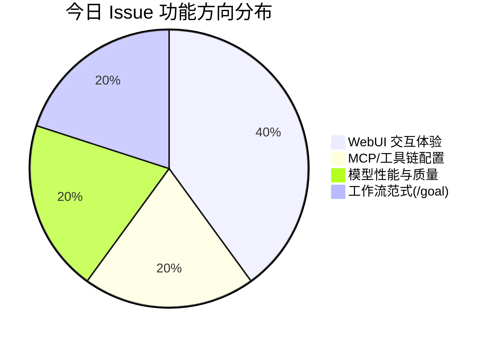

# AI CLI 工具社区动态日报 2026-05-11

> 生成时间: 2026-05-11 00:21 UTC | 覆盖工具: 9 个

- [Claude Code](https://github.com/anthropics/claude-code)
- [OpenAI Codex](https://github.com/openai/codex)
- [Gemini CLI](https://github.com/google-gemini/gemini-cli)
- [GitHub Copilot CLI](https://github.com/github/copilot-cli)
- [Kimi Code CLI](https://github.com/MoonshotAI/kimi-cli)
- [OpenCode](https://github.com/anomalyco/opencode)
- [Pi](https://github.com/badlogic/pi-mono)
- [Qwen Code](https://github.com/QwenLM/qwen-code)
- [DeepSeek TUI](https://github.com/Hmbown/DeepSeek-TUI)
- [Claude Code Skills](https://github.com/anthropics/skills)

---

## 横向对比

# AI CLI 工具生态横向对比分析报告 | 2026-05-11

---

## 1. 生态全景

当前 AI CLI 工具生态呈现**"功能趋同、体验分化"**的成熟竞争格局：头部产品（Claude Code、OpenAI Codex）围绕 Agent 协作、会话治理和企业计费构建护城河；中国阵营（Kimi、Qwen、DeepSeek）以快速迭代追赶，在模型适配和本地化体验上形成特色；独立项目（OpenCode、Pi）则通过架构创新（Effect 系统、Bun 运行时）探索差异化路径。整体从"能用"走向"好用"的关键转折期，**稳定性债务**（Windows 适配、进程生命周期、缓存命中率）成为所有工具的共同瓶颈，而**多智能体协作**和**开放协议（MCP/HTTP API）**正成为下一代竞争制高点。

---

## 2. 各工具活跃度对比

| 工具 | Issues（今日） | PRs（今日） | Release 动态 | 关键特征 |
|:---|:---:|:---:|:---|:---|
| **Claude Code** | 50 | 2 | 无 | 高讨论密度，计费危机与 Windows 稳定性为核心矛盾 |
| **OpenAI Codex** | 50 | 10 | 无 | PR 活跃度高，Goals 功能修复与插件生态扩展并进 |
| **Gemini CLI** | 50 | 10 | 无 | 安全合规密集审查，Agent 自治性为长期博弈点 |
| **GitHub Copilot CLI** | 13（过滤后） | 1 | 无 | 遭遇垃圾信息冲击，1.0.4x 版本回归故障紧急 |
| **Kimi Code CLI** | 5 | 5 | 无 | 单人贡献者闭环高效，WebUI 体验优化集中 |
| **OpenCode** | 50 | 10 | **v1.14.46 紧急修复** | `/exit` 回归缺陷驱动版本迭代，Agent Teams 高热 |
| **Pi** | 31 | 11 | 无 | 组织迁移后遗症爆发，大规模重构中（`closed-because-refactor`） |
| **Qwen Code** | 50 | 10 | **v0.15.10** | 二进制误判问题簇突出，配置管理提案矩阵爆发 |
| **DeepSeek TUI** | 50 | 10 | **v0.8.28** | 24 小时 4 个 patch 版本，终端兼容性修复密集 |

> **注**：Issues/PRs 统计口径为"今日有更新"，非累计总数。

---

## 3. 共同关注的功能方向

| 功能方向 | 涉及工具 | 具体诉求 | 紧迫度 |
|---------|---------|---------|:---:|
| **Windows 平台 parity** | Claude Code、OpenAI Codex、DeepSeek TUI、Pi | 文件系统同步（virtiofs）、ARM64 原生构建、终端 VT 序列兼容、SSO 认证持久化 | 🔥🔥🔥🔥🔥 |
| **进程/计费生命周期治理** | Claude Code、OpenAI Codex、Gemini CLI | 孤儿进程熔断、headless 预算上限、实时费用暴露、缓存命中率优化 | 🔥🔥🔥🔥🔥 |
| **多智能体协作（Agent Teams/Swarms）** | Claude Code、OpenCode、Qwen Code、Kimi | 对标 Claude Cowork 270万 DAU 验证的模式，DAG 协调、角色类型化、子 Agent 状态诚实 | 🔥🔥🔥🔥 |
| **MCP/开放协议生态** | OpenAI Codex、Gemini CLI、Qwen Code、DeepSeek TUI | 工具暴露标准化、延迟加载、Server 模式对外服务、协议兼容性修复 | 🔥🔥🔥🔥 |
| **会话生命周期管理** | Claude Code、OpenAI Codex、Gemini CLI、Qwen Code | 删除非仅归档、跨端同步、worktree 隔离、上下文压缩可控 | 🔥🔥🔥🔥 |
| **Shell/CLI 基础体验** | Claude Code、OpenCode、DeepSeek TUI、Pi | 自动补全、VIM 键位、输入状态机规范、外部编辑器集成可靠 | 🔥🔥🔥 |

---

## 4. 差异化定位分析

| 工具 | 核心侧重 | 目标用户 | 技术路线特征 |
|:---|:---|:---|:---|
| **Claude Code** | 企业远程开发（Cowork）、深度 IDE 集成 | 企业团队、全栈开发者 | TypeScript/Node，Anthropic 模型独占，重客户端智能 |
| **OpenAI Codex** | Goals 意图驱动、插件市场生态 | 生产力导向的付费开发者 | 多模型路由（OpenAI/Azure），TUI 品牌体验一致性 |
| **Gemini CLI** | 安全合规、策略引擎治理 | 企业合规场景、Google Cloud 用户 | Ink React TUI，强调确定性安全（先拦截后执行） |
| **GitHub Copilot CLI** | IDE 生态延伸、GitHub 工作流 | 现有 Copilot 订阅用户 | 与 VS Code/IDE 深度绑定，preToolUse hooks 安全模型 |
| **Kimi Code CLI** | 快速 UI 迭代、模型性能性价比 | 中国开发者、WebUI 偏好用户 | WebUI + CLI 双端并重，K2.6 模型自研 |
| **OpenCode** | 开源可扩展、Agent 生态自治 | 开源贡献者、自定义需求强烈的极客 | Effect 函数式架构、LM Studio 动态发现、技能系统 |
| **Pi** | 极致终端体验、多提供商兼容 | 终端原生开发者、模型切换需求者 | Bun 运行时、最短唯一前缀匹配等交互创新 |
| **Qwen Code** | 中文场景优化、平台化跃迁 | 中国开发者、阿里云生态用户 | 工具链延迟加载、Prompt cache 成本优化、Cowork 对标 |
| **DeepSeek TUI** | 推理过程可视化、成本极致敏感 | API 成本敏感型用户、长思考需求者 | Rust 高性能终端、DEC 2026 同步更新、缓存命中率透明 |

---

## 5. 社区热度与成熟度

```
活跃度矩阵（今日数据）
┌─────────────────┬─────────────┬─────────────┬─────────────────────────────┐
│     工具        │  讨论热度    │  贡献活跃度  │         成熟度判断           │
├─────────────────┼─────────────┼─────────────┼─────────────────────────────┤
│ Claude Code     │ ████████████│ ████████░░░ │ 成熟但承压：计费/Windows危机 │
│ OpenAI Codex    │ ██████████░░│ ██████████░ │ 快速迭代期：Goals/插件扩张   │
│ Gemini CLI      │ █████████░░░│ █████████░░ │ 治理深化期：安全合规优先      │
│ Copilot CLI     │ ██████░░░░░ │ ███░░░░░░░░ │ 维护波动期：垃圾信息+回归故障 │
│ Kimi CLI        │ █████░░░░░░ │ ████████░░░ │ 追赶加速期：单人贡献者驱动    │
│ OpenCode        │ ██████████░░│ ██████████░ │ 生态建设期：Agent Teams 高热 │
│ Pi              │ ████████░░░ │ █████████░░ │ 重构阵痛期：org迁移+架构升级  │
│ Qwen Code       │ ██████████░░│ █████████░░ │ 功能爆发期：配置提案矩阵涌现  │
│ DeepSeek TUI    │ ██████████░░│ ███████████ │ 稳定攻坚期：24h 4 patch 节奏 │
└─────────────────┴─────────────┴─────────────┴─────────────────────────────┘
```

**关键判断**：
- **最活跃社区**：DeepSeek TUI（修复响应速度极快）、OpenCode（Issue-PR 闭环效率高）
- **最大风险点**：Claude Code（计费信任危机可能引发用户迁移）、Copilot CLI（版本回归+治理失控）
- **最快增长潜力**：Qwen Code（MCP Server 模式+Cowork 对标若落地，生态位跃迁显著）

---

## 6. 值得关注的趋势信号

| 信号 | 证据 | 对开发者的参考价值 |
|:---|:---|:---|
| **"静默烧钱"成为行业公敌** | Claude Code #50589（$350/5天）、#57719（$313/8.5h）、Gemini #16750 权限疲劳 | 选择工具时**优先验证 headless/自动化场景的硬性预算熔断机制**，生产环境部署前必须测试孤儿进程行为 |
| **Windows 从"支持"变为"原生"要求** | 所有工具 Windows Issues 占比 >30%，ARM64 成为新战场 | 团队采购需评估**Windows ARM64 原生支持时间表**，Surface Pro 11/Snapdragon X Elite 用户暂避 Pi、Kimi 等未适配工具 |
| **MCP 从"连接协议"进化为"服务边界"** | Qwen #4007（MCP Server 模式）、OpenAI #21396（插件市场 CLI）、Gemini #21963（参数剥离） | 自建工具链应考虑**双向 MCP 暴露**（既消费也提供服务），避免被锁定在单一客户端 |
| **Agent 可观测性从"日志"升级为"状态机透明"** | Pi #4338（working 黑箱）、Gemini #22323（子 Agent 谎报成功）、OpenCode #12661（Teams 协调） | 复杂工作流必须要求**子 Agent 返回结构化状态（非二元 success/failure）**，优先选择支持 `--debug-agent-loop` 或等效机制的工具 |
| **终端渲染进入"GPU 原生"时代** | DeepSeek #1361（DEC 2026 同步更新）、Pi #4222（栈溢出） | 新一代终端（Ghostty、VS Code GPU 模式）要求客户端实现**帧同步协议**，传统逐字符绘制工具将面临兼容性债务 |
| **配置管理成为"第二战场"** | Qwen #4011-#4018（8 连提案）、Claude Code #13843（跨端同步）、Kimi #2216（路径导航） | 评估工具的**配置可移植性**（导出/导入/加密/版本管理），避免深度使用后陷入迁移锁定 |

---

> **决策建议**：当前节点，**成本敏感型团队**关注 DeepSeek TUI 的缓存优化与 Qwen Code 的 prompt cache；**企业合规场景**审视 Gemini CLI 的策略引擎与 Claude Code 的计费透明度；**生态扩展需求**押注 OpenCode 的 Agent Teams 与 Qwen Code 的 MCP Server 化进度。所有选型必须包含**Windows 平台实测**和**headless 预算熔断测试**两项基准验证。

---

## 各工具详细报告

<details>
<summary><strong>Claude Code</strong> — <a href="https://github.com/anthropics/claude-code">anthropics/claude-code</a></summary>

## Claude Code Skills 社区热点

> 数据来源: [anthropics/skills](https://github.com/anthropics/skills)

# Claude Code Skills 社区热点报告（2026-05-11）

---

## 1. 热门 Skills 排行（按社区活跃度）

| 排名 | Skill | 功能 | 状态 | 链接 |
|:---|:---|:---|:---|:---|
| 1 | **document-typography** | AI 生成文档的排版质量控制：防止孤行、寡行、编号错位等常见排版问题 | 🟡 Open | [PR #514](https://github.com/anthropics/skills/pull/514) |
| 2 | **skill-quality-analyzer + skill-security-analyzer** | 元技能：对 Skills 进行五维度质量评估（结构、提示工程、安全性等）及安全审计 | 🟡 Open | [PR #83](https://github.com/anthropics/skills/pull/83) |
| 3 | **frontend-design**（改进版） | 提升前端设计技能的可执行性，确保每条指令能在单轮对话中完成 | 🟡 Open | [PR #210](https://github.com/anthropics/skills/pull/210) |
| 4 | **odt** | OpenDocument 文本创建、模板填充及 ODT↔HTML 转换 | 🟡 Open | [PR #486](https://github.com/anthropics/skills/pull/486) |
| 5 | **testing-patterns** | 全栈测试体系：测试哲学、单元测试、React 组件测试、集成/E2E 测试 | 🟡 Open | [PR #723](https://github.com/anthropics/skills/pull/723) |
| 6 | **shodh-memory** | AI 代理的持久化记忆系统，跨对话维护上下文 | 🟡 Open | [PR #154](https://github.com/anthropics/skills/pull/154) |
| 7 | **appdeploy** | 直接从 Claude 部署全栈 Web 应用到公网 URL | 🟡 Open | [PR #360](https://github.com/anthropics/skills/pull/360) |
| 8 | **AURELION suite** | 四件套认知框架：结构化思维模板、顾问模式、代理执行、记忆管理 | 🟡 Open | [PR #444](https://github.com/anthropics/skills/pull/444) |

**讨论热点**：document-typography 切中 AI 生成文档的普遍痛点；元技能（质量/安全分析）反映社区对 Skills 自身工程化的关注；AURELION 和 shodh-memory 代表"认知架构"类技能的兴起。

---

## 2. 社区需求趋势（从 Issues 提炼）

| 方向 | 代表 Issue | 核心诉求 |
|:---|:---|:---|
| **企业协作与治理** | [#228](https://github.com/anthropics/skills/issues/228) 组织级 Skill 共享 | 告别 Slack 传文件，需要内置共享库/直链分发 |
| **安全与信任边界** | [#492](https://github.com/anthropics/skills/issues/492) 命名空间仿冒风险 | 社区 Skill 与官方 Skill 需明确区分，防权限滥用 |
| **插件生态治理** | [#189](https://github.com/anthropics/skills/issues/189), [#1087](https://github.com/anthropics/skills/issues/1087) | 插件去重、按需加载，避免上下文膨胀 |
| **MCP 协议互通** | [#16](https://github.com/anthropics/skills/issues/16) Skills 暴露为 MCP | 用统一协议封装 AI 能力，实现跨工具编排 |
| **企业部署兼容性** | [#29](https://github.com/anthropics/skills/issues/29) Bedrock 支持, [#532](https://github.com/anthropics/skills/issues/532) SSO 免 API Key | 脱离 Anthropic 直连，适配企业认证体系 |
| **评估与可靠性** | [#556](https://github.com/anthropics/skills/issues/556) 技能触发率 0% | 需要可量化的技能激活测试框架 |

---

## 3. 高潜力待合并 Skills（评论活跃 + 解决明确痛点）

| Skill | 合并潜力 | 关键价值 | 链接 |
|:---|:---|:---|:---|
| **document-typography** | ⭐⭐⭐⭐⭐ | 所有 AI 生成文档的通用刚需，零配置生效 | [PR #514](https://github.com/anthropics/skills/pull/514) |
| **testing-patterns** | ⭐⭐⭐⭐⭐ | 补齐 Claude Code 在工程化测试领域的空白 | [PR #723](https://github.com/anthropics/skills/pull/723) |
| **odt** | ⭐⭐⭐⭐☆ | 开源文档标准的战略意义，对标现有 docx/pdf 技能 | [PR #486](https://github.com/anthropics/skills/pull/486) |
| **skill-quality-analyzer** | ⭐⭐⭐⭐☆ | 社区自我治理基础设施，提升整体 Skill 质量基线 | [PR #83](https://github.com/anthropics/skills/pull/83) |
| **appdeploy** | ⭐⭐⭐☆☆ | 打通"生成→部署"闭环，但依赖外部商业服务 | [PR #360](https://github.com/anthropics/skills/pull/360) |
| **sensory（macOS AppleScript）** | ⭐⭐⭐☆☆ | 替代截图自动化，原生系统操控的新范式 | [PR #806](https://github.com/anthropics/skills/pull/806) |

> **注**：Lubrsy706 的三连修复 PR（[#538](https://github.com/anthropics/skills/pull/538), [#541](https://github.com/anthropics/skills/pull/541), [#539](https://github.com/anthropics/skills/pull/539)）虽为 bugfix，但显示社区对现有技能（pdf/docx/skill-creator）的精细化打磨投入。

---

## 4. Skills 生态洞察

> **社区正从"功能扩展"转向"工程化治理"**——不再满足于更多 Skill，而是要求可共享的企业级分发、可量化的触发可靠性、可审计的安全边界，以及 Skill 自身的质量基础设施（元技能、测试框架、MCP 标准化）。

---

---

# Claude Code 社区动态日报 | 2026-05-11

## 今日速览

今日社区活跃度极高，50 个 Issues 中有大量新增讨论，核心矛盾集中在 **Windows 平台 Cowork 功能的稳定性危机**（文件系统同步失效、定时任务崩溃）与 **计费/用量控制的透明度不足**（组织限额误触、孤儿进程持续扣费）。同时，Shell 自动补全与跨平台会话同步成为开发者呼声最高的功能缺口。

---

## 社区热点 Issues

### 🔴 平台稳定性：Windows Cowork 系统性故障

| # | 标题 | 状态 | 评论 | 核心问题 |
|---|------|------|------|---------|
| [#38993](https://github.com/anthropics/claude-code/issues/38993) | Cowork: virtiofs FUSE mount 提供截断/过期文件 | OPEN | 17 | **host 端文件变更无法同步至 VM**，严重影响 Windows 开发者协作工作流 |
| [#55631](https://github.com/anthropics/claude-code/issues/55631) | Cowork 调度器运行 24-30 小时后停止触发任务 | OPEN | 3 | 仅重启 Windows 可恢复，指向底层定时器/事件循环泄漏 |
| [#57896](https://github.com/anthropics/claude-code/issues/57896) | 定时任务 12-24 小时后自主停止；重启后批量吞并队列 | OPEN | 2 | 与 #55631 同源，补充"catch-up burst"灾难性行为 |
| [#57910](https://github.com/anthropics/claude-code/issues/57910) | 定时任务 cron 触发泄漏进程 + API 会话状态 | **CLOSED** | 2 | 单次 cron 触发产生 **78 个孤儿进程**，RAM 与 API 费用双重泄漏 |

**为什么重要**：Windows Cowork 作为企业级远程开发核心功能，文件系统与调度双崩溃已构成生产阻断。社区出现多篇重复/关联报告，说明问题具有普遍性而非个案。

---

### 💰 计费与用量控制：信任危机

| # | 标题 | 状态 | 评论 | 核心问题 |
|---|------|------|------|---------|
| [#52908](https://github.com/anthropics/claude-code/issues/52908) | "You've hit your org's monthly usage limit" | OPEN | 15 | 组织限额误触发，影响团队正常办公 |
| [#50589](https://github.com/anthropics/claude-code/issues/50589) | Opus 报告 nohup 进程"已中止"但未实际终止，5 天扣费 $350 | OPEN | 2 | **模型输出与系统行为不一致**导致财务损失 |
| [#46787](https://github.com/anthropics/claude-code/issues/46787) | 孤儿进程静默消耗配额；会话掉线后继续运行 | OPEN | 3 | 多平台（macOS）孤儿进程 + 未授权信用卡扣费 |
| [#57719](https://github.com/anthropics/claude-code/issues/57719) | `claude -p` headless 无花费可见性/上限，8.5h 烧掉 $313 | OPEN | 2 | 自动化编排场景缺乏硬性预算熔断机制 |

**为什么重要**：计费问题从"体验瑕疵"升级为"财务风险"，涉及模型可靠性（#50589）、进程生命周期管理（#46787、#57910）、以及 headless 场景的产品设计缺失（#57719）。支持团队内部出现"3 次 Fin 矛盾"的 routing loop，暴露售后体系承压。

---

### 🔗 生态互通：会话同步与 IDE 集成

| # | 标题 | 状态 | 评论 | 核心问题 |
|---|------|------|------|---------|
| [#13843](https://github.com/anthropics/claude-code/issues/13843) | Claude.ai 与 Claude Code 共享对话上下文 | OPEN | 13 | **66 👍 为今日最高**，用户需要在 Web 与 CLI 间无缝迁移工作流 |
| [#35004](https://github.com/anthropics/claude-code/issues/35004) | VS Code 重启后面板标签页始终空白（session ID 被丢弃） | **CLOSED** | 8 | IDE 插件反序列化逻辑缺陷，已修复关闭 |

**为什么重要**：#13843 长期高票未决，反映 Anthropic 产品线割裂的结构性痛点；#35004 的关闭显示 IDE 集成质量正在改善。

---

### 🛠️ 开发者体验：CLI 基础能力缺口

| # | 标题 | 状态 | 评论 | 核心问题 |
|---|------|------|------|---------|
| [#7738](https://github.com/anthropics/claude-code/issues/7738) | Bash completion for Claude Code tool | OPEN | 10 | **22 👍**，2025-09 创建至今，今日仍有新增讨论 |
| [#57871](https://github.com/anthropics/claude-code/issues/57871) | 添加 bash/zsh/fish shell completion 支持 | **CLOSED** | 2 | 与 #7738 重复，今日快速关闭合并追踪 |
| [#57781](https://github.com/anthropics/claude-code/issues/57781) | 为 CLI 添加自动补全功能 | OPEN | 2 | 用户明确需求 iTerm.app 场景下的交互优化 |

**为什么重要**：Shell completion 是 CLI 工具的"基线功能"，Claude Code 作为开发者核心工具长期缺失，社区已出现多个重复请求。

---

### 🔐 认证与平台适配

| # | 标题 | 状态 | 评论 | 核心问题 |
|---|------|------|------|---------|
| [#57026](https://github.com/anthropics/claude-code/issues/57026) | Windows Desktop + SSO: oauthAccount 未写入 `~/.claude.json` | OPEN | 3 | Team 计划企业部署受阻，OTel 指标缺失用户身份 |
| [#57908](https://github.com/anthropics/claude-code/issues/57908) | Web 客户端 OTLP 遥测缺失 user.account_id 等字段 | OPEN | 4 | 与 #57026 同源：Web/CLI 遥测数据不一致，影响团队级可观测性 |
| [#57924](https://github.com/anthropics/claude-code/issues/57924) | `/install-github-app` 无 Pro 账户无法取消/退出 | OPEN | 1 | 交互死锁，新用户 onboarding 阻断 |
| [#57923](https://github.com/anthropics/claude-code/issues/57923) | Xcode 认证无法识别 Premium Nonprofit 席位 | OPEN | 1 | 教育/非营利计划与 Apple 生态集成漏洞 |

---

## 重要 PR 进展

| # | 标题 | 状态 | 功能/修复内容 | 评估 |
|---|------|------|-------------|------|
| [#57880](https://github.com/anthropics/claude-code/pull/57880) | Autonomous Claude Swarms — DAG-aware multi-tier coordination | OPEN | **原生 Agent Teams 增强**：DAG 感知的多层协调、角色类型化 head 节点，支持自主代理团队 | 🔥 **高潜力**：作者自述用 Claude Code 自举开发，直接对标原生 Teams 功能，但需审视与官方路线图冲突 |
| [#57888](https://github.com/anthropics/claude-code/pull/57888) | Scope `child_process_exec` to JS/TS files | OPEN | 修复 `security_reminder_hook.py` 中 `"exec("` 子串误匹配 Python `asyncio.create_subprocess_exec` 的假阳性 | ✅ **精准修复**：安全规则的语言范围收窄，减少 Python 开发者干扰 |

> 注：今日仅 2 个 PR 更新，社区贡献活跃度低于 Issue 讨论。PR #57880 的"Swarm"架构值得持续关注其是否被官方采纳或分流。

---

## 功能需求趋势

基于 50 个活跃 Issue 的聚类分析：

| 方向 | 热度 | 代表 Issue | 趋势解读 |
|------|------|-----------|---------|
| **Windows 平台稳定性** | 🔥🔥🔥🔥🔥 | #38993, #55631, #57896, #57026 | Cowork + 调度器 + 认证三连崩，已成企业采用最大阻力 |
| **计费透明与硬性控制** | 🔥🔥🔥🔥🔥 | #52908, #50589, #46787, #57719 | 从"想看明细"升级为"需要熔断"，headless/自动化场景是盲区 |
| **Shell/CLI 交互优化** | 🔥🔥🔥🔥 | #7738, #57781, #57871, #45842 | completion、auto-complete、`--continue` 标志，指向"更 Unix-native"的期待 |
| **跨端会话同步** | 🔥🔥🔥🔥 | #13843, #57920, #57921 | Web↔CLI↔Desktop 的状态漫游，worktree/目录变更后的 resume 韧性 |
| **MCP/工具生态治理** | 🔥🔥🔥 | #57922, #41473 | 自定义 MCP Server 的工具调用限制、结构化记忆框架 |
| **遥测与可观测性** | 🔥🔥🔥 | #57908, #57026, #53959 | Team 计划企业部署需要完整的用户身份与用量追踪 |

---

## 开发者关注点

### 1. **"静默烧钱"恐慌：进程生命周期 = 财务安全**
> #50589, #46787, #57910, #57719 的共同模式：Claude Code 在后台持续持有 API 会话、累积费用，而用户界面或模型输出声称"已停止"。开发者需要：
> - **硬性进程超时**（可配置）
> - **headless 模式的预算上限**（绝对值或百分比）
> - **实时费用暴露**（OTel 或 CLI 状态栏）

### 2. **Windows 作为二等公民的积怨**
> Cowork 的文件系统（virtiofs）、定时调度（Windows 事件循环）、SSO 认证（oauthAccount 持久化）三条主线同时崩溃，且修复周期长达数周。企业 Windows 开发者正在评估替代方案。

### 3. **"我自建了比官方更好的"——社区创新的张力**
> #57880（Swarm 编排）、#41473（结构化记忆框架）显示高级用户在官方功能缺失时自行构建复杂系统。这既是生态活力的信号，也提示官方需明确 Agent Teams、Memory 等方向的路线图，避免社区贡献与内部开发重复或冲突。

### 4. **基础体验债务**
> Shell completion（#7738 创建于 2025-09，至今 OPEN）、worktree resume（#57920, #57921）、Web 端 git push 代理（#57925）等问题，属于"1000 个小切口"的累积，正在消耗核心用户对产品的耐心。

---

*日报基于 github.com/anthropics/claude-code 公开数据生成*

</details>

<details>
<summary><strong>OpenAI Codex</strong> — <a href="https://github.com/openai/codex">openai/codex</a></summary>

# OpenAI Codex 社区动态日报 | 2026-05-11

## 今日速览

今日社区焦点集中在 **Goals 功能的稳定性修复**（PR #22045 针对早期用户反馈优化目标延续提示词）与 **Windows 平台体验问题**（ARM64 模拟运行、WSL 模式、Chrome 插件缺失等集中爆发）。CLI 侧新增 API Key 预验证（PR #21983）和终端宠物彩蛋（PR #21206），插件生态扩展至 CLI 市场命令（PR #21396）。

---

## 社区热点 Issues（Top 10）

| # | Issue | 状态 | 核心要点 | 社区反应 |
|---|-------|------|---------|---------|
| [#9544](https://github.com/openai/codex/issues/9544) | 远程压缩任务流断开 | **已关闭** | `compact_remote` 在高负载下流中断，影响长会话上下文压缩 | 🔥 50 评论，14 👍；Max 订阅用户高频复现，修复后验证关闭 |
| [#3550](https://github.com/openai/codex/issues/3550) | VS Code 扩展：会话按工作区隔离 | 开放 | 全局 Recent Tasks 列表跨项目混杂，请求按 workspace 作用域 | 📌 26 评论，63 👍；长期高票需求，IDE 集成体验核心痛点 |
| [#8784](https://github.com/openai/codex/issues/8784) | CLI 增加 `codex delete <session>` | 开放 | 仅归档无法彻底删除会话，需手动清理 `~/.codex/archived_sessions/` | 📌 24 评论，79 👍；隐私与数据管理高需求 |
| [#19910](https://github.com/openai/codex/issues/19910) | Goals 功能：压缩后目标延续提示丢失 | 开放 | 新 Goals 特性在 mid-turn compaction 后丢失 active goal 上下文 | ⚠️ 22 评论；直接影响生产力核心功能，作者 @etraut-openai 已响应 |
| [#17444](https://github.com/openai/codex/issues/17444) | Windows MCP Server 启动失败 | 开放 | Windows 平台 MCP 工具链 boot 异常，0.120.0 持续复现 | ⚠️ 22 评论，9 👍；Windows 开发者工作流阻断 |
| [#18960](https://github.com/openai/codex/issues/18960) | Codex App WebSocket 频繁重连 | 开放 | `response.completed` 前服务端关闭连接，Pro 用户受影响 | ⚠️ 20 评论，18 👍；稳定性问题，影响付费体验 |
| [#12129](https://github.com/openai/codex/issues/12129) | TUI Enter 换行 vs 发送行为反转 | **已关闭** | 当前 Enter 直接发送，请求改为 Enter 换行、Ctrl+Enter 发送 | 📌 20 评论，28 👍；UX 争议大，多行编辑场景强需求 |
| [#9926](https://github.com/openai/codex/issues/9926) | 交互式 `ask_user_question` 工具 | 开放 | 结构化问答替代自由对话，支持 tabbed 问卷 UI | 📌 17 评论，24 👍；Agent 工作流效率提升提案 |
| [#13018](https://github.com/openai/codex/issues/13018) | App 支持删除线程（非仅归档） | 开放 | 归档后仍需手动删文件，请求 UI 内彻底删除 | 📌 14 评论，82 👍；全平台最高票之一，与 #8784 CLI 侧呼应 |
| [#21569](https://github.com/openai/codex/issues/21569) | Azure OpenAI GPT-5.5 远程压缩高需求失败 | 开放 | ~244k tokens 时 `compact_remote` 稳定触发 Azure 高负载错误 | ⚠️ 7 评论；企业级部署阻断，A/B 测试排除端点特异性 |

---

## 重要 PR 进展（Top 10）

| # | PR | 状态 | 功能/修复内容 | 影响面 |
|---|-----|------|------------|--------|
| [#22045](https://github.com/openai/codex/pull/22045) | 优化 Goals 延续提示词 | **开放** | 目标延续与预算限制提示改为 hidden user-context 消息（原 developer message），精简提示内容 | 直接回应 #19910 等反馈，Goals 功能稳定性 |
| [#21983](https://github.com/openai/codex/pull/21983) | API Key 登录前验证 | **开放** | 持久化凭证前调用 `/models` 验证 key 有效性，无效 key 显式报错 | 减少"登录成功但无法使用"的迷惑体验 |
| [#21972](https://github.com/openai/codex/pull/21972) | Hook 可见性分级提示 | **开放** | 区分" consequential hook 行为"与"后台上下文工作"的渲染噪音，关联 #19383/#20766 | TUI 信息密度优化 |
| [#21206](https://github.com/openai/codex/pull/21206) | TUI 终端宠物彩蛋 | **开放** | CLI 引入 App 同款环境宠物动画，不遮挡文本/输入/审批界面 | 品牌体验一致性，开发者情感化设计 |
| [#21396](https://github.com/openai/codex/pull/21396) | 插件市场 CLI 命令 | **开放** | `plugin marketplace add/list/remove` 命令，支持 `plugin@marketplace` 稳定 ID | 插件生态基础设施扩展 |
| [#18748](https://github.com/openai/codex/pull/18748) | 终端审查事件遥测 | **开放** | Review 作为独立事件上报（非仅 counter），统一 guardian/user review 分析 | 安全与合规审计能力 |
| [#20825](https://github.com/openai/codex/pull/20825) | Git 插件缓存元数据读取 | **已关闭** | 已安装 Git 来源市场插件从缓存 bundle 读取元数据，保持分类优先级 | 插件列表性能优化 |
| [#21585](https://github.com/openai/codex/pull/21585) | Windows CI 稳定化 | **已关闭** | Dev Drive 启用、sccache 0.14.0、Windows 特定测试硬化 | Windows 开发体验与发布质量 |
| [#21587](https://github.com/openai/codex/pull/21587) | Agent 任务取消竞态修复 | **已关闭** | 原子移除 claimed job 状态，条件化 worker 分配防并发竞争 | 多 worker 场景可靠性 |
| [#22047](https://github.com/openai/codex/pull/22047) | `codex exec --quiet` 静默模式 | **已关闭** | 抑制配置摘要 banner，便于父级测试框架集成 | 自动化/CI 场景刚需 |

---

## 功能需求趋势

基于 50 条活跃 Issue 分析，社区需求呈现 **五大集中方向**：

| 方向 | 代表 Issue | 热度指标 |
|-----|-----------|---------|
| **会话生命周期管理** | #8784, #13018, #20476, #20506 | 删除/清理/隔离会话为最高频功能请求，跨 CLI/App/Web 三端 |
| **IDE 深度集成** | #3550, #21788 | VS Code 工作区隔离、Chrome 插件 Windows 补全 |
| **Windows 平台 parity** | #17444, #13565, #17491, #20886, #21788, #22071 | ARM64 原生支持、WSL 模式、模拟运行性能、插件缺失 |
| **Goals/Agent 可靠性** | #19910, #14513, #9926 | 新 Goals 特性的上下文保持、执行中断、结构化交互 |
| **性能与稳定性** | #18960, #20301, #21569, #19936, #21232 | WebSocket 重连、缓存命中率、大图像项目卡顿、Azure 高负载 |

---

## 开发者关注点

### 🔴 高频痛点

1. **Windows 二等公民体验**
   - ARM64 设备（Surface Pro 11、Snapdragon X Elite）被迫 x86 模拟运行，WSL 模式失效，Chrome 插件缺失
   - 建议：推进 Windows ARM64 原生构建与插件商店分发

2. **Goals 功能"半成品"感知**
   - mid-turn compaction 丢失目标上下文、预算限制提示干扰
   - 建议： compaction 策略增加 goal 状态快照机制

3. **会话数据黑洞**
   - 归档≠删除，跨设备同步后历史堆积，无批量清理能力
   - 建议：提供 `codex session purge` 及 App 端批量删除

### 🟡 生态期待

- **Hook 可观测性**：#21972 的分级提示是开始，开发者需要更细粒度的 hook 执行追踪
- **多环境工具路由**：PR #20137 等已合并，但模型侧 `environment_id` 暴露策略（PR #20314）仍需完善文档
- **插件市场 CLI 化**：#21396 填补 CLI 与 App 的插件管理 gap，期待 `codex plugin search` 与版本锁定

---

*日报基于 github.com/openai/codex 公开数据生成 | 2026-05-11*

</details>

<details>
<summary><strong>Gemini CLI</strong> — <a href="https://github.com/google-gemini/gemini-cli">google-gemini/gemini-cli</a></summary>

# Gemini CLI 社区动态日报 | 2026-05-11

## 今日速览

今日社区活跃度集中在**Agent 系统稳定性**与**安全合规**两大主题。长期悬而未决的 session 权限缓存问题（#16750）持续引发大量讨论，同时多个 Auto Memory 相关安全修复进入密集审查期。核心基础设施方面，Vertex AI 兼容性修复与代理支持改进成为合并重点。

---

## 社区热点 Issues

| # | 标题 | 状态 | 评论 | 核心看点 |
|---|------|------|------|---------|
| [#16750](https://github.com/google-gemini/gemini-cli/issues/16750) | "Allow for session" 对含路径 shell 命令仅生效一次 | OPEN | **159** | 🔥 **社区最痛点**。用户选择"session 允许"后，同一命令因路径参数不同被反复提示确认，严重打断流式工作体验。讨论持续 4 个月未决，涉及权限匹配粒度的产品设计分歧。 |
| [#15268](https://github.com/google-gemini/gemini-cli/issues/15268) | 交互式 Hook 配置 GUI | OPEN | 8 | 降低 Hook 使用门槛的关键 UX 改进，提议基于 Ink 构建可视化配置界面，与现有 CLI 美学保持一致。 |
| [#19826](https://github.com/google-gemini/gemini-cli/issues/19826) | 测试规范：process.env 迁移至 vi.stubEnv() | OPEN | 7 | `good first issue` 标签，帮助新贡献者熟悉 GEMINI.md 测试约定，体现工程规范建设。 |
| [#22745](https://github.com/google-gemini/gemini-cli/issues/22745) | AST 感知文件读写与代码库映射评估 | OPEN | 7 | 架构级探索，通过 AST 精准定位方法边界减少 token 浪费，可能根本性改善大代码库场景下的 Agent 效率。 |
| [#15167](https://github.com/google-gemini/gemini-cli/issues/15167) | 工具确认流程中 BeforeTool Hook 的 UI 时序 | OPEN | 6 | Hook 执行顺序的交互设计缺陷：先问用户再被 Hook 拦截，造成认知冲突，需重新设计确认流。 |
| [#24353](https://github.com/google-gemini/gemini-cli/issues/24353) | 组件级行为评估体系 | OPEN | 6 | 76 个行为 eval 测试后的质量基础设施升级，从"能跑"走向"可量化信任"。 |
| [#22323](https://github.com/google-gemini/gemini-cli/issues/22323) | 子 Agent MAX_TURNS 中断被误报为成功 | OPEN | 6 | **可靠性漏洞**。`codebase_investigator` 等子 Agent 触达轮次上限后返回"GOAL success"，导致主 Agent 基于错误状态继续执行，可能产生级联错误。 |
| [#26563](https://github.com/google-gemini/gemini-cli/issues/26563) | `/memory add` 报错 "save_memory" 工具未找到 | OPEN | 5 | v0.41.1 回归问题，Memory 系统核心功能不可用，影响用户知识沉淀工作流。 |
| [#25166](https://github.com/google-gemini/gemini-cli/issues/25166) | Shell 命令执行后假死："Waiting input" | OPEN | 3 | 高频偶发阻塞，简单命令完成后 UI 状态未同步，需排查 TTY/伪终端信号处理。 |
| [#26525](https://github.com/google-gemini/gemini-cli/issues/26525) | Auto Memory 确定性脱敏与日志缩减 | OPEN | 2 | 安全合规急迫需求：敏感信息先进入模型上下文再被"建议"脱敏，存在数据泄露窗口期。 |

---

## 重要 PR 进展

| # | 标题 | 状态 | 功能/修复内容 |
|---|------|------|-------------|
| [#26652](https://github.com/google-gemini/gemini-cli/pull/26652) | Vertex AI 兼容：thought_signature 改为 snake_case | OPEN | **P1 修复**。解决 Vertex AI 后端 400 INVALID_ARGUMENT 错误，SDK camelCase 与 Vertex 严格 snake_case 校验的命名规范冲突。 |
| [#26838](https://github.com/google-gemini/gemini-cli/pull/26838) | 开发模式清除 CI 环境变量保活 Ink 交互 | **CLOSED** | 修复 `npm run start` 因 `CI=true` 导致 Ink 静默挂起，已合并。 |
| [#26063](https://github.com/google-gemini/gemini-cli/pull/26063) | 项目临时目录权限收紧 | OPEN | 安全加固：`~/.gemini/` 下对话历史、Agent 日志、内存状态等敏感状态的文件权限限制，防止多用户环境信息泄露。 |
| [#23809](https://github.com/google-gemini/gemini-cli/pull/23809) | 遥测内存泄漏防火墙 | OPEN | **P1 修复**。大 payload 导致堆耗尽 OOM，通过预初始化缓冲上限与字符串截断实现防御性熔断。 |
| [#26361](https://github.com/google-gemini/gemini-cli/pull/26361) | 代理支持：externalize https-proxy-agent | OPEN | 修复 esbuild 打包后 `HttpsProxyAgent is not a constructor` 错误，企业代理场景刚需。 |
| [#26540](https://github.com/google-gemini/gemini-cli/pull/26540) | 策略引擎工具审批修复 | OPEN | **P1 修复**。YOLO/AUTO_EDIT 模式下审批未持久化、冗余弹窗等问题，涉及正则空字节修复与策略状态机校正。 |
| [#21963](https://github.com/google-gemini/gemini-cli/pull/21963) | MCP 工具参数剥离 $schema | OPEN | Draft 2020-12 JSON Schema 的 `$schema` 字段导致 Gemini API 间歇性失败，保本地校验、清 API 传输。 |
| [#24736](https://github.com/google-gemini/gemini-cli/pull/24736) | AgentHistoryProvider 并查集上下文压缩 | OPEN | 语义聚类替代硬截断，相似消息归入冷存储森林，改善长会话上下文窗口管理。 |
| [#21265](https://github.com/google-gemini/gemini-cli/pull/21265) | 子 Agent INVALID_ARGUMENT 错误韧性 | OPEN | API 400 错误的结构化识别与上下文透传，使主 Agent 可自主恢复而非直接崩溃。 |
| [#25362](https://github.com/google-gemini/gemini-cli/pull/25362) | Vertex AI 区域覆盖配置 | OPEN | `vertexLocation` 设置项，解决预览模型仅部署于 `global` 区域时的 404 问题。 |

---

## 功能需求趋势

基于 50 条活跃 Issue 的聚类分析，社区当前三大方向：

| 趋势方向 | 代表 Issue | 成熟度 |
|---------|-----------|--------|
| **Agent 自治与可控性** | #16750 权限记忆、#22323 子 Agent 状态诚实、#22672 危险操作拦截 | 🔶 核心痛点，设计博弈中 |
| **Memory 系统安全与质量** | #26525 脱敏、#26523 隔离无效补丁、#26522 终止低信号重试 | 🔴 近期爆发，5月初密集提交 |
| **企业级治理与合规** | #15270 策略引擎集成、#15272 Hook 沙箱、#24782 allowEnv 策略 | 🔶 基础设施搭建期 |

次级趋势：AST 感知工具链（#22745/#22746）代表的长远效率优化，以及 Hook 生态的 UX 完善（#15268/#15273）。

---

## 开发者关注点

**高频痛点**

1. **权限确认疲劳** — #16750 的 159 条评论揭示深层矛盾：安全粒度与流畅体验的平衡尚无共识，开发者呼吁"路径通配符匹配"或"命令签名哈希"等中间方案。

2. **子 Agent 黑箱化** — #22323 与 #19857（verbose 模式）共同指向子 Agent 的可观测性缺失：状态误报、错误吞没、调试困难，"成功/失败"二元反馈不足以支撑复杂工作流。

3. **Windows 路径边缘情况** — #25216 `A:\` 临时路径崩溃显示跨平台路径处理的持续脆弱性。

**新兴诉求**

- **确定性安全**：Auto Memory 的"先上传再脱敏"模式（#26525）被质疑不符合企业数据治理的"零信任"原则，要求前置拦截而非后置建议。
- **配置即代码**：Hook/策略的配置方式从 JSON 手动编辑向 GUI（#15268）和版本可控迁移工具（#15267）演进，反映 DevOps 成熟度的社区期待。

---

*日报基于 google-gemini/gemini-cli 公开 GitHub 数据生成*

</details>

<details>
<summary><strong>GitHub Copilot CLI</strong> — <a href="https://github.com/github/copilot-cli">github/copilot-cli</a></summary>

# GitHub Copilot CLI 社区动态日报 | 2026-05-11

## 今日速览

今日社区遭遇大规模垃圾信息冲击，同一用户批量创建 10+ 条无关 Issue，维护者需紧急清理。与此同时，1.0.4x 版本出现严重回归：主会话中文本-only 助手回合会静默终止且不会自动继续，另有插件系统、MCP 懒加载等正经技术议题持续获得关注。

---

## 社区热点 Issues

| # | 标题 | 状态 | 重要性 | 社区反应 |
|---|------|------|--------|----------|
| [#3239](https://github.com/github/copilot-cli/issues/3239) | **主会话严重回归：文本-only 助手回合静默终止，无自动继续** | 🔴 OPEN | **🔴 Critical** | 新上报的 1.0.4x 回归，用户消息明确要求操作时助手仅返回文本不调用工具，CLI 不警告、不自动继续，直接卡住。严重影响核心交互流程 |
| [#2901](https://github.com/github/copilot-cli/issues/2901) | MCP 服务器按需懒加载（首次工具调用时连接） | 🔵 OPEN | **🟡 High** | 6 👍，社区痛点明确：MCP 服务器越多启动越慢，多数会话根本用不到全部服务器。提案改为延迟连接 |
| [#2736](https://github.com/github/copilot-cli/issues/2736) | `posix_spawnp failed` 后错误诊断命令缺失 | 🔵 OPEN | **🟡 High** | 3 👍，Shell 命令启动失败时 CLI 误判为命令未安装，属于工具层可靠性问题 |
| [#2392](https://github.com/github/copilot-cli/issues/2392) | preToolUse hooks 在子代理中未强制执行 | 🔵 OPEN | **🟡 High** | 3 👍，安全绕过漏洞：主代理的限制可通过 `task` 工具委派给子代理规避 |
| [#2893](https://github.com/github/copilot-cli/issues/2893) | 并行工具调用下 preToolUse hooks 被静默绕过 | 🔵 OPEN | **🟡 High** | Hook 超时机制缺陷：超时后 CLI 停止等待但子进程继续运行，且 fallback 为 `allow`，安全策略形同虚设 |
| [#3238](https://github.com/github/copilot-cli/issues/3238) | 畸形 `plugin.json` "commands" 字段导致每次提示崩溃 | 🔵 OPEN | **🟡 Medium** | 错误信息极不友好（`TypeError: a.replace is not a function` minified 堆栈），插件开发者体验差 |
| [#3222](https://github.com/github/copilot-cli/issues/3222) | 纯工具助手回合导致 UI 静默——多批次工具调用无文本块 | 🔵 OPEN | **🟡 Medium** | 与 #3239 相关的 UI/UX 问题：模型连续输出工具调用无解说文本时，用户视角会话"冻结" |
| [#3223](https://github.com/github/copilot-cli/issues/3223) | `$TOOL_INPUT_FILE_PATH` 聊天 hook 变量不工作 | 🔵 OPEN | **🟡 Medium** | 官方文档示例（prettier hook）直接报错，文档与实际实现脱节 |
| [#3225](https://github.com/github/copilot-cli/issues/3225) | Copilot 忘记当前对话上下文 | 🔵 OPEN | **🟡 Medium** | 会话记忆问题：关闭聊天窗口后恢复对话，Copilot 丢失之前讨论内容 |
| [#3224](https://github.com/github/copilot-cli/issues/3224) | 新增 `/github` 或 `/desktop` 命令打开 GitHub Desktop | 🔵 OPEN | **🟢 Low** | 功能请求，对标现有 `/ide` 命令，提升 Git 工作流集成度 |

> **垃圾信息警报**：用户 `parezanovicluka863-byte` 批量创建 #3226-#3236 共 11 条包含辱骂、阴谋论内容的 Issue；`dear-devil0147` 创建 #3218-#3221 共 4 条空/无意义 Issue。已关闭 #3217-#3219、#3237，其余待清理。

---

## 重要 PR 进展

| # | 标题 | 状态 | 说明 |
|---|------|------|------|
| [#3163](https://github.com/github/copilot-cli/pull/3163) | ViewSonic monitor | 🟡 OPEN | 关联 #2591、#3561、#3559，初始化 GitHub Actions runners。内容描述极不完整，疑似测试/误提或需要更多上下文 |

> 注：今日仅 1 条 PR 更新，且信息不完整。建议关注者核实是否为有效贡献。

---

## 功能需求趋势

从 Issues 分布提炼出四大社区关注方向：

| 方向 | 代表 Issue | 核心诉求 |
|------|-----------|---------|
| **🚀 启动与性能优化** | #2901 | MCP 懒加载、减少冷启动时间 |
| **🔒 安全与策略执行** | #2392, #2893 | preToolUse hooks 在子代理、并行调用场景下的强制一致性 |
| **🛠️ 开发者体验（DX）** | #3238, #3223 | 插件系统错误信息友好化、文档与实现同步 |
| **💬 会话可靠性** | #3239, #3222, #3225 | 防止助手"静默"、上下文不丢失、交互状态可感知 |

---

## 开发者关注点

### 🔴 紧急痛点
- **1.0.4x 回归性故障**：主会话核心交互路径断裂（#3239），升级该版本的用户可能广泛受影响
- **安全策略绕过**：hooks 机制在子代理和并行场景下的双重失效（#2392 + #2893），对企业/合规场景是严重隐患

### 🟡 高频摩擦
- **MCP 生态膨胀带来的性能税**：每增一个服务器，全员买单启动时间（#2901）
- **插件开发调试困难**：JSON Schema 校验失败时崩溃信息不可读（#3238），官方示例代码不工作（#3223）

### 🟢 体验期待
- **更深度的桌面工具链集成**：GitHub Desktop 一键唤起（#3224），延续 `/ide` 的设计语言

---

*日报基于 github.com/github/copilot-cli 公开数据生成。垃圾信息 Issue 已做过滤标注，实际技术议题 13 条。*

</details>

<details>
<summary><strong>Kimi Code CLI</strong> — <a href="https://github.com/MoonshotAI/kimi-cli">MoonshotAI/kimi-cli</a></summary>

# Kimi Code CLI 社区动态日报 | 2026-05-11

## 今日速览

今日社区活跃度较高，WebUI 文件导航体验成为焦点，贡献者 **morphishk** 同日提交 Issue 与配套 PR 实现可编辑路径栏功能。同时 K2.6 模型性能退化反馈引发关注，MCP 工具链可配置性需求持续涌现。

---

## 社区热点 Issues

| # | 标题 | 状态 | 关键价值 |
|---|------|------|---------|
| [#2221](https://github.com/MoonshotAI/kimi-cli/issues/2221) | MCP 工具输出字符限制可配置化 | 🟢 OPEN | **基础设施灵活性**。当前 100,000 字符硬编码限制对不同 MCP 服务器适配性不足，社区需细粒度控制工具输出截断行为 |
| [#2219](https://github.com/MoonshotAI/kimi-cli/issues/2219) | K2.6 模型性能退化 | 🟢 OPEN | **模型质量回归**。响应变慢且输出质量下降，影响生产环境稳定性，需官方紧急排查模型后端或提示策略变更 |
| [#2218](https://github.com/MoonshotAI/kimi-cli/issues/2218) | 支持类似 Codex 的 `/goal` 长任务指令 | 🟢 OPEN | **工作流范式扩展**。对标 OpenAI Codex 的意图驱动编程，社区寻求从对话式交互向目标委托式交互升级 |
| [#2206](https://github.com/MoonshotAI/kimi-cli/issues/2206) | WebUI 长文件名导致操作按钮溢出 | 🟢 OPEN | **UI 可用性缺陷**。固定侧边栏宽度下 Radix UI 布局计算问题，已有关联修复 PR |
| [#2216](https://github.com/MoonshotAI/kimi-cli/issues/2216) | Workspace 文件栏支持可编辑路径栏与自动补全 | 🟢 OPEN | **导航效率提升**。深层目录鼠标操作低效，需求与 PR #2215 形成完整闭环 |

---

## 重要 PR 进展

| # | 标题 | 状态 | 技术要点 |
|---|------|------|---------|
| [#2220](https://github.com/MoonshotAI/kimi-cli/pull/2220) | 技能系统扩展与 AGENTS 加载对齐 | 🔴 CLOSED | 新增 `.piebox/skills` 扫描路径、`AGENTS.local.md` 本地加载支持；移除 9 反引号代码块包裹；Shell 提示符增加显示行导航 |
| [#2217](https://github.com/MoonshotAI/kimi-cli/pull/2217) | 后台自动触发冷却恢复机制 | 🟡 OPEN | 修复 #2193：3 次连续失败后台运行后暂停 10 分钟，冷却结束后重置计数器，保障用户输入响应性 |
| [#2215](https://github.com/MoonshotAI/kimi-cli/pull/2215) | WebUI 可编辑路径栏与智能补全 | 🟡 OPEN | 实现 Workspace 侧边栏键盘导航：路径输入、智能建议、直接跳转，配套 Issue #2216 |
| [#2207](https://github.com/MoonshotAI/kimi-cli/pull/2207) | 修复长文件名隐藏操作按钮 | 🟡 OPEN | 针对 Issue #2206：Radix UI Slot 子元素宽度计算修复，确保展开/下载按钮始终可见 |
| [#2214](https://github.com/MoonshotAI/kimi-cli/pull/2214) | `/clear` 后显示轮转备份提示 | 🟡 OPEN | 返回备份路径、明确 `/undo` 无法恢复 `/clear` 前历史，增加回归测试防止用户数据误操作预期 |

---

## 功能需求趋势



| 方向 | 热度 | 具体表现 |
|------|------|---------|
| **WebUI 文件导航** | 🔥🔥🔥 | 路径栏编辑、长文件名处理、侧边栏交互优化集中爆发 |
| **MCP 生态适配** | 🔥🔥 | 输出限制可配置化，反映 MCP 服务器多样化带来的灵活性需求 |
| **模型质量保障** | 🔥🔥 | K2.6 退化反馈提示版本发布后的回归测试机制待加强 |
| **意图驱动编程** | 🔥 | `/goal` 对标 Codex，长任务自动化成为下一代 CLI 竞争点 |

---

## 开发者关注点

| 痛点层级 | 问题 | 影响面 |
|---------|------|--------|
| **阻塞性** | K2.6 输出质量与速度双降 | 所有升级用户，生产环境稳定性 |
| **高频摩擦** | 深层目录鼠标导航低效 | WebUI 重度用户 |
| **配置僵化** | MCP 工具链参数硬编码 | 自定义 MCP 服务器开发者 |
| **认知负担** | `/clear` 历史恢复边界模糊 | 会话管理敏感用户 |

> **趋势判断**：morphishk 的单人 Issue-PR 闭环模式（#2206→#2207、#2216→#2215）显示社区贡献者开始形成"问题发现-即时实现"的高效协作范式，项目维护者可考虑优化 PR  Review 吞吐量以匹配社区活跃度。

---

*数据来源：[MoonshotAI/kimi-cli](https://github.com/MoonshotAI/kimi-cli) | 统计周期：2026-05-10 至 2026-05-11*

</details>

<details>
<summary><strong>OpenCode</strong> — <a href="https://github.com/anomalyco/opencode">anomalyco/opencode</a></summary>

# OpenCode 社区动态日报 | 2026-05-11

## 今日速览

今日 OpenCode 发布 v1.14.46 紧急修复版本，重点解决 `/exit` 等核心 slash 命令在 TUI 中异常消失的问题；社区围绕 **Agent 团队协作**、**Tokens/s 性能指标** 和 **VIM 键位支持** 三大功能方向持续高热讨论，同时 GPT-5.5 模型支持已快速落地。

---

## 版本发布

### [v1.14.46](https://github.com/anomalyco/opencode/releases/tag/v1.14.46) — 配置稳定性与 API 规范修复

| 类型 | 内容 |
|:---|:---|
| **🛡️ 核心改进** | 新增内置 `customize-opencode` skill，降低用户自定义配置导致启动失败的概率 |
| **🐛 Bug 修复** | 修复 HTTP API 中数值型/布尔型查询参数在 OpenAPI 规范及 SDK 中的生成错误，涉及 session 与 file 端点 |

> 该版本为 v1.14.42 后紧急迭代，主要回应近期大量 `/exit` 命令失效的用户反馈。

---

## 社区热点 Issues（Top 10）

| # | Issue | 状态 | 评论 | 👍 | 核心看点 |
|:---|:---|:---|:---:|:---:|:---|
| [#12661](https://github.com/anomalyco/opencode/issues/12661) | **Agent Teams 等效或更优方案** | 🔵 OPEN | 33 | 110 | **社区最热功能请求**。对标 Claude Code 的 Agent Teams 多智能体协作，Reddit 跨平台讨论引流，110 赞显示强需求。 |
| [#24039](https://github.com/anomalyco/opencode/issues/24039) | **GPT-5.5 支持（OpenAI provider）** | ✅ CLOSED | 21 | 14 | 已快速关闭，社区对 OpenAI 新模型跟进效率认可。 |
| [#6096](https://github.com/anomalyco/opencode/issues/6096) | **实验性 Tokens/秒 计算与显示** | 🔵 OPEN | 16 | 50 | 性能可观测性长期诉求，50 赞表明用户对"速度感知"的强需求。 |
| [#25824](https://github.com/anomalyco/opencode/issues/25824) | **Desktop 插件加载但自定义 Agent 不可见** | 🔵 OPEN | 14 | 4 | `oh-my-openagent` 插件生态的关键兼容性问题，TUI/GUI 行为不一致。 |
| [#24316](https://github.com/anomalyco/opencode/issues/24316) | **Qwen 3.6 35b-a3b 裸工具调用导致进度卡死** | 🔵 OPEN | 12 | 1 | 模型-工具链兼容性边界案例，涉及 llama.cpp 与 OpenCode 责任界定。 |
| [#26549](https://github.com/anomalyco/opencode/issues/26549) | **`/exit` `/quit` 缺失于自动补全** | 🔵 OPEN | 11 | 19 | **v1.14.42 回归缺陷**，直接影响用户退出体验，已有关联 PR 修复。 |
| [#22528](https://github.com/anomalyco/opencode/issues/22528) | **1.4.4 终端动画与音效关闭方法** | 🔵 OPEN | 10 | 41 | 高赞体验问题，默认开启的"惊喜"功能缺乏明显关闭入口。 |
| [#21470](https://github.com/anomalyco/opencode/issues/21470) | **OpenCode 严重 CPU 绑定** | 🔵 OPEN | 9 | 7 | 与 Gemini-3.1 组合时本地计算耗时远超 API 等待，性能优化优先级信号。 |
| [#20802](https://github.com/anomalyco/opencode/issues/20802) | **自定义 OpenAI 兼容 provider 图片附件异常** | 🔵 OPEN | 8 | 1 | 视觉能力在第三方 provider 链路中的传输断裂，影响 vision 场景扩展。 |
| [#11111](https://github.com/anomalyco/opencode/issues/11111) | **VIM 键盘布局支持** | 🔵 OPEN | 8 | 27 | 开发者效率工具的经典诉求，27 赞显示核心用户群体偏好。 |

---

## 重要 PR 进展（Top 10）

| # | PR | 状态 | 作者 | 功能/修复内容 |
|:---|:---|:---|:---|:---|
| [#26756](https://github.com/anomalyco/opencode/pull/26756) | **LM Studio 模型动态发现** | 🔵 OPEN | ipogosov | 从 `/v1/models` 实时拉取模型列表，替代静态 catalog，解决用户加载/卸载模型后不同步问题 |
| [#26776](https://github.com/anomalyco/opencode/pull/26776) | **Effectify 压缩流程测试** | ✅ CLOSED | kitlangton | 将剩余异步测试迁移至 Effect 架构，统一 `compactionProcessLayer` 提供模式 |
| [#26652](https://github.com/anomalyco/opencode/pull/26652) | **后台代码迁移服务** | ✅ CLOSED | thdxr | 全局后台迁移机制，JSON marker 追踪避免阻塞启动，解耦 SQL 迁移文件 |
| [#25654](https://github.com/anomalyco/opencode/pull/25654) | **MCP Streamable HTTP Accept 头修复** | 🔵 OPEN | kagura-agent | 补全 `Accept: application/json, text/event-stream`，兼容智谱等严格服务器 |
| [#26606](https://github.com/anomalyco/opencode/pull/26606) | **Slash 命令自动补全无视启用状态** | ✅ CLOSED | kagura-agent | **直接修复 #26549**：`/exit` `/quit` `/q` 因 `enabled: false` 被过滤，改为始终显示 |
| [#26742](https://github.com/anomalyco/opencode/pull/26742) | **简化压缩测试辅助函数** | ✅ CLOSED | kitlangton | 合并重复 helper，统一 summary compaction 调用模式 |
| [#26771](https://github.com/anomalyco/opencode/pull/26771) | **恢复托管 textarea 键位处理** | ✅ CLOSED | kommander | 修复 OpenTUI 换行符丢失，添加 `esc`→`escape`、`enter`→`return` 别名映射 |
| [#18767](https://github.com/anomalyco/opencode/pull/18767) | **移动端触摸优化** | 🔵 OPEN | noahbentusi | 完整移动/触摸适配方案，保留桌面体验，覆盖手势、视口、输入模式 |
| [#26773](https://github.com/anomalyco/opencode/pull/26773) | **集成浏览器工作区** | 🔵 OPEN | AlexDelgado20 | 桌面应用内嵌浏览器，支持网页打开与控制，拓展 Agent 工具边界 |
| [#26724](https://github.com/anomalyco/opencode/pull/26724) | **TUI Markdown 渲染演示优化** | ✅ CLOSED | kitlangton | 全屏 Markdown 演示入口，优化代码块间距、H1 样式、表格、diff 块等 |

---

## 功能需求趋势

基于 50 条活跃 Issue 的聚类分析，社区当前聚焦五大方向：

```
┌─────────────────────────────────────────┬────────┬─────────────────────────────┐
│ 功能方向                                │ 热度   │ 典型代表                     │
├─────────────────────────────────────────┼────────┼─────────────────────────────┤
│ 🤖 Agent 生态与多智能体协作              │ 🔥🔥🔥 │ #12661 Agent Teams, #25824  │
│                                         │        │ 插件 Agent 可见性             │
├─────────────────────────────────────────┼────────┼─────────────────────────────┤
│ ⚡ 性能可观测性与优化                    │ 🔥🔥🔥 │ #6096 Tokens/s, #21470 CPU  │
│                                         │        │ 绑定, #23804 /tmp 泄漏       │
├─────────────────────────────────────────┼────────┼─────────────────────────────┤
│ 🎮 开发者体验与交互效率                  │ 🔥🔥   │ #11111 VIM, #15257 折叠推理, │
│                                         │        │ #21578 会话级权限, #26549    │
│                                         │        │ /exit 回归                   │
├─────────────────────────────────────────┼────────┼─────────────────────────────┤
│ 🖼️ 视觉与多模态能力扩展                  │ 🔥🔥   │ #20802 自定义 provider 图片, │
│                                         │        │ #26064 粘贴多图片            │
├─────────────────────────────────────────┼────────┼─────────────────────────────┤
│ 🔧 模型生态快速跟进                      │ 🔥     │ #24039 GPT-5.5, #24316 Qwen  │
│                                         │        │ 3.6 兼容性                   │
└─────────────────────────────────────────┴────────┴─────────────────────────────┘
```

> **新兴信号**：终端吉祥物/伙伴系统（#26745，对标 Claude Buddy）开始冒头，反映 AI 工具情感化设计探索。

---

## 开发者关注点

### 🔴 高频痛点（需紧急响应）

| 问题 | 影响面 | 现状 |
|:---|:---|:---|
| **`/exit` 命令失效与自动补全缺失** | 所有 TUI 用户 | v1.14.42-46 回归，PR #26606 已合并但未完全覆盖所有场景（#26761 报告仍无法退出） |
| **Desktop 与 TUI 插件行为不一致** | 插件开发者/用户 | `oh-my-openagent` 等插件在 GUI 中 Agent 不可见，生态分裂风险 |
| **CPU 占用过高替代 I/O 等待** | 大上下文用户 | 300k tokens 场景下本地处理 1.5h+，成本感知差 |

### 🟡 体验摩擦（累积不满）

- **配置发现性**：音效/动画（#22528）、权限开关位置变更（#21578）缺乏明显入口
- **跨平台稳定性**：Pop OS 启动失败（#26746）、Windows 插件兼容（#26516）
- **国际化缺陷**：中文环境下 `@` 文件列出异常（#26716）

### 🟢 生态建设机会

- **测试基础设施**：kitlangton 主导的 Effect 架构迁移（7 个相关 PR）显示技术债清理进入深水区
- **Provider 扩展**：LM Studio 动态发现（#26756）、MCP 协议兼容（#25654）降低接入门槛

---

*日报基于 github.com/anomalyco/opencode 公开数据生成 | 2026-05-11*

</details>

<details>
<summary><strong>Pi</strong> — <a href="https://github.com/badlogic/pi-mono">badlogic/pi-mono</a></summary>

# Pi 社区动态日报 | 2026-05-11

## 今日速览

过去24小时 Pi 社区活跃度极高，**31个 Issues 和 11个 PR** 涌入，核心围绕**组织迁移后遗症**（`@mariozechner` → `@earendil-works`）、**TUI 渲染稳定性**及**多提供商兼容性**展开。大量 Issue 被标记 `closed-because-weekend, closed-because-refactor`，暗示团队正进行大规模重构，社区反馈处于集中收纳阶段。

---

## 社区热点 Issues（Top 10）

| # | 标题 | 状态 | 核心看点 |
|---|------|------|---------|
| [#1890](https://github.com/earendil-works/pi/issues/1890) | Footer token stats 增强：彩色化上下文管理 | ✅ CLOSED | **产品体验优化**。6条讨论，将 token 统计改为颜色化可视化（↑121k ↓89k R65k），帮助用户直观感知压缩阈值与上下文窗口关系，已合并。 |
| [#4355](https://github.com/earendil-works/pi/issues/4355) | `/resume` 触发 core dump（GC Mark-Compact 阶段崩溃） | ✅ CLOSED | **稳定性红线**。4条讨论，Bun 运行时 GC 在 4GB+ 堆内存时崩溃，标记 `closed-because-refactor`，暗示底层内存管理正在重构。 |
| [#715](https://github.com/earendil-works/pi/issues/715) | 外部编辑器按键被 Pi 拦截（0.43.0→0.45.2 回归） | ✅ CLOSED | **长期顽疾**。4条讨论，预编译二进制中 `Ctrl+G` 唤起的 nvim 输入被"吞食"，与 Bun 终端处理逻辑相关，跨版本未根治。 |
| [#4349](https://github.com/earendil-works/pi/issues/4349) | 组织迁移解释缺失引发社区信任危机 | ✅ CLOSED | **治理事件**。3条讨论，`@mariozechner` 突然迁移至 `@earendil-works`，扩展配置被迫变更，维护者未提前沟通，用户直言 "suspicious"。 |
| [#4338](https://github.com/earendil-works/pi/issues/4338) | Agent 假死："working" 循环无进展 | ✅ CLOSED | **核心功能缺陷**。3条讨论，高频反馈的 agent 停滞问题，需手动重启会话，严重影响工作流连续性。 |
| [#2779](https://github.com/earendil-works/pi/issues/2779) | Node 18 正则语法错误导致启动崩溃 | ✅ CLOSED | **兼容性陷阱**。3条讨论，`/.../v` 标志（Unicode sets mode）在 Node 18.17 不支持，但文档未标明最低 Node 版本要求。 |
| [#4375](https://github.com/earendil-works/pi/issues/4375) | SDK 文档工具 API 严重过时 | ✅ CLOSED | **文档债务**。3条讨论，官网仍展示 `readTool`/`bashTool` 等已废弃 API，实际需用 `createAgentSession({ tools })`，新人极易踩坑。 |
| [#4222](https://github.com/earendil-works/pi/issues/4222) | Markdown 渲染栈溢出（大内容） | 🔴 OPEN | **性能瓶颈**。大文件 benchmark 触发 `RangeError: Maximum call stack size exceeded`，递归渲染需改为迭代实现。 |
| [#4342](https://github.com/earendil-works/pi/issues/4342) | `ANTHROPIC_AUTH_TOKEN` 污染非 Anthropic 提供商 | 🔴 OPEN | **多提供商架构缺陷**。Xiaomi MiMo 等使用 `anthropic-messages` 协议的提供商被错误注入 Anthropic token，导致 401。 |
| [#4362](https://github.com/earendil-works/pi/issues/4362) | `pi update --self` 仍指向旧仓库 | 🔴 OPEN | **迁移遗漏**。自更新命令未同步新 org，用户会被静默装回旧包，存在安全风险。 |

---

## 重要 PR 进展（Top 10）

| # | 标题 | 状态 | 技术价值 |
|---|------|------|---------|
| [#4383](https://github.com/earendil-works/pi/pull/4383) | 修复 SDK 文档工具配置 API | 🔵 OPEN | **文档纠偏**。替换废弃的 `readTool`/`bashTool`/`grepTool`，改用 `createAgentSession({ tools })` 的 allowlist 模式，降低新人接入成本。 |
| [#4380](https://github.com/earendil-works/pi/pull/4380) | 新增 Volcengine 提供商（kimi-k2.6/minimax-m2.7/glm-5.1） | ✅ CLOSED | **国产模型支持**。通过 Anthropic-compatible API 接入火山引擎，补齐国内大模型生态，同时修复 `ai`/`web-ui` 包的构建依赖缺失。 |
| [#4379](https://github.com/earendil-works/pi/pull/4379) | 渲染 Markdown 待办列表复选框 | 🔵 OPEN | **TUI 细节打磨**。修复 `- [ ]` / `- [x]` 渲染时丢失复选框的问题，提升长文档可读性。 |
| [#4327](https://github.com/earendil-works/pi/pull/4327) | 列表项自动缩进换行 | ✅ CLOSED | **窄终端体验**。90-100 列宽下列表项带缩进换行，避免视觉混乱，已合并。 |
| [#4354](https://github.com/earendil-works/pi/pull/4354) | Bun WebSocket 代理环境变量支持 | ✅ CLOSED | **企业网络适配**。Bun 原生 WebSocket 忽略 `HTTP_PROXY`（[oven-sh/bun#15489](https://github.com/oven-sh/bun/issues/15489)），手动注入代理配置，修复企业内网连接问题。 |
| [#4358](https://github.com/earendil-works/pi/pull/4358) | Fireworks 缓存亲和性路由 | ✅ CLOSED | **成本优化**。无服务器架构下请求随机命中副本导致缓存失效，添加 session affinity 头，确保 prefix cache 命中率和 `cacheRead` 折扣计价生效。 |
| [#4374](https://github.com/earendil-works/pi/pull/4374) | `--json-no-partial` 模式：O(n) 流式输出 | ✅ CLOSED | **性能关键**。原 `--mode json` 每 token 发送全量累积内容，长思考场景 O(n²) 爆炸，新增 flag 仅发送增量，API 消费者大幅减负。 |
| [#4367](https://github.com/earendil-works/pi/pull/4367) / [#4368](https://github.com/earendil-works/pi/pull/4368) | 后台化直接 bash 命令（`Ctrl+B`） | ✅ CLOSED | **交互创新**。`!command` 前台执行时可 `Ctrl+B` 挂起后台，无后台任务时退化为光标左移，兼顾幂用户效率与直觉操作。 |
| [#4363](https://github.com/earendil-works/pi/pull/4363) | 最短唯一前缀匹配 `/command` | ✅ CLOSED | **效率优化**。`/ed` 自动匹配 `/editor`，避免完整输入+参数时的 Enter 冲突，已关联关闭 #4364。 |

---

## 功能需求趋势

从 31 条 Issues 提炼四大方向：

| 方向 | 代表 Issue | 紧迫度 |
|------|-----------|--------|
| **组织迁移收尾** | #4349, #4362, #4376 | 🔴 高 |
| | 包名、自更新、文档、扩展市场均需彻底切换至 `earendil-works`，残留旧引用导致用户困惑和安全风险。 | |
| **TUI 渲染健壮性** | #4222, #4333, #4379, #4327, #4382 | 🟡 中高 |
| | 栈溢出、主题未初始化、ENOBUFS 崩溃、复选框缺失等，显示终端渲染层债务累积，需系统性重构。 | |
| **多提供商兼容架构** | #4342, #4381, #4340, #4377, #4380 | 🟡 中高 |
| | Anthropic SDK 硬编码行为（token 读取、SSE 解析、超时）外溢影响其他提供商，协议抽象层需解耦。 | |
| **Agent 可靠性** | #4338, #4330, #4345, #4355 | 🔴 高 |
| | 假死、异步竞态、流截断不报错、GC 崩溃，核心 agent 循环的容错和可观测性不足。 | |

---

## 开发者关注点

### 🔴 高频痛点

1. **组织迁移的"幽灵依赖"**
   - `pi update --self` 仍拉取旧包（#4362）、SDK 文档示例旧 import（#4375）、用户本地 `node_modules` 残留 `@mariozechner` 路径（#2779）
   - **诉求**：官方发布完整迁移清单，提供自动重定向或迁移脚本

2. **Agent 不可观测的"黑箱"**
   - "working" 循环无日志（#4338）、流截断静默成功（#4345）、工具调用超时 5min 硬限制（#4340）
   - **诉求**：增加 `--debug-agent-loop` 或结构化日志暴露内部状态机

3. **外部编辑器集成脆弱**
   - nvim 按键被拦截（#715）、Windows 下 `hx` 输入异常（#4372）、`cmd+backspace` 整行删除不可撤销（#4373）
   - **诉求**：终端 raw mode 切换更可靠，或提供 headless/API 模式彻底解耦 TUI

### 🟡 新兴需求

- **模型生态扩展**：Volcengine（#4380）、Xiaomi MiMo（#4342）、Fireworks 缓存优化（#4358）显示社区积极接入国内/二线提供商
- **输出可控性**：`--json-no-partial`（#4374）反映下游工具链对性能敏感，需要更精细的流式协议
- **会话卫生**：追踪 `write` 工具遗留文件（#4378）、卸载文档（#4370）提示 Pi 正从"玩具"走向"生产工具"，用户关注环境副作用

---

> 📌 **备注**：大量 `closed-because-weekend, closed-because-refactor` 标签表明维护者可能在执行**大规模周末重构**，建议社区关注后续是否发布架构变更公告，避免重复提交同类问题。

</details>

<details>
<summary><strong>Qwen Code</strong> — <a href="https://github.com/QwenLM/qwen-code">QwenLM/qwen-code</a></summary>

# Qwen Code 社区动态日报 | 2026-05-11

---

## 1. 今日速览

今日 Qwen Code 发布 **v0.15.10** 稳定版，重点修复 CLI `/model` 命令参数验证和 OpenAI 请求日志记录问题。社区爆发 **"二进制误判"** 集中讨论——`write_file`/`edit` 工具误将 UTF-8 文本、.cs 文件识别为 binary payload 成为最高频 Bug 反馈。同时，用户 **Maddock-DR** 单日提交 8 个功能请求，围绕配置同步、安全存储、MCP 互操作等构建完整生态提案。

---

## 2. 版本发布

### [v0.15.10](https://github.com/QwenLM/qwen-code/releases/tag/v0.15.10) | 2026-05-10
- **修复 CLI 参数验证**：`/model` 命令参数校验增强（[@yiliang114](https://github.com/yiliang114)）
- **修复核心日志**：记录实际发送到网络的 OpenAI 请求原文，便于调试代理问题（[@tanzhenxin](https://github.com/tanzhenxin)）

### [v0.15.9-nightly.20260510.f4d0ad6b7](https://github.com/QwenLM/qwen-code/releases/tag/v0.15.9-nightly.20260510.f4d0ad6b7) | 2026-05-10
- 与 v0.15.10 相同变更集，夜间构建渠道同步

---

## 3. 社区热点 Issues

| # | 状态 | 标题 | 重要性分析 |
|---|:---:|------|-----------|
| [#4004](https://github.com/QwenLM/qwen-code/issues/4004) | 🔴 OPEN | **write_file 误将 UTF-8 文本识别为 binary payload** | **P1 级核心 Bug**：中文+Markdown 特殊字符触发保守编码检测，用户被迫用 `cat << 'EOF'` 绕过。与 #3964、#4010、#4024 构成"二进制误判"问题簇，影响中文开发者日常 workflow |
| [#3945](https://github.com/QwenLM/qwen-code/issues/3945) | ✅ CLOSED | **edit 工具对大文件不可用——read_file 截断导致死锁** | 已关闭但影响深远：`edit` 要求"完整读取"前置条件，但 `read_file` 自动截断大文件，形成逻辑死锁。代表工具链设计层面的耦合问题 |
| [#4025](https://github.com/QwenLM/qwen-code/issues/4025) | 🔴 OPEN | **Statusline `cxt` 百分比不准确** | 上下文窗口计量失真导致用户无法判断何时 `/compact`，可能突然报错或过早压缩丢失记忆。属于可靠性基础设施缺陷 |
| [#4000](https://github.com/QwenLM/qwen-code/issues/4000) | 🔴 OPEN | **重构 `/commit` 命令：AI 辅助生成 commit message** | 原 PR #3935 因设计问题被关闭后的重启提案，涉及 CLI 核心交互范式——从"git 包装器"升级为"AI 协作式提交" |
| [#4026](https://github.com/QwenLM/qwen-code/issues/4026) | 🔴 OPEN | **Cowork Mode：对标 Claude Cowork 的多智能体协作** | 市场导向型大功能：Claude Cowork 已验证 270 万 DAU，Qwen Code 需覆盖非开发者知识工作者场景，含 Artifact、Computer Use 等 |
| [#4007](https://github.com/QwenLM/qwen-code/issues/4007) | 🔴 OPEN | **MCP Server 模式：对外暴露 Skills 和工具能力** | 生态位关键：MCP 协议由 Linux Foundation 托管，85k stars 生态，支持 Claude Desktop/Cursor/百炼等外部调用，是工具化→平台化的跃迁 |
| [#4012](https://github.com/QwenLM/qwen-code/issues/4012) | 🔴 OPEN | **统一 Agent Profile 多设备多工具同步** | 用户配置管理痛点集中爆发：SOUL.md、Skills、Memory 仅存本地，换设备即丢失。关联 #4011-#4018 形成完整配置管理提案矩阵 |
| [#4033](https://github.com/QwenLM/qwen-code/issues/4033) | 🔴 OPEN | **等待外部进程时 CPU 功耗过高** | 性能/体验问题：构建依赖下载、编译等待期间空转耗电，影响笔记本用户长时间使用 |
| [#4028](https://github.com/QwenLM/qwen-code/issues/4028) | 🔴 OPEN | **qwen vs llama.cpp/web UI 性能对比** | 社区自发基准测试，使用 Qwen3-Coder-30B-A3B-Instruct-GGUF 模型，反映用户对推理性能透明度的需求 |
| [#4021](https://github.com/QwenLM/qwen-code/issues/4021) | 🔴 OPEN | **消息队列系统：顺序执行与 UI 指示器** | 背景自动化场景需求：连续发送消息需排队处理，避免竞态，需可视化队列状态 |

---

## 4. 重要 PR 进展

| # | 状态 | 标题 | 技术要点 |
|---|:---:|------|---------|
| [#3975](https://github.com/QwenLM/qwen-code/pull/3975) | 🔵 OPEN | `/directory remove` 子命令 | 补全工作区目录管理 CLI，支持路径解析、沙箱检查、作用域感知设置更新，与现有 `/directory add` 对称 |
| [#4020](https://github.com/QwenLM/qwen-code/pull/4020) | 🔵 OPEN | Anthropic 代理兼容性与全局 prompt cache | 区分原生 `api.anthropic.com` 与 IdeaLab 等代理路径，非官方 baseURL 启用跨会话 prompt 缓存，降低 API 成本 |
| [#4027](https://github.com/QwenLM/qwen-code/pull/4027) | 🔵 OPEN | 配置存储安全加固 | 敏感文件强制 `0o600` 权限、原子写入+备份机制，直接回应社区对 API Key 明文存储的安全焦虑 |
| [#4022](https://github.com/QwenLM/qwen-code/pull/4022) | 🔵 OPEN | 低频工具延迟加载 | 6 个工具（Monitor/SendMessage/Skill/TaskStop/TodoWrite/WebFetch）标记 `shouldDefer`，减少初始 prompt token，对齐 Claude Code 策略 |
| [#4023](https://github.com/QwenLM/qwen-code/pull/4023) | 🔵 OPEN | 取消操作后自动恢复 prompt 与队列保留 | 修复 ESC 取消后 prompt 滞留历史记录、工具执行中取消丢失后续队列的交互断层 |
| [#4032](https://github.com/QwenLM/qwen-code/pull/4032) | 🔵 OPEN | `/stats model` 长模型名单行显示 | 修复 #4031 的 UI 换行问题，动态扩展列宽，保持多模型场景的紧凑布局 |
| [#3214](https://github.com/QwenLM/qwen-code/pull/3214) | 🔵 OPEN | 替换 fdir 为 `git ls-files` + ripgrep fallback | 性能优化：`@` 文件提及自动补全从全量扫描改为 Git 感知，尊重 `.gitignore`，大仓库提速显著 |
| [#3990](https://github.com/QwenLM/qwen-code/pull/3990) | 🔵 OPEN | VS Code: Token Plan 作为一级认证提供方 | 扩展认证体系，新增 `token-plan` 选项，完善设置写入与 WebView 配置同步 |
| [#3991](https://github.com/QwenLM/qwen-code/pull/3991) | 🔵 OPEN | DashScope 代理 BaseURL 支持 prompt cache | `DASHSCOPE_PROXY_BASE_URL` 环境变量识别 API 网关代理，启用缓存降本 |
| [#3974](https://github.com/QwenLM/qwen-code/pull/3974) | 🔵 OPEN | 本地模型服务器卸载后自动重试 | LM Studio 等因空闲卸载模型时，2 秒延迟后自动重试，改善本地部署体验 |

---

## 5. 功能需求趋势

```
┌─────────────────────────────────────────────────────────┐
│  🔥 配置管理与同步生态（8 Issues）                        │
│     → Profile 同步 / 加密存储 / 多工具映射 / Git 集成     │
│     → 核心推手: Maddock-DR 的单日提案矩阵                │
├─────────────────────────────────────────────────────────┤
│  🔥 工具链可靠性——二进制检测与文件操作（5 Issues）        │
│     → UTF-8/中文/Markdown/.cs 误判为 binary              │
│     → 大文件截断与 edit 死锁                             │
├─────────────────────────────────────────────────────────┤
│  🌡️  开放协议与平台化（MCP/HTTP API Server）             │
│     → 从终端工具 → 可被外部系统调用的服务化平台            │
├─────────────────────────────────────────────────────────┤
│  🌡️  性能与资源效率                                    │
│     → 工具延迟加载 / 等待进程空转 / 上下文计量准确性       │
├─────────────────────────────────────────────────────────┤
│  🌡️  IDE/编辑器集成深化                                │
│     → VS Code Token Plan / LSP 诊断 / 状态暴露            │
├─────────────────────────────────────────────────────────┤
│  💡 新兴：多模态与浏览器自动化                            │
│     → browser-use 工具请求 / 百炼 CLI 多模态插件           │
└─────────────────────────────────────────────────────────┘
```

---

## 6. 开发者关注点

| 痛点类别 | 具体表现 | 影响面 |
|---------|---------|--------|
| **🔴 文件类型检测"假阳性"** | `write_file`/`edit`/`read_file` 均可能将合法文本判定为 binary，中文、Markdown 特殊字符、加密文件系统、大文件截断后均为触发条件 | 阻断日常编码 workflow，中文社区尤为严重 |
| **🔴 配置可移植性缺失** | 无原生导出/导入、无版本管理、无加密、多设备/多工具隔离 | 用户被迫手动维护 `~/.qwen/`，迁移成本高 |
| **🟡 上下文窗口"黑盒"** | `cxt` 百分比不准确，无法预判 compact 时机 | 导致突然报错或过早丢失对话历史 |
| **🟡 本地模型体验断层** | 模型卸载后无重试、启动诊断不可见、性能对比缺乏基准 | 自托管用户流失风险 |
| **🟡 工具生态封闭** | 无 MCP/HTTP 暴露、无浏览器自动化、无多模态原生支持 | 与 Claude/Cursor 生态差距拉大 |

---

> **分析师备注**：今日社区呈现"修复集中释放 + 生态提案爆发"的双峰特征。v0.15.10 的发布节奏稳健，但二进制误判问题的跨版本反复（0.15.7→0.15.10 仍未根治）提示检测逻辑需要根本性重构而非补丁式修复。Maddock-DR 的配置管理 8 连提案虽显激进，但精准命中用户痛点，建议维护团队将其整合为 Roadmap 讨论而非逐案评估。

</details>

<details>
<summary><strong>DeepSeek TUI</strong> — <a href="https://github.com/Hmbown/DeepSeek-TUI">Hmbown/DeepSeek-TUI</a></summary>

# DeepSeek TUI 社区动态日报 | 2026-05-11

---

## 1. 今日速览

今日 DeepSeek TUI 迎来 **v0.8.28 维护版本**发布，重点修复了 GPU 终端闪屏、Ctrl+Enter 内容丢失、思考内容无法流式输出等高频问题。社区 Issues 活跃度极高，50 条更新中 Windows 终端兼容性与输入交互成为最集中的反馈领域，同时工具调用权限管理和缓存命中率优化引发深度技术讨论。

---

## 2. 版本发布

### v0.8.28（2026-05-10 发布）
🔗 [PR #1400](https://github.com/Hmbown/DeepSeek-TUI/pull/1400)

**核心修复：**
- **GPU 终端闪屏根治**：引入 DEC 2026 同步更新转义序列（`ESC[?2026h/l`），解决 Ghostty、VS Code Terminal、Kitty 等 GPU 加速终端的渲染闪烁问题
- **Ctrl+Enter 内容丢失**：修复引擎空闲状态下 Ctrl+Enter 换行内容未进入模型上下文的 bug
- **思考内容流式输出**：解决 V4-Pro 长思考阶段内容无法实时显示、需等待完成后按 Ctrl+O 查看的问题
- **工具调用权限持久化 bug**：修复拒绝一次工具调用后永久自动拒绝同类工具的误拦截
- **缓存统计显示**：修复 API 未返回缓存数据时显示为 0 的误导性问题

**质量指标：** 2645 测试通过，代码格式与 Clippy 检查全部清洁。

---

## 3. 社区热点 Issues

| # | Issue | 状态 | 评论 | 关键度 | 说明 |
|---|-------|------|------|--------|------|
| [#1177](https://github.com/Hmbown/DeepSeek-TUI/issues/1177) | 输入缓存命中率太低 | 🔴 OPEN | 20 | ⭐⭐⭐⭐⭐ | **成本敏感型用户核心痛点**。对比 DeepSeek-Reasonix 95%+ 的缓存命中率差距悬殊，直接影响 API 调用成本，需架构层优化 prompt 去重策略 |
| [#1255](https://github.com/Hmbown/DeepSeek-TUI/issues/1255) | Win10 终端会话框无法滚动 | 🟢 CLOSED | 11 | ⭐⭐⭐⭐⭐ | Windows 用户基础体验阻塞，已快速修复，反映 Windows 终端适配仍是重灾区 |
| [#861](https://github.com/Hmbown/DeepSeek-TUI/issues/861) | Thinking collapse 多根因分析 | 🔴 OPEN | 7 | ⭐⭐⭐⭐⭐ | **长文本质分析**。系统梳理思考块冻结/截断/丢失的三大根因，v0.8.28 已修复 RC3/RC4，剩余根因待跟进 |
| [#828](https://github.com/Hmbown/DeepSeek-TUI/issues/828) | 多终端使用后卡死 | 🔴 OPEN | 7 | ⭐⭐⭐⭐ | 跨会话状态恢复缺陷，涉及 capacity-memory checkpoint 机制，影响长时间工作流稳定性 |
| [#1269](https://github.com/Hmbown/DeepSeek-TUI/issues/1269) | 始终提示工作中无反馈 | 🔴 OPEN | 6 | ⭐⭐⭐⭐ | 异步任务状态机悬停问题，doctor 检测通过但实际阻塞，诊断工具需增强 |
| [#1372](https://github.com/Hmbown/DeepSeek-TUI/issues/1372) | Ctrl+Enter 换行内容未进上下文 | 🔴 OPEN | 3 | ⭐⭐⭐⭐ | v0.8.28 部分修复，但用户报告仍有场景复现，需验证边界条件 |
| [#1112](https://github.com/Hmbown/DeepSeek-TUI/issues/1112) | 快照膨胀至 1.2TB | 🔴 OPEN | 3 | ⭐⭐⭐⭐ | **运维级事故**。自动快照机制缺乏清理策略，导致磁盘耗尽，需紧急配置化治理 |
| [#1377](https://github.com/Hmbown/DeepSeek-TUI/issues/1377) | Deny tool use 永久阻断 | 🔴 OPEN | 2 | ⭐⭐⭐⭐ | 权限状态机设计缺陷，v0.8.28 已修复但用户需验证会话恢复场景 |
| [#1338](https://github.com/Hmbown/DeepSeek-TUI/issues/1338) | Enter 补充需求导致 GUI 崩溃 | 🔴 OPEN | 2 | ⭐⭐⭐⭐ | 运行时并发输入与任务调度冲突，需引入挂起/队列机制 |
| [#1357](https://github.com/Hmbown/DeepSeek-TUI/issues/1357) | 输入框与运行时提示文字重叠 | 🔴 OPEN | 3 | ⭐⭐⭐ | UI 层布局计算 bug，影响输入可见性，体验细节打磨 |

---

## 4. 重要 PR 进展

| # | PR | 状态 | 核心贡献 | 关联 Issue |
|---|-----|------|---------|-----------|
| [#1361](https://github.com/Hmbown/DeepSeek-TUI/pull/1361) | DEC 2026 同步更新防闪屏 | 🟢 MERGED | 终端渲染原子化：用 `ESC[?2026h/l` 包裹绘制批次，消除 GPU 终端帧撕裂 | #1295, #1260, #1363 |
| [#1347](https://github.com/Hmbown/DeepSeek-TUI/pull/1347) | Ctrl+Enter 内容丢失修复 | 🟢 MERGED | 引擎空闲时消息路由至 `rx_steer` 未被 `handle_deepseek_turn` 监听的问题 | #1331, #1372 |
| [#1390](https://github.com/Hmbown/DeepSeek-TUI/pull/1390) | 思考内容流式输出 | 🟢 MERGED | 折叠视图下实时渲染 thinking tokens，无需等待 MessageComplete | #1324, #861 |
| [#1389](https://github.com/Hmbown/DeepSeek-TUI/pull/1389) | MessageComplete 事件竞态修复 | 🟢 MERGED | 解决 thinking 内容从 `api_messages` 丢失导致下次 turn HTTP 400 | #861 RC3 |
| [#1388](https://github.com/Hmbown/DeepSeek-TUI/pull/1388) | 工具拒绝永久阻断修复 | 🟢 MERGED | 区分 `tool_name` 与 `action_id`，避免 deny 状态误泛化到同类工具 | #1377 |
| [#1392](https://github.com/Hmbown/DeepSeek-TUI/pull/1392) | 缓存统计兜底显示 | 🟢 MERGED | API 省略缓存字段时从 `usage` 回退计算，避免 0 值误导 | - |
| [#1386](https://github.com/Hmbown/DeepSeek-TUI/pull/1386) | 首回合延迟优化 | 🟢 MERGED | 文件索引遍历设上限，解决大目录 10s+ `Working...` 挂起 | #697 |
| [#1379](https://github.com/Hmbown/DeepSeek-TUI/pull/1379) | V4 工具描述引导语句 | 🟢 MERGED | 9 个工具 description 增加 steering，减少模型滥用 `exec_shell` | #711 |
| [#1365](https://github.com/Hmbown/DeepSeek-TUI/pull/1365) | VS Code 终端低动画模式 | 🟢 MERGED | 自动检测 `TERM_PROGRAM=vscode` 启用 `low_motion` | - |
| [#1340](https://github.com/Hmbown/DeepSeek-TUI/pull/1340) | Cmux 通知支持 | 🟢 MERGED | `LC_TERMINAL` 探测 + OSC9 允许列表，补全终端通知覆盖 | #1281 |

---

## 5. 功能需求趋势

基于 50 条 Issues 聚类分析，社区关注方向呈现 **"稳定性优先、效率次之、生态扩展"** 的层次结构：

| 趋势方向 | 热度 | 典型诉求 | 代表 Issue |
|---------|------|---------|-----------|
| **终端兼容性矩阵** | 🔥🔥🔥🔥🔥 | Windows 终端滚动/闪屏、Ghostty 渲染异常、Cmux 通知缺失 | #1255, #1295, #1363, #1281 |
| **输入交互范式** | 🔥🔥🔥🔥🔥 | 鼠标选择滚动、粘贴换行处理、Ctrl+Enter 行为一致性 | #1302, #1331, #1292, #1163 |
| **成本优化机制** | 🔥🔥🔥🔥 | 缓存命中率提升、token 用量透明化、快照存储治理 | #1177, #1112, #1392 |
| **思考过程可视化** | 🔥🔥🔥🔥 | 流式 thinking、折叠/展开控制、推理内容不丢失 | #861, #1324 |
| **工具调用治理** | 🔥🔥🔥 | 权限粒度控制、MCP 工具数量限制、拒绝状态管理 | #1377, #1250, #1267 |
| **跨会话可靠性** | 🔥🔥🔥 | 状态恢复、checkpoint 机制、多终端并发安全 | #828, #1062 |
| **模型路由智能化** | 🔥🔥 | CJK 关键词识别、自动 Flash/Pro 选择、复杂任务判定 | #1402 |

---

## 6. 开发者关注点

### 🔴 高频痛点（需产品决策）

| 痛点 | 影响面 | 根因分析 | 社区期待 |
|-----|--------|---------|---------|
| **Windows 体验落差** | ~30% Issues | 传统控制台 API 与 VT 序列支持不均，GPU 终端检测缺失 | 官方 Windows Terminal 专项适配，或提供 `win32-native` 降级模式 |
| **输入状态机混乱** | 多版本反复 | 粘贴/换行/提交的三态转换缺乏形式化定义 | 明确的输入模式规范文档（类似 Vim modal） |
| **缓存命中率黑盒** | 成本敏感用户 | prompt 归一化策略未暴露，无法诊断 | `--verbose-cache` 调试模式或缓存分析报告 |
| **快照无界增长** | 生产环境风险 | 自动 checkpoint 缺乏 TTL/配额机制 | `snapshots.max_size` / `snapshots.max_age` 配置项 |

### 🟡 架构级讨论

- **MCP 生态接入瓶颈**：工具截断为 5 个（#1250）、npx 沙箱启动失败（#1267）反映 MCP 客户端成熟度不足，需从"能连接"进化到"大规模服务化"
- **通知系统闭环**：模型主动触发通知（#1322）与终端环境探测（#1340）形成需求对，提示需要统一的跨平台通知抽象层

### 🟢 正向反馈

v0.8.28 的 **快速迭代节奏** 获认可：24 小时内 4 个 patch 版本（0.8.25→0.8.28），关键 bug 平均关闭时间 < 48h，社区对维护团队响应效率评价积极。

---

*日报基于 GitHub 公开数据生成，不代表官方立场。如需深度分析特定技术决策，建议参与对应 Issue/PR 讨论。*

</details>

---
*本日报由 [agents-radar](https://github.com/duanyytop/agents-radar) 自动生成。*