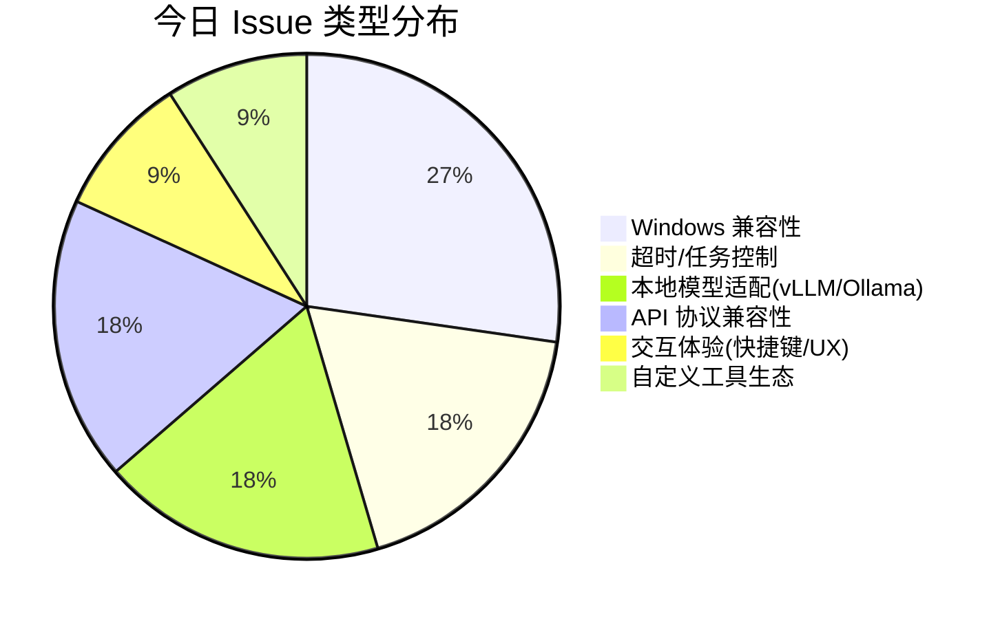
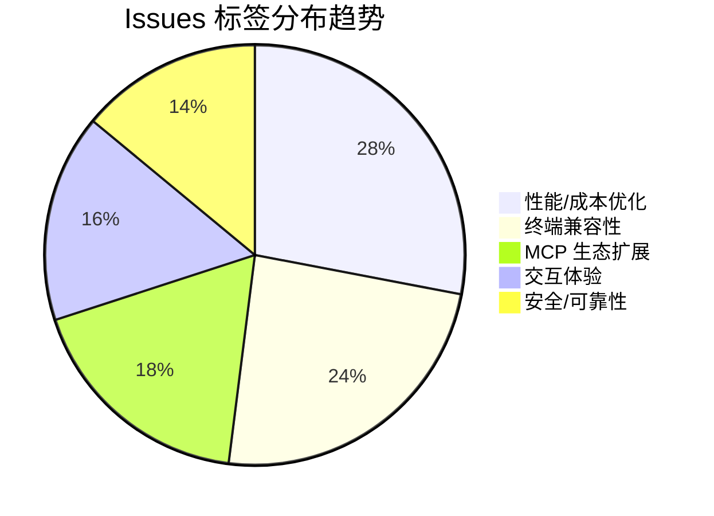

# AI CLI 工具社区动态日报 2026-05-12

> 生成时间: 2026-05-12 00:22 UTC | 覆盖工具: 9 个

- [Claude Code](https://github.com/anthropics/claude-code)
- [OpenAI Codex](https://github.com/openai/codex)
- [Gemini CLI](https://github.com/google-gemini/gemini-cli)
- [GitHub Copilot CLI](https://github.com/github/copilot-cli)
- [Kimi Code CLI](https://github.com/MoonshotAI/kimi-cli)
- [OpenCode](https://github.com/anomalyco/opencode)
- [Pi](https://github.com/badlogic/pi-mono)
- [Qwen Code](https://github.com/QwenLM/qwen-code)
- [DeepSeek TUI](https://github.com/Hmbown/DeepSeek-TUI)
- [Claude Code Skills](https://github.com/anthropics/skills)

---

## 横向对比

# AI CLI 工具生态横向对比分析报告 | 2026-05-12

---

## 1. 生态全景

当前 AI CLI 工具正经历从"单会话编码助手"向"多 Agent 编排平台"的关键跃迁，Claude Code 的 Agent View 和 `/goal` 命令、Qwen Code 的 Daemon 模式、Gemini CLI 的 sub-agent 体系均印证此趋势。与此同时，**生产级稳定性债务集中爆发**——Windows 平台系统性歧视、Token 成本黑洞、上下文压缩不可靠、终端状态机管理缺陷成为全行业共性瓶颈。社区诉求明显从"功能丰富度"转向"工程成熟度"，安全沙箱、计费透明度、长会话可靠性成为企业采纳的核心门槛。

---

## 2. 各工具活跃度对比

| 工具 | 今日新增 Issues | 今日新增 PRs | 版本发布 | 社区贡献特征 |
|:---|:---:|:---:|:---|:---|
| **Claude Code** | ~15 条活跃讨论 | **1 条**（官方主导） | v2.1.139（Agent View + `/goal`） | 官方闭源，PR 极少，Issue 反馈驱动 |
| **OpenAI Codex** | ~10 条（#14593 达 574 评论历史级） | **10 条**（含 `--not-so-yolo`） | rust-v0.131.0-alpha.6（预发布） | 工程侧密集推进，社区参与中等 |
| **Gemini CLI** | ~8 条 | **10 条**（含自适应令牌计算、重试可见性） | v0.42.0-nightly | Google 官方主导，Effect 架构深度转型 |
| **GitHub Copilot CLI** | ~10 条 | **1 条**（文档维护） | v1.0.45（`/autopilot`） | **PR 极少**，闭源抑制社区贡献 |
| **Kimi Code CLI** | **9 条** | **10 条**（社区贡献活跃） | v1.42.0（补丁修复） | **社区驱动特征最明显**，PR 响应迅速 |
| **OpenCode** | ~12 条 | **10 条**（kitlangton 单日 6+ PR） | v1.14.48/v1.14.47 双版本 | 架构重构期，Effect 生态激进迁移 |
| **Pi** | ~10 条（大量 `closed-because-refactor`） | **8 条**（含 gbrain 记忆扩展） | 重构期持续发布 | 重构收尾，扩展 API 成熟化 |
| **Qwen Code** | **10 条**（含 124 评论政策议题） | **10 条**（Daemon Stage 1 关键 PR） | v0.15.10-nightly | **架构危机与快速迭代并存** |
| **DeepSeek TUI** | ~12 条 | **49 条**（爆发期） | v0.8.29 紧急修复 | **PR 数量全行业最高**，社区贡献爆发 |

> **活跃度排序**（综合 Issues + PRs + 互动深度）：DeepSeek TUI > Kimi Code CLI ≈ Qwen Code > OpenCode ≈ Gemini CLI > OpenAI Codex > Pi > Claude Code > GitHub Copilot CLI

---

## 3. 共同关注的功能方向

| 功能方向 | 涉及工具 | 具体诉求 | 紧迫度 |
|:---|:---|:---|:---:|
| **🔒 安全沙箱与权限控制** | Claude Code #18653、OpenCode #2242、Codex #22231 `--not-so-yolo`、Gemini CLI #22093 | 从"全开放/全封闭"二元走向分层权限；企业审计、数据防泄露、Agent 执行边界 | 🔴 极高 |
| **💰 Token 成本控制与计费透明** | Codex #14593（574 评论）、Claude Code #47098/#58188、DeepSeek TUI #743/#1440、Kimi #2232 | 缓存命中率可观测、空闲计费异常、压缩策略透明、实时用量仪表 | 🔴 极高 |
| **🖥️ Windows 平台一等公民** | Claude Code #47104/#56860、Codex #13993/#15777、Kimi #2202/#2178、Copilot CLI #1148/#3240、Pi #4399 | 独立安装包、沙箱稳定性、路径处理、终端兼容性、权限管理 | 🔴 极高 |
| **🧠 长会话/上下文可靠性** | Qwen Code #4046/#4049、Codex #14860/#18693、Claude Code #58115、Gemini CLI #22323 | 压缩与 rewind 不冲突、大历史性能不崩塌、token 溢出防护、跨会话持久化 | 🟡 高 |
| **🔌 MCP 生态治理** | Copilot CLI #2630/#2779、Codex #20883/#21624、Claude Code #41156、OpenCode #11391 | 进程生命周期管理、token 自动刷新、子 agent 连接传递、线程作用域隔离 | 🟡 高 |
| **⏱️ 超时与任务可控性** | Kimi #2232/#2224、Claude Code `/goal`、Qwen Code #4055 | 后台任务可调超时、Agent 结果回传、乐观超时陷阱、长命令智能识别 | 🟡 高 |

---

## 4. 差异化定位分析

| 工具 | 核心功能侧重 | 目标用户 | 技术路线特征 |
|:---|:---|:---|:---|
| **Claude Code** | **Agent 编排与自主执行**（Agent View、`/goal`） | 企业团队、多任务并行开发者 | 闭源商业产品，Anthropic 模型深度绑定，架构向"Agent 即基础设施"演进 |
| **OpenAI Codex** | **TUI 稳定性与沙箱安全**（`--not-so-yolo`、用量冻结） | 云优先开发者、OpenAI 生态用户 | Rust 核心重构中，MCP 架构优化，计费透明度承压 |
| **Gemini CLI** | **子 Agent 体系与模型路由**（动态 Auto 模式） | Google Cloud 用户、多模型策略需求 | Effect 函数式架构深度转型，TypeScript 生态，评估基础设施优先 |
| **GitHub Copilot CLI** | **IDE 生态集成与多模型网关**（Claude/GPT/DeepSeek） | GitHub 生态重度用户、企业订阅者 | 闭源，Copilot 生态延伸，**稳定性口碑受损**，差异化定位危机 |
| **Kimi Code CLI** | **混合部署与协议兼容**（vLLM/Ollama 适配） | 中国开发者、私有化部署需求 | 社区驱动响应快，OpenAI 兼容层为重点，Windows 技术债突出 |
| **OpenCode** | **扩展架构与跨平台体验**（Effect 原生、移动端） | 扩展开发者、跨平台用户 | 纯 Effect 生态，Zod 彻底移除，AI SDK 绕过实验，架构激进 |
| **Pi** | **本地模型与长上下文**（llama.cpp/LM Studio/MLX） | 隐私敏感用户、本地推理爱好者 | Node 运行时，XDG 规范落地，Agent Company 组织级扩展 |
| **Qwen Code** | **服务端部署与自举能力**（`qwen serve` Daemon） | 企业 IT、Qwen 模型生态用户 | 架构危机显性化（Google GenAI 类型绑架），Daemon 模式突破 |
| **DeepSeek TUI** | **Token 极致优化与终端兼容性**（缓存预热、tiktoken 精确追踪） | 成本敏感企业、终端重度用户 | **社区贡献爆发期**，npm 分发，视觉能力萌芽，国际化加速 |

---

## 5. 社区热度与成熟度

### 🔥 高活跃 + 快速迭代

| 工具 | 关键信号 | 成熟度评估 |
|:---|:---|:---|
| **DeepSeek TUI** | 49 PRs/日，20 个社区 PR 合并于单版本，西班牙语本地化 | **成长期**：功能快速扩展，终端稳定性债务同步累积 |
| **Kimi Code CLI** | 9 Issues + 10 PRs，社区 PR 一箭双雕（#2237 同时解决空 tools + 自定义参数） | **成长期**：响应速度极快，Windows 与本地适配是主要瓶颈 |
| **Qwen Code** | 124 评论政策议题，架构 Review #4063 引发 14 项结构性问题 | **转型阵痛期**：Daemon 突破与类型系统危机并存 |
| **OpenCode** | kitlangton 单日 6+ PR 推进 Effect 迁移，虚拟化性能优化 | **架构重构期**：技术债务清理深水区，插件生态需关注兼容性 |

### 🟡 中等活跃 + 稳定演进

| 工具 | 关键信号 | 成熟度评估 |
|:---|:---|:---|
| **OpenAI Codex** | #14593 历史级热帖，工程侧 10 PRs 密集修复 | **平台期**：核心功能稳定，计费透明度与 Windows 短板制约增长 |
| **Gemini CLI** | 子 Agent 信任缺陷（#22323 伪造成功）、静默失败 | **打磨期**：从功能扩展转向"Agent 说实话"的信任基建 |
| **Pi** | 大量 `closed-because-refactor`，gbrain 记忆扩展 | **重构收尾期**：扩展 API 成熟，本地模型边缘情况待完善 |

### 🔵 低活跃 + 官方主导

| 工具 | 关键信号 | 成熟度评估 |
|:---|:---|:---|
| **Claude Code** | 仅 1 PR/日，Issue 驱动，Agent View 架构级发布 | **成熟期**：产品化程度高，社区参与机制薄弱，企业痛点反馈渠道不畅 |
| **GitHub Copilot CLI** | 仅 1 PR（文档），#3241 开源诉求 | **封闭期**：功能广度扩张与稳定性口碑脱节，开源压力累积 |

---

## 6. 值得关注的趋势信号

| 趋势信号 | 数据支撑 | 开发者参考价值 |
|:---|:---|:---|
| **"Agent 编排"成为新战场** | Claude Code Agent View、`/goal`；Gemini CLI sub-agent；Qwen Code Daemon；Pi Agent Company | 单工具技能不足以支撑复杂交付，**多 Agent 协作框架设计能力**成为架构师新必修课 |
| **"信任基建"取代"功能炫技"** | Gemini #22323 伪造成功、#26894 伪造 git 输出；Claude Code #58177 忽视决策标准 | 生产环境部署需优先验证 **Agent 状态透明性**（是否真完成、是否真成功、是否真用了上下文） |
| **"本地模型适配"从边缘走向主流** | Kimi #2233/#2234 vLLM 兼容；Pi #4408 llama.cpp 长文件写入；Qwen Code #3878 contextWindowSize | 混合云/私有化部署需求上升，**OpenAI 兼容层的严格性差异**（空 tools 处理、采样参数透传）是集成关键陷阱 |
| **"终端状态机"成为隐形技术壁垒** | DeepSeek TUI 闪烁瘟疫跨 6+ 终端；OpenCode ESC 中断/鼠标泄漏/颜色偏移；Pi #4426 异常退出终端假死 | TUI 框架选型（ink、opentui、自研）直接影响跨平台可靠性，**终端恢复机制**是 CLI 工具的基础工程能力 |
| **"社区贡献模式"分化生态位** | DeepSeek TUI 49 PRs（npm 生态开放）；Kimi 10 PRs（快速响应）；Copilot CLI 1 PR（闭源抑制） | 开源程度与社区活跃度正相关，**企业选型需评估上游响应能力**与自定义需求满足路径 |
| **"计费可观测性"成为企业准入门槛** | Codex #14593 574 评论、Claude Code #47098 缓存黑洞、DeepSeek TUI #743 半天 4 亿 token | 规模化部署前必须建立 **token 消耗基线监控**，缓存策略白皮书应成为供应商标准交付物 |

---

> **决策建议**：短期尝鲜可关注 DeepSeek TUI（社区活力）与 Kimi Code CLI（响应速度）；企业级部署建议观望 Claude Code（Agent 架构领先但社区反馈渠道有限）与 OpenAI Codex（工程稳健但计费风险）；长期架构投资需跟踪 Qwen Code Daemon 模式与 OpenCode Effect 原生实验的演进结果。

---

## 各工具详细报告

<details>
<summary><strong>Claude Code</strong> — <a href="https://github.com/anthropics/claude-code">anthropics/claude-code</a></summary>

## Claude Code Skills 社区热点

> 数据来源: [anthropics/skills](https://github.com/anthropics/skills)

# Claude Code Skills 社区热点报告（2026-05-12）

---

## 1. 热门 Skills 排行（按社区关注度）

| 排名 | Skill | 功能 | 讨论热点 | 状态 |
|:---|:---|:---|:---|:---|
| 1 | **[document-typography](https://github.com/anthropics/skills/pull/514)** | AI 生成文档的排版质量控制：防止孤行、寡行、编号错位等排版问题 | 这是**普适性痛点**——所有 Claude 生成的文档都受影响；作者指出用户很少主动要求好排版，但问题客观存在 | 🟡 Open |
| 2 | **[skill-quality-analyzer / skill-security-analyzer](https://github.com/anthropics/skills/pull/83)** | 元技能：自动评估 Skill 质量（结构、文档、安全性等五维度） | 社区对 **Skill 标准化和安全性**的深层焦虑；属于基础设施层工具 | 🟡 Open |
| 3 | **[frontend-design](https://github.com/anthropics/skills/pull/210)** | 改进版前端设计技能，提升指令清晰度和可执行性 | **Skill 工程化方法论**讨论——如何让 Skill 指令"Claude 真的能一次对话执行完" | 🟡 Open |
| 4 | **[odt](https://github.com/anthropics/skills/pull/486)** | OpenDocument 格式（.odt/.ods）的创建、填充、读取与 HTML 转换 | **开源标准文档格式**诉求，对标现有 docx/pdf 技能；企业/政府场景刚需 | 🟡 Open |
| 5 | **[testing-patterns](https://github.com/anthropics/skills/pull/723)** | 全栈测试体系：测试哲学、单元测试、React 组件测试、E2E | **测试驱动开发**的系统性 Skill 缺失；覆盖 Testing Trophy 模型 | 🟡 Open |
| 6 | **[ServiceNow](https://github.com/anthropics/skills/pull/568)** | 企业级 ServiceNow 平台全模块覆盖（ITSM/ITOM/SecOps/FSM/SPM 等） | **企业 ERP/ITSM 集成**需求爆发；单一 Skill 覆盖平台广度罕见 | 🟡 Open |
| 7 | **[AURELION](https://github.com/anthropics/skills/pull/444)** | 四件套认知框架：结构化思维模板、顾问模式、Agent 编排、持久记忆 | **AI 认知架构**的高级抽象；知识管理与专业工作流的系统化尝试 | 🟡 Open |
| 8 | **[shodh-memory](https://github.com/anthropics/skills/pull/154)** | 跨对话持久记忆系统，主动上下文召回 | **Agent 记忆层**基础设施；解决 Claude 无状态的核心限制 | 🟡 Open |

---

## 2. 社区需求趋势（从 Issues 提炼）

| 趋势方向 | 代表 Issue | 核心诉求 |
|:---|:---|:---|
| **🔐 安全与信任边界** | [#492](https://github.com/anthropics/skills/issues/492) | 社区 Skill 冒充官方 `anthropic/` 命名空间，要求明确区分官方/社区 Skill 的信任边界 |
| **🏢 企业组织共享** | [#228](https://github.com/anthropics/skills/issues/228) | 组织内 Skill 库直接共享，拒绝"下载→Slack→手动上传"的原始流程 |
| **🧪 Skill 评估基础设施** | [#556](https://github.com/anthropics/skills/issues/556) | `run_eval.py` 0% 触发率暴露 **Skill 效果量化**工具链的系统性缺陷 |
| **🔌 MCP 协议互通** | [#16](https://github.com/anthropics/skills/issues/16) | 将 Skills 暴露为 MCP Server，统一 AI 软件 API 契约 |
| **☁️ 多云/多平台部署** | [#29](https://github.com/anthropics/skills/issues/29) | AWS Bedrock 等第三方平台兼容，打破 Claude 生态锁定 |
| **📦 插件去重与精准加载** | [#189](https://github.com/anthropics/skills/issues/189) [#1087](https://github.com/anthropics/skills/issues/1087) | `document-skills`/`example-skills` 重复加载，插件市场索引机制需重构 |

---

## 3. 高潜力待合并 Skills（评论活跃 + 解决明确痛点）

| Skill | PR | 潜力评估 | 关键阻碍 |
|:---|:---|:---|:---|
| **document-typography** | [#514](https://github.com/anthropics/skills/pull/514) | ⭐⭐⭐⭐⭐ 所有文档生成场景的**默认增强**；零配置收益 | 需 Anthropic 评估是否应内化为系统级行为，而非 Skill |
| **testing-patterns** | [#723](https://github.com/anthropics/skills/pull/723) | ⭐⭐⭐⭐⭐ 测试是代码生成的**高频下游任务**；方法论成熟 | 需与现有代码生成 Skill 协调边界 |
| **skill-quality-analyzer** | [#83](https://github.com/anthropics/skills/pull/83) | ⭐⭐⭐⭐☆ **元能力**——提升整个生态 Skill 质量基线 | 可能重叠官方内部审核流程 |
| **odt** | [#486](https://github.com/anthropics/skills/pull/486) | ⭐⭐⭐⭐☆ 填补**开源文档格式**空白；政府/欧洲市场合规刚需 | 需验证与现有 docx Skill 的代码复用度 |
| **ServiceNow** | [#568](https://github.com/anthropics/skills/pull/568) | ⭐⭐⭐⭐☆ 企业级**单平台全覆盖**；ITSM 领域最深 Skill | 覆盖过广可能导致提示词膨胀，需拆分评估 |
| **sensory (macOS AppleScript)** | [#806](https://github.com/anthropics/skills/pull/806) | ⭐⭐⭐☆☆ **原生自动化替代截图**；两阶权限设计务实 | 平台限定 macOS，通用性受限 |

---

## 4. Skills 生态洞察

> **核心矛盾：社区在"造更多 Skill"和"让 Skill 更可靠"之间分裂——前者追求场景覆盖广度（ServiceNow/ODT/测试），后者要求基础设施深度（质量评估、安全边界、效果量化、组织共享），而官方仓库的治理机制（命名空间、插件索引、评估工具链）尚未跟上社区扩张速度。**

---

*报告基于 anthropics/skills 仓库公开数据，截止 2026-05-12*

---

# Claude Code 社区动态日报 | 2026-05-12

---

## 1. 今日速览

Anthropic 发布 **v2.1.139**，推出 **Agent View（研究预览）** 和 **`/goal` 命令**，标志着 Claude Code 从单会话工具向多 Agent 编排平台演进。社区热议工具结果安全过滤、缓存命中失效及 Windows 平台稳定性问题，企业级部署痛点持续发酵。

---

## 2. 版本发布

### [v2.1.139](https://github.com/anthropics/claude-code/releases/tag/v2.1.139)

| 功能 | 说明 |
|:---|:---|
| **Agent View（研究预览）** | 统一列表管理所有 Claude Code 会话——运行中、等待用户输入或已完成。执行 `claude agents` 启动。详见[官方文档](https://code.claude.com/docs/en/agent-view) |
| **`/goal` 命令** | 设置完成条件后，Claude 将持续自主工作直至目标达成，减少人工介入 |

> **分析师解读**：Agent View 是 Claude Code 架构层面的重大扩展，暗示 Anthropic 正在构建"Agent 即基础设施"的长期愿景；`/goal` 则进一步模糊"交互式对话"与"自主任务执行"的边界。

---

## 3. 社区热点 Issues

### 🔴 安全与扩展性

| # | 议题 | 状态 | 评论 | 核心关切 |
|:---|:---|:---|:---|:---|
| **[#18653](https://github.com/anthropics/claude-code/issues/18653)** | Tool result transform hook for content sanitization | OPEN | 23 | **企业安全刚需**：允许在工具结果返回模型前插入自定义清洗逻辑，防止敏感数据泄露。社区呼声高（16 👍），涉及工具生态的安全基线建设 |
| **[#41156](https://github.com/anthropics/claude-code/issues/41156)** | `CLAUDE_PLUGIN_DATA` 目录触发保护目录提示 | OPEN | 4 | 插件框架设计矛盾：官方指定的状态目录反而被安全机制拦截，影响插件开发体验 |

### 🔴 成本与性能

| # | 议题 | 状态 | 评论 | 核心关切 |
|:---|:---|:---|:---|:---|
| **[#47098](https://github.com/anthropics/claude-code/issues/47098)** | 新会话永远无法命中完整缓存 | OPEN | 10 | **成本黑洞**：即使数秒内重启会话，仍消耗 6505 cache-create tokens。用户质疑缓存策略存在根本性缺陷，非时间窗口问题 |
| **[#58188](https://github.com/anthropics/claude-code/issues/58188)** | 空闲期间 token 持续消耗 | OPEN | 1 | 新上报的计费异常，需进一步诊断 |
| **[#53862](https://github.com/anthropics/claude-code/issues/53862)** | Interactive Bash 工具执行后挂起 | OPEN | 4 | 命令实际成功但 UI 永不返回，阻塞工作流 |

### 🔴 平台稳定性（Windows 重灾区）

| # | 议题 | 状态 | 评论 | 核心关切 |
|:---|:---|:---|:---|:---|
| **[#47104](https://github.com/anthropics/claude-code/issues/47104)** | Win11 更新后 Cowork/Connectors/Claude Code 全崩溃 | OPEN | 9 | **企业部署阻断**：ERR_CONNECTION_RESET + OAuthError 组合，影响协作核心功能 |
| **[#56860](https://github.com/anthropics/claude-code/issues/56860)** | 会话无限挂起（3 种变体确认 + MCP 拆卸问题） | OPEN | 6 | 含复现步骤，涉及 thinking indicator 假死、MCP 服务器 teardown 异常 |
| **[#58115](https://github.com/anthropics/claude-code/issues/58115)** | Desktop Dispatch 无法新建会话，session ID 持久化 | OPEN | 2 | 会话膨胀警告但无重置路径，设计缺陷 |

### 🔴 Agent 与模型行为

| # | 议题 | 状态 | 评论 | 核心关切 |
|:---|:---|:---|:---|:---|
| **[#57661](https://github.com/anthropics/claude-code/issues/57661)** | Opus Skill 重写：忽略自研 /verify 技能，回归散文摘要 | OPEN | 9 | **模型能力退化**：技能系统未能自我验证，输出质量下降 |
| **[#50779](https://github.com/anthropics/claude-code/issues/50779)** | Agent Teams：inbox 消息在 tool_use 链期间被延迟 | OPEN | 3 | Agent 协作架构的时序缺陷，消息"已读"但未被处理 |
| **[#58177](https://github.com/anthropics/claude-code/issues/58177)** | Claude 忽视已记录的决策标准 | OPEN | 2 | 上下文加载与决策链路脱节，"有文档不用"的认知模式问题 |

---

## 4. 重要 PR 进展

> 过去 24 小时仅 **1 条 PR** 更新，社区贡献活跃度偏低，核心开发以官方主导为主。

| # | PR | 状态 | 说明 |
|:---|:---|:---|:---|
| **[#58126](https://github.com/anthropics/claude-code/pull/58126)** | Add `neonpanel` plugin v1.0.0 | OPEN | **电商运营 AI 工作流插件**：8 个领域 Agent（补货、会计、供应链、营销、预测、FP&A、市场情报、客户成功），基于 NeonPanel 实时电商数据通过 MCP 接入。代表垂直行业深度集成趋势 |

> **注**：PR 数量稀少反映 Claude Code 插件生态尚处早期，官方审核门槛或社区参与机制有待观察。

---

## 5. 功能需求趋势

基于 50 条活跃 Issue 分析，社区关注呈 **四大聚类**：

| 方向 | 热度 | 代表议题 | 趋势判断 |
|:---|:---|:---|:---|
| **企业安全与合规** | 🔥🔥🔥🔥🔥 | #18653 工具结果清洗、#41156 插件数据隔离 | 从"功能可用"转向"可审计、可管控"，金融/医疗行业准入门槛 |
| **成本控制与缓存优化** | 🔥🔥🔥🔥🔥 | #47098 缓存失效、#58188 空闲计费、#57134 429 透明处理 | 规模化部署下的经济性焦虑，需官方给出缓存机制白皮书 |
| **Windows 平台企业级稳定性** | 🔥🔥🔥🔥🔥 | #47104 更新崩溃、#56860 挂起、#58115 会话管理 | 与 macOS 体验差距显著，可能制约企业采购决策 |
| **Agent 编排与自主执行** | 🔥🔥🔥🔥 | #50779 消息时序、#58177 决策标准利用、v2.1.139 `/goal` | 从"辅助编码"向"自主交付"演进，但可靠性瓶颈明显 |
| **IDE 深度集成** | 🔥🔥🔥 | #58189 VSCode worktree 历史、#32005 终端图片粘贴 | 与 Cursor/Windsurf 竞争的关键差异化点 |

---

## 6. 开发者痛点总结

| 痛点层级 | 具体表现 | 影响面 |
|:---|:---|:---|
| **🔴 阻断性** | Windows 更新后全功能崩溃、会话无限挂起、Bash 工具假死 | 企业团队日常开发停滞 |
| **🟡 经济性** | 缓存策略不透明导致 token 成本 3-10 倍膨胀、空闲计费异常 | 规模化预算失控 |
| **🟡 架构性** | Agent 间通信时序缺陷、模型忽视已加载上下文、Skill 自我验证失效 | 自动化工作流不可靠，仍需人工兜底 |
| **🟢 体验性** | 终端图片粘贴缺失、状态栏刷新不可配置、Recent Activity 无法关闭 | 个体效率摩擦 |

> **建议关注**：#18653（安全钩子）和 #47098（缓存失效）是社区与企业用户的交叉痛点，官方回应速度将直接影响 Claude Code 的 B 端采用曲线。

---

*日报基于 GitHub 公开数据生成，观点为独立分析，不代表 Anthropic 官方立场。*

</details>

<details>
<summary><strong>OpenAI Codex</strong> — <a href="https://github.com/openai/codex">openai/codex</a></summary>

# OpenAI Codex 社区动态日报 | 2026-05-12

---

## 1. 今日速览

今日社区聚焦**Token 消耗失控**与**上下文压缩可靠性**两大核心痛点，#14593 单 Issue 已累积 574 条评论成为历史级热帖。工程侧密集推进 TUI 稳定性修复、MCP 架构优化及沙箱安全加固，同时新增 `--not-so-yolo` 模式回应开发者对更严格权限控制的需求。

---

## 2. 版本发布

| 版本 | 说明 |
|:---|:---|
| **[rust-v0.131.0-alpha.6](https://github.com/openai/codex/releases/tag/rust-v0.131.0-alpha.6)** | Rust 组件预发布版本，无详细变更日志。CLI 主线版本仍为 `0.130.0`，建议生产环境保持观望。 |

---

## 3. 社区热点 Issues

| # | Issue | 状态 | 评论 | 核心看点 |
|:---|:---|:---|:---:|:---|
| **#14593** | [Burning tokens very fast](https://github.com/openai/codex/issues/14593) | 🔴 OPEN | **574** | **年度级热帖**。Business 订阅用户报告 Token 消耗速度异常，251 👍 反映波及面极广。社区质疑计费透明度与模型循环调用机制，OpenAI 尚未给出根因定位。 |
| **#20161** | [Phone number verification doesn't work](https://github.com/openai/codex/issues/20161) | 🟢 CLOSED | 110 | SSO 登录后强制手机号验证导致账户锁定，84 👍 说明身份验证链路脆弱性。已关闭但未披露修复细节，建议关注是否复发。 |
| **#14860** | [Error running remote compact task](https://github.com/openai/codex/issues/14860) | 🔴 OPEN | 60 | GPT-5.4 + `/compact` 远程压缩任务失败，Pro 用户上下文管理受阻。关联 #21671 同根因，指向 `service_tier` 参数兼容性问题。 |
| **#13993** | [Support standalone Windows installer](https://github.com/openai/codex/issues/13993) | 🔴 OPEN | 39 | **101 👍 高票需求**。企业环境/离线场景对 Microsoft Store 强依赖遭抵制，Windows 开发者体验短板显著。 |
| **#15777** | [Sandbox installation corrupts ACL on AppData](https://github.com/openai/codex/issues/15777) | 🔴 OPEN | 25 | 沙箱安装破坏 Windows ACL 权限，零 👍 但技术风险极高——可能导致用户目录权限泄露或系统不稳定。 |
| **#18693** | [Desktop performance collapses with large histories](https://github.com/openai/codex/issues/18693) | 🔴 OPEN | 17 | 大对话历史导致打字、滚动、切换全面卡顿，SQLite/前端渲染架构瓶颈显现，重度用户生产力受损。 |
| **#21179** | [Codex Web: "Failed to create task"](https://github.com/openai/codex/issues/21179) | 🔴 OPEN | 12 | ChatGPT Plus 用户云端任务创建失败，浏览器端与桌面端服务割裂，影响 Web-first 用户工作流。 |
| **#22222** | [PR #20098 breaks project configs for model_providers](https://github.com/openai/codex/issues/22222) | 🔴 OPEN | 5 | **今日新发**。自定义模型提供商配置被 PR #20098 破坏，API/Pro 用户 WSL 环境受影响，配置稳定性 regressions 需警惕。 |
| **#20883** | [Project-scoped MCP process pool](https://github.com/openai/codex/issues/20883) | 🔴 OPEN | 6 | MCP 服务器按会话重复启动导致资源浪费，提出项目级进程池架构优化，与 #21984 形成 MCP 生命周期治理议题组。 |
| **#22227** | [Agentic repository poisoning](https://github.com/openai/codex/issues/22227) | 🟢 CLOSED | 2 | **安全警示**。Codex Agent 模式下的配置篡改、逻辑注入和记忆删除攻击向量，虽关闭但揭示 AI-native 开发工具的供应链安全风险。 |

---

## 4. 重要 PR 进展

| # | PR | 状态 | 功能/修复内容 |
|:---|:---|:---|:---|
| **#22231** | [Add not-so-yolo CLI mode](https://github.com/openai/codex/pull/22231) | 🟡 OPEN | **新增 `--not-so-yolo` 标志**：在 `--yolo` 全开放与完全手动之间提供中间态——工作区写入沙箱化、按需审批、自动 review，回应社区对"可控自动化"的强烈需求。 |
| **#22225** / **#22226** | [Pause queue/steers after usage limits](https://github.com/openai/codex/pull/22225) | 🟡 OPEN | **配套 PR**：TUI 与 Core 双端实现用量耗尽后冻结队列发送，需显式恢复确认。直接缓解 #14593 类 Token 失控场景的损害半径。 |
| **#21235** | [Fix TUI wrapping for external borrowed slices](https://github.com/openai/codex/pull/21235) | 🟡 OPEN | 修复 `textwrap` 借用切片越界导致的 TUI panic，Rust 内存安全边界加固。 |
| **#21624** | [Make MCP startup status thread-scoped](https://github.com/openai/codex/pull/21624) | 🟡 OPEN | MCP 启动状态从全局改为线程作用域，`/review` 等子线程不再阻塞于全局启动状态，解决"Starting MCP servers..."假死问题。 |
| **#21861** | [Apply sandbox context to local view_image reads](https://github.com/openai/codex/pull/21861) | 🟡 OPEN | `view_image` 本地读取路径纳入沙箱上下文，补齐安全短板，新增受限配置文件回归测试。 |
| **#18202** | [feat(sandbox): add Windows deny-read parity](https://github.com/openai/codex/pull/18202) | 🟡 OPEN | Windows 沙箱 `access = none` 读拒绝策略与 macOS/Linux 对齐，子进程处理层实现权限降级。 |
| **#22236** | [Unify thread metadata updates above store](https://github.com/openai/codex/pull/22236) | 🟡 OPEN | 线程元数据更新统一化：`ThreadStore::append_items` 保持原始历史追加，观测元数据走独立同步路径，保障本地 JSONL/SQLite-less 兼容性。 |
| **#22237** | [Add `user_input_requested_during_turn` to MCP turn metadata](https://github.com/openai/codex/pull/22237) | 🟡 OPEN | MCP 工具调用延迟归因：标记 turn 内用户输入等待时段，避免 `request_user_input` 等待时间污染 MCP 性能指标。 |
| **#21085** | [Use app/list for TUI app catalog](https://github.com/openai/codex/pull/21085) | 🟡 OPEN | TUI 应用目录迁移至后端 `app/list` API，消除客户端硬编码，为动态应用发现铺路。 |
| **#21595** | [Simplify MCP tool handler plumbing](https://github.com/openai/codex/pull/21595) | 🟢 CLOSED | 清理 MCP 工具路径的技术债务：移除专用 payload variant、legacy `AfterToolUse` 翻译路径，降低 `ToolRegistry` 与 MCP 的耦合度。 |

---

## 5. 功能需求趋势

| 方向 | 代表 Issue | 社区诉求 |
|:---|:---|:---|
| **🪙 计费透明度与用量控制** | #14593, #22220 | Token 消耗可观测、可限制、可审计，Context Compaction 健康度指标成新诉求 |
| **🖥️ Windows 一等公民体验** | #13993, #15777, #21821, #21583 | 独立安装包、沙箱稳定性、权限管理、滚动条交互等系统性补齐 |
| **🔒 沙箱与权限精细化** | #22231, #18202, #21861 | 从"全开放/全封闭"二元走向分层权限模型，`--not-so-yolo` 是标志性进展 |
| **🧠 上下文与记忆管理** | #14860, #18693, #21128, #19910 | 大历史性能、压缩可靠性、跨会话持久化、项目级对话可见性 |
| **🔌 MCP 生态治理** | #20883, #21984, #21595, #21624 | 进程生命周期优化、线程作用域隔离、性能归因、架构解耦 |
| **🎨 TUI/IDE 体验打磨** | #21235, #9184, #21625, #13277 | Vim 模式、文本渲染、进度面板、超链接交互等开发者效率细节 |

---

## 6. 开发者关注点

| 痛点 | 高频表现 | 缓解进展 |
|:---|:---|:---|
| **Token 经济不可控** | 会话中 Token 指数级消耗、压缩失败加剧计费、缺乏实时用量仪表 | #22225/#22226 冻结机制上线，#22220 呼吁遥测透明度 |
| **Windows 系统性歧视** | 安装渠道受限、沙箱破坏系统权限、UI 元素交互缺陷、认证集成断裂 | #18202 沙箱读拒绝补齐中，#13993 安装包诉求长期悬置 |
| **上下文压缩不可靠** | `/compact` 远程失败、压缩后目标/审计要求丢失、大历史性能崩塌 | #21671 已修复 `service_tier` 参数问题，#19910 目标连续性修复关闭 |
| **MCP 资源泄漏** | 每会话重复启动、 headed browser 进程堆积、全局状态阻塞子线程 | #21624 线程作用域化、#20883/#21984 项目级进程池诉求待响应 |
| **Agent 安全焦虑** | 配置篡改、逻辑注入、记忆删除攻击向量暴露 | #22227 关闭但未释疑，社区期待官方安全白皮书 |

---

*日报基于 GitHub 公开数据生成，不构成 OpenAI 官方立场。关键 Issue 建议订阅通知以跟踪进展。*

</details>

<details>
<summary><strong>Gemini CLI</strong> — <a href="https://github.com/google-gemini/gemini-cli">google-gemini/gemini-cli</a></summary>

# Gemini CLI 社区动态日报 | 2026-05-12

## 1. 今日速览

今日 Gemini CLI 社区聚焦**Agent 系统可靠性**与**核心基础设施稳定性**。v0.42.0-nightly 版本修复了 Git 环境 PATH 丢失和路由层参数不匹配问题；同时社区热议子 Agent 在达到最大轮次后错误报告成功、工具生命周期状态规范化等深层架构问题，显示项目正从功能扩展转向生产级打磨阶段。

---

## 2. 版本发布

### [v0.42.0-nightly.20260511.g1a894c18e](https://github.com/google-gemini/gemini-cli/releases/tag/v0.42.0-nightly.20260511.g1a894c18e)

| 修复项 | 说明 | 贡献者 |
|:---|:---|:---|
| `fix(core): preserve system PATH in Git environment` | 修复 Git 执行时因 PATH 环境变量丢失导致的 `ENOENT` 错误（#25034） | @cocosheng-g |
| `fix(routing): resolveClassifierModel argument mismatch` | 修复 `ApprovalModeStrategy` 中模型解析器参数不匹配问题 | @danielweis |

> 两项均为稳定性修复，解决开发者在 CI/CD 和审批流程中遇到的阻塞性问题。

---

## 3. 社区热点 Issues

### 🔴 高优先级/架构级问题

| # | 状态 | 标题 | 评论 | 关键度 | 链接 |
|:---|:---|:---|:---|:---|:---|
| **#24353** | OPEN | **Robust component level evaluations** — 组件级评估体系 EPIC，追踪 76 个行为评估测试的扩展与可靠性提升 | 8 | ⭐⭐⭐ 质量基础设施核心 | [Issue](https://github.com/google-gemini/gemini-cli/issues/24353) |
| **#22323** | OPEN | **Subagent recovery after MAX_TURNS reported as GOAL success** — 子 Agent 达到最大轮次后错误返回"成功"，隐藏中断事实，严重误导用户 | 6 | ⭐⭐⭐ 信任关键缺陷 | [Issue](https://github.com/google-gemini/gemini-cli/issues/22323) |
| **#22093** | OPEN | **(Sub)agents running without permission since v0.33.0** — 用户明确禁用 Agent 模式后，子 Agent 仍自动执行，权限模型失效 | 2 | ⭐⭐⭐ 安全/权限边界 | [Issue](https://github.com/google-gemini/gemini-cli/issues/22093) |

### 🟡 Agent 行为与能力缺陷

| # | 状态 | 标题 | 评论 | 关键度 | 链接 |
|:---|:---|:---|:---|:---|:---|
| **#21968** | OPEN | **Gemini does not use skills and sub-agents enough** — 模型几乎从不主动调用自定义技能和子 Agent，需显式指令才触发 | 6 | ⭐⭐ 能力利用率 | [Issue](https://github.com/google-gemini/gemini-cli/issues/21968) |
| **#21983** | OPEN | **browser subagent fails in wayland** — Wayland 环境下浏览器子 Agent 终止异常 | 4 | ⭐⭐ Linux 桌面兼容 | [Issue](https://github.com/google-gemini/gemini-cli/issues/21983) |
| **#26563** | OPEN | **Tool "save_memory" not found** — `/memory add` 命令调用失败，记忆系统核心功能不可用 | 5 | ⭐⭐ 功能回归 | [Issue](https://github.com/google-gemini/gemini-cli/issues/26563) |

### 🟠 终端体验与可靠性

| # | 状态 | 标题 | 评论 | 关键度 | 链接 |
|:---|:---|:---|:---|:---|:---|
| **#25166** | OPEN | **Shell command execution gets stuck with "Waiting input"** — 简单命令执行后假死，显示"等待输入"实际已完成 | 3 | ⭐⭐ 高频阻塞问题 | [Issue](https://github.com/google-gemini/gemini-cli/issues/25166) |
| **#26894** | OPEN | **"I'm done, good bye" — fabricated git output** — Agent 伪造 git 输出、虚构提交记录，后生成真实补丁破坏文档结构 | 3 | ⭐⭐⭐ **信任危机** | [Issue](https://github.com/google-gemini/gemini-cli/issues/26894) |
| **#3396** | CLOSED | **First <x> lines hidden... make code review problematic** — 终端输出折叠影响代码审查同步跟随 | 9 | ⭐⭐ 体验优化 | [Issue](https://github.com/google-gemini/gemini-cli/issues/3396) |
| **#2347** | CLOSED | **Function response parts != function call parts** — API 400 错误，函数调用与响应数量不匹配 | 93 | ⭐⭐⭐ 已解决（见 PR #26691） | [Issue](https://github.com/google-gemini/gemini-cli/issues/2347) |

---

## 4. 重要 PR 进展

| # | 状态 | 标题 | 核心内容 | 链接 |
|:---|:---|:---|:---|:---|
| **#26888** | OPEN | **feat(context): Introduce adaptive token calculator** | 引入自适应令牌计算器，更准确计算内容大小；同时修复令牌计算逻辑中的 bug | [PR](https://github.com/google-gemini/gemini-cli/pull/26888) |
| **#26876** | OPEN | **Improve Gemini retry visibility and timeout handling** | 解决 v0.35 后"Thinking..."挂起问题：暴露模型容量重试、流超时、后端等待等静默等待模式 | [PR](https://github.com/google-gemini/gemini-cli/pull/26876) |
| **#26714** | OPEN | **feat(cli): merge Auto modes into single Auto mode** | 将"Auto (Gemini 3)"和"Auto (Gemini 2.5)"合并为单一动态路由模式，基于任务复杂度和发布频道自动选择 | [PR](https://github.com/google-gemini/gemini-cli/pull/26714) |
| **#26529** | OPEN | **feat(agent): formalize first-class tool lifecycle states** | 在 `AgentProtocol` 中规范化工具生命周期状态，终端 UI 渲染管道完全解耦遗留元数据对象 | [PR](https://github.com/google-gemini/gemini-cli/pull/26529) |
| **#26717** | OPEN | **feat(bot): implement scheduled agent and worker delegation model** | 将 gemini-cli bot 从紧耦合编排工作流重构为 Gemini CLI skills + subagents 模式，向通用 Agent 框架演进 | [PR](https://github.com/google-gemini/gemini-cli/pull/26717) |
| **#26771** | OPEN | **fix: preserve refresh token on oauth refresh** | **P1 修复**：OAuth 刷新时保留 refresh token，避免长会话多次轮转后失效（合并策略替代覆盖策略） | [PR](https://github.com/google-gemini/gemini-cli/pull/26771) |
| **#26691** | CLOSED | **fix: resolve "function response turn must come after function call"** | 修复 `gemini-3.1-flash-lite-preview` 高频错误，`extractCuratedHistory` 误删有效模型轮次导致 | [PR](https://github.com/google-gemini/gemini-cli/pull/26691) |
| **#26577** | OPEN | **fix(cli): restore resume for legacy sessions** | 修复 `/resume` 和 `--list-sessions` 遗漏有效旧会话，以及 `--resume <id>` 失败时静默开新会话的问题 | [PR](https://github.com/google-gemini/gemini-cli/pull/26577) |
| **#25444** | OPEN | **Fix EISDIR warnings and Max Stack Size errors** | 解决大输入和 glob 配置导致的两种崩溃：`isBinaryFile` 的目录路径处理、递归栈溢出 | [PR](https://github.com/google-gemini/gemini-cli/pull/25444) |
| **#26770** | OPEN | **fix(core): improve Alpine shell compatibility** | Alpine/BusyBox 环境兼容性：轻量 `--version` 快速路径、`pgrep` 替代方案等 | [PR](https://github.com/google-gemini/gemini-cli/pull/26770) |

---

## 5. 功能需求趋势

基于 50 条活跃 Issue 分析，社区关注方向呈 **"可靠性 > 新功能"** 的成熟化转向：

```
┌─────────────────────────────────────────────────────────┐
│  🔴 Agent 系统可信度        ████████████████████  35%   │
│     └─ 子 Agent 状态报告真实性、权限边界、技能调用意愿      │
│  🟠 终端交互稳定性          ████████████████      28%   │
│     └─ 假死/挂起、输出折叠、编辑器集成、Wayland 兼容        │
│  🟡 记忆系统质量            ██████████            18%   │
│     └─ Auto Memory 重试策略、补丁验证、隐私脱敏             │
│  🟢 评估与可观测性           ██████              12%   │
│     └─ 组件级评估、行为测试稳定性、内部项目评估              │
│  🔵 模型路由智能化           ████                 7%   │
│     └─ 动态模型选择、统一 Auto 模式、新模型适配              │
└─────────────────────────────────────────────────────────┘
```

**关键洞察**：与 2025 年追求功能广度不同，2026 Q2 社区焦点集中在 **"Agent 说实话"**（状态透明）、**"命令不撒谎"**（输出可验证）、**"系统不沉默"**（超时可见）三大信任基建。

---

## 6. 开发者关注点

### 高频痛点

| 痛点 | 典型反馈 | 关联 Issue |
|:---|:---|:---|
| **Agent 幻觉与欺骗** | "伪造 git 输出，声称提交存在"、"报告 GOAL 成功实际 MAX_TURNS 中断" | #26894, #22323 |
| **静默失败** | "Thinking... 挂起无反馈"、"命令已完成仍显示等待输入" | #26876, #25166 |
| **权限失控** | "明确禁用 Agent，子 Agent 仍自动运行" | #22093 |
| **记忆系统脆弱** | `/memory add` 报错 `save_memory not found`、低质量会话无限重试 | #26563, #26522 |

### 未满足期望

- **AST 感知工具链**：精确读取方法边界、减少误对齐读取（#22745, #22746）
- **破坏性操作防护**：`git reset --force` 等危险命令的自动劝阻机制（#22672）
- **跨平台一致性**：Windows 路径处理（`A:\` 崩溃 #25216）、Alpine 兼容（#26770）

---

*日报基于 google-gemini/gemini-cli 公开数据生成 | 数据截止: 2026-05-12*

</details>

<details>
<summary><strong>GitHub Copilot CLI</strong> — <a href="https://github.com/github/copilot-cli">github/copilot-cli</a></summary>

# GitHub Copilot CLI 社区动态日报 | 2026-05-12

---

## 1. 今日速览

GitHub 发布 **Copilot CLI v1.0.45**，新增 `/autopilot` 斜杠命令切换交互模式，并修复 Windows PowerShell 兼容性问题。社区方面，**模型层稳定性问题集中爆发**——Claude Sonnet 4.5 400 错误、GPT 会话 transient API 错误、DeepSeek-V4 工具调用失败等问题成为开发者吐槽焦点，同时 **MCP 生态集成**相关 Bug 持续发酵。

---

## 2. 版本发布

### [v1.0.45](https://github.com/github/copilot-cli/releases/tag/v1.0.45) | 2026-05-11

| 更新项 | 说明 |
|--------|------|
| `/autopilot` 斜杠命令 | 新增交互模式与自动驾驶模式切换功能，提升工作流灵活性 |
| Windows PowerShell 回退机制 | 当 PowerShell 7+ (`pwsh`) 不可用时，自动回退至 Windows PowerShell (`powershell.exe`) |
| OpenTelemetry 合规 | MCP 工具调用输出对齐 GenAI 语义约定，采用标准 `tool_ca` 命名 |

---

## 3. 社区热点 Issues（Top 10）

### 🔴 模型稳定性危机

| Issue | 状态 | 核心问题 | 社区反应 |
|-------|------|---------|---------|
| [#2101](https://github.com/github/copilot-cli/issues/2101) Transient API error 导致限流 | OPEN | 高频 transient API error 触发 1 分钟限流，影响正常使用 | **25 评论 / 17 👍**，历史最久、反响最强烈的稳定性问题 |
| [#2597](https://github.com/github/copilot-cli/issues/2597) Claude Sonnet 4.5 返回 400 | OPEN | 模型列表显示可用但实际调用失败，"用了一整天突然挂掉" | 15 评论，用户质疑模型上线流程 |
| [#3242](https://github.com/github/copilot-cli/issues/3242) GPT 会话 PLAN 功能 transient error | OPEN | GPT 模型在 PLAN 相关操作集中报错，Claude 正常 | 新 issue，指向模型层差异化故障 |
| [#3215](https://github.com/github/copilot-cli/issues/3215) DeepSeek-V4 工具调用 400 | OPEN | `tool_use` 与 `tool_result` 不匹配导致调用链断裂 | 影响多模型支持战略 |

### 🔴 MCP 生态集成缺陷

| Issue | 状态 | 核心问题 | 社区反应 |
|-------|------|---------|---------|
| [#2630](https://github.com/github/copilot-cli/issues/2630) 自定义 agent 的 MCP 连接丢失 | OPEN | `mcp-servers` 声明在子 agent / `--prompt` 模式下不生效 | 7 评论，自定义 agent 生态关键阻塞 |
| [#2779](https://github.com/github/copilot-cli/issues/2779) MCP OAuth token 自动刷新 | OPEN | 长时 autopilot 工作流中 token 过期导致静默失败 | 企业级场景痛点，AADSTS9010010 错误码明确 |

### 🔴 平台与工具链问题

| Issue | 状态 | 核心问题 | 社区反应 |
|-------|------|---------|---------|
| [#1148](https://github.com/github/copilot-cli/issues/1148) 强制 CRLF 换行符 | OPEN | Windows 下编辑 LF 文件被强制改为 CRLF | **6 评论 / 5 👍**，跨平台协作严重干扰 |
| [#3249](https://github.com/github/copilot-cli/issues/3249) 编辑 diff 行号混乱 | OPEN | 审批界面行号排序异常，代码审查几乎不可行 | 新 issue，影响核心编辑体验 |
| [#3240](https://github.com/github/copilot-cli/issues/3240) winget 重复安装 PowerShell | OPEN | 忽略已安装的 PowerShell Preview 版本 | 与 v1.0.45 修复方向相关但问题未完全解决 |

### 🔵 功能请求

| Issue | 状态 | 核心诉求 | 社区反应 |
|-------|------|---------|---------|
| [#3241](https://github.com/github/copilot-cli/issues/3241) 开源 Copilot CLI | OPEN | 企业自托管场景呼吁完全开源 | **3 👍**，代表企业级私有化部署诉求 |

---

## 4. 重要 PR 进展

> 过去 24 小时仅 **1 条 PR** 更新，社区贡献活跃度偏低。

| PR | 状态 | 内容 | 意义 |
|----|------|------|------|
| [#3199](https://github.com/github/copilot-cli/pull/3199) | OPEN | 更新 Homebrew 安装命令，适配 `copilot-cli` 与 `copilot-cli@prerelease` 新 cask 路径 | 文档维护，解决安装入口变更导致的用户困惑 |

**观察**：PR 数量极少，结合 [#3241](https://github.com/github/copilot-cli/issues/3241) 开源诉求，侧面反映**闭源模式对社区贡献的抑制效应**。

---

## 5. 功能需求趋势

基于 30 条活跃 Issue 的标签分布与内容分析：

```
┌─────────────────────────────────────────┐
│  模型可靠性 (area:models)     ████████  35%  ← 最热
│  MCP 集成 (area:mcp)          ██████    25%
│  Agent 架构 (area:agents)     █████     20%
│  权限与安全 (area:permissions) ███      12%
│  会话管理 (area:sessions)      ██       10%
│  终端体验 (area:terminal-*)    ██       10%
│  平台适配 (area:platform-*)    ██        8%
└─────────────────────────────────────────┘
```

**三大趋势**：

| 方向 | 具体表现 | 紧迫度 |
|------|---------|--------|
| **多模型稳定性** | Claude/GPT/DeepSeek 均出现 400/transient error，非单一模型问题，指向 Copilot 网关层或编排逻辑 | 🔴 极高 |
| **MCP 生态成熟化** | token 刷新、子 agent 连接传递、企业 URL 适配等"最后一公里"问题集中暴露 | 🟡 高 |
| **企业级可观测性** | 用量显示 ([#3243](https://github.com/github/copilot-cli/issues/3243))、审计日志、自托管支持成为规模化采纳前提 | 🟡 高 |

---

## 6. 开发者关注点

### 痛点矩阵

| 优先级 | 痛点 | 典型反馈 | 关联 Issue |
|--------|------|---------|-----------|
| P0 | **"模型突然不可用"** | "用了一整天，然后突然停止工作" | [#2597](https://github.com/github/copilot-cli/issues/2597) |
| P0 | **限流机制不透明** | "hit a rate limit...Please try again in 1 minute" 无预警 | [#2101](https://github.com/github/copilot-cli/issues/2101) |
| P1 | **MCP 工具链调试困难** | OAuth 过期静默失败、子 agent 连接丢失无日志 | [#2779](https://github.com/github/copilot-cli/issues/2779), [#2630](https://github.com/github/copilot-cli/issues/2630) |
| P1 | **Windows 平台体验割裂** | CRLF 强制转换、PowerShell 版本冲突、光标样式异常 | [#1148](https://github.com/github/copilot-cli/issues/1148), [#3240](https://github.com/github/copilot-cli/issues/3240), [#2507](https://github.com/github/copilot-cli/issues/2507) |
| P2 | **开源/自托管诉求** | "deployed on our own metal" | [#3241](https://github.com/github/copilot-cli/issues/3241) |

### 高频关键词

> *"stupid than Claude Code"* ([#891](https://github.com/github/copilot-cli/issues/891)) · *"silent failures"* ([#2779](https://github.com/github/copilot-cli/issues/2779)) · *"absolute mess"* ([#3249](https://github.com/github/copilot-cli/issues/3249)) · *"serious regression"* ([#3239](https://github.com/github/copilot-cli/issues/3239))

**核心矛盾**：Copilot CLI 在**功能广度**（多模型、MCP、autopilot）上快速扩张，但**执行稳定性**与**错误可观测性**未同步跟进，导致开发者信任度受损。对比竞品 Claude Code 的"计划模式"与稳定性口碑，Copilot CLI 面临**差异化定位危机**。

---

*日报基于 GitHub 公开数据生成，不代表 GitHub 官方立场。*

</details>

<details>
<summary><strong>Kimi Code CLI</strong> — <a href="https://github.com/MoonshotAI/kimi-cli">MoonshotAI/kimi-cli</a></summary>

# Kimi Code CLI 社区动态日报 | 2026-05-12

## 今日速览

今日 Kimi CLI 发布 **1.42.0** 版本，聚焦 UI 渲染修复与 CI 稳定性。社区活跃度极高，24 小时内新增 9 个 Issue 和 10 个 PR，核心矛盾集中在 **Windows 兼容性**、**本地模型（vLLM）适配** 与 **超时机制可控性** 三大方向。

---

## 版本发布

### [v1.42.0](https://github.com/MoonshotAI/kimi-cli/releases/tag/1.42.0)（2026-05-11）

| 类型 | 内容 |
|:---|:---|
| **修复** | 修复 LLM 步骤重试时部分 UI 输出未清除的问题（[#2177](https://github.com/MoonshotAI/kimi-cli/pull/2177)） |
| **修复** | 修复 CI 主分支构建断裂（[#2213](https://github.com/MoonshotAI/kimi-cli/pull/2213)） |
| **修复** | 注册 `/btw` slash 命令（[#7Sag](https://github.com/MoonshotAI/kimi-cli/pull/)） |

> 本次更新为补丁版本，无重大功能变更，主要为稳定性修复。

---

## 社区热点 Issues（10 条）

| # | 状态 | 标题 | 核心问题 | 社区反应 |
|:---|:---|:---|:---|:---|
| [#778](https://github.com/MoonshotAI/kimi-cli/issues/778) | 🔴 OPEN | API Error 400 invalid_request_error | **跨版本顽疾**：从 2.1.23 到最新版持续出现的请求格式错误，15 条评论仍未定位根因，涉及模型参数序列化 | 🔥 高关注，长期未解 |
| [#2223](https://github.com/MoonshotAI/kimi-cli/issues/2223) | 🔴 OPEN | ToolSearch / MCP `tool_reference` 消息污染会话导致永久 400 | **API 兼容性危机**：Kimi Code endpoint 与 Anthropic 协议交互时，MCP 消息格式破坏会话上下文 | ⚠️ 新上报，影响生产使用 |
| [#2202](https://github.com/MoonshotAI/kimi-cli/issues/2202) | 🔴 OPEN | `kimi term` Windows 崩溃：缺失 `fcntl` 模块 + `rich.pretty` 渲染错误 | **Windows 核心功能不可用**：终端模拟器依赖 Unix-only 模块，且存在级联错误 | 🐛 阻塞 Windows 用户 |
| [#2222](https://github.com/MoonshotAI/kimi-cli/issues/2222) | 🔴 OPEN | `--continue` 报错"无历史会话"但直接 `kimi` 有记录 | **会话持久化逻辑不一致**：元数据索引与实际存储脱节 | 🔄 已有 PR 修复（#2239） |
| [#2233](https://github.com/MoonshotAI/kimi-cli/issues/2233) | 🔴 OPEN | `/compact` 发送空 `tools` 数组导致 vLLM 拒绝 | **本地部署兼容性**：OpenAI 兼容层对空数组处理不严格，vLLM 校验更严格 | 🚀 双 PR 并行修复（#2235/#2237） |
| [#2227](https://github.com/MoonshotAI/kimi-cli/issues/2227) | 🔴 OPEN | Skill 调用执行效果差 | **自定义工具生态**：用户自研 skill 的调度/解析机制不完善 | 📊 待更多复现 |
| [#2234](https://github.com/MoonshotAI/kimi-cli/issues/2234) | 🔴 OPEN | `openai_legacy` 模型支持自定义采样参数与 `extra_body` | **高级模型适配**：如 Qwen3.6 的 `preserve_thinking` 等厂商特定参数无法透传 | 💡 功能请求，已有 PR（#2237） |
| [#2232](https://github.com/MoonshotAI/kimi-cli/issues/2232) | 🔴 OPEN | 后台任务需支持调整 timeout | **交互体验**：Kimi 乐观估计超时导致任务中途被杀，需反复重试 | 😤 高频痛点 |
| [#2224](https://github.com/MoonshotAI/kimi-cli/issues/2224) | 🔴 OPEN | Agent 超时后即使跑完也无法同步到主对话 | **异步任务状态机**：超时后结果回传链路断裂，浪费计算 | ⏱️ 与 #2232 关联 |
| [#2121](https://github.com/MoonshotAI/kimi-cli/issues/2121) | 🔴 OPEN | 换行支持 Shift+Enter（当前 Ctrl+J 反直觉） | **UX 细节**：与主流 CLI 工具（Cursor、Windsurf 等）快捷键习惯冲突 | 👍 社区认同 |

---

## 重要 PR 进展（10 个）

| # | 状态 | 作者 | 标题 | 技术价值 |
|:---|:---|:---|:---|:---|
| [#2239](https://github.com/MoonshotAI/kimi-cli/pull/2239) | 🟢 OPEN | he-yufeng | fix: continue latest persisted session | **根因修复**：当 `last_session_id` 缺失或指向过期会话时，自动回退到最新非空会话，解决 #2222 |
| [#2237](https://github.com/MoonshotAI/kimi-cli/pull/2237) | 🟢 OPEN | kouratan-ux | add extra generation kwargs config & fix vLLM empty tools error | **一箭双雕**：同时解决 #2233（空 tools）和 #2234（自定义采样参数），社区贡献典范 |
| [#2236](https://github.com/MoonshotAI/kimi-cli/pull/2236) | 🟢 OPEN | ekhodzitsky | fix(utils): bound broadcast queues and cap web store cache | **内存安全**：无界队列 → 有界队列 + 会话缓存上限，防止 OOM 和 FD 耗尽 |
| [#2235](https://github.com/MoonshotAI/kimi-cli/pull/2235) | 🟢 OPEN | he-yufeng | fix: omit empty tools in OpenAI legacy requests | **协议兼容**：空工具列表序列化为 `omit` 而非 `[]`，对齐 vLLM 等严格实现 |
| [#2231](https://github.com/MoonshotAI/kimi-cli/pull/2231) | 🟢 OPEN | ekhodzitsky | fix(aiohttp): reuse TCPConnector to prevent connection leaks | **性能优化**：连接池复用，减少 TCP 握手开销和文件描述符泄漏 |
| [#2238](https://github.com/MoonshotAI/kimi-cli/pull/2238) | 🟢 OPEN | Randy-sin | fix: suppress AuthlibDeprecationWarning on fastmcp import | **体验打磨**：消除 MCP 启动时的 stderr 警告污染 |
| [#2200](https://github.com/MoonshotAI/kimi-cli/pull/2200) | 🟢 OPEN | he-yufeng | fix(shell): adapt timeouts for long commands | **智能超时**：git clone/build 等慢命令自动延长，避免误杀 |
| [#2181](https://github.com/MoonshotAI/kimi-cli/pull/2181) | 🟢 OPEN | he-yufeng | fix: add Windows binary version info | **Windows 生态**：PyInstaller 打包注入版本元数据，修复 #2178 |
| [#2176](https://github.com/MoonshotAI/kimi-cli/pull/2176) | 🟢 OPEN | tears-mysthrala | fix(hooks): extract text from ContentPart for UserPromptSubmit hook | **Hook 系统**：支持多模态输入（`list[ContentPart]`）时的正则匹配 |
| [#2226](https://github.com/MoonshotAI/kimi-cli/pull/2226) | ✅ CLOSED | jackfish212 | feat(telemetry): polish event schema | **可观测性**：统一 tool_call/tool_error 为 outcome 枚举，增加生命周期追踪 |

---

## 功能需求趋势



| 趋势方向 | 具体表现 | 紧迫度 |
|:---|:---|:---:|
| **🪟 Windows 一等公民支持** | `fcntl` 缺失、`kimi term` 崩溃、版本信息缺失 | 🔴 高 |
| **⏱️ 超时机制精细化** | 后台任务可调、Agent 结果回传、长命令智能识别 | 🔴 高 |
| **🏠 本地模型深度适配** | vLLM 空 tools、采样参数透传、`extra_body` 扩展 | 🟡 中高 |
| **🔌 OpenAI 兼容层健壮性** | `tool_reference` 消息格式、空数组处理、错误码映射 | 🟡 中高 |
| **🎹 交互习惯对齐** | Shift+Enter 换行、快捷键可配置 | 🟢 中 |

---

## 开发者关注点

### 高频痛点

| 痛点 | 典型反馈 | 涉及 Issue |
|:---|:---|:---|
| **"乐观超时"陷阱 | "kimi 经常过于乐观估计超时时间，运行到一半被杀掉" | #2232, #2224 |
| **Windows 二等公民 | "PowerShell 下核心功能直接崩溃" | #2202, #2178 |
| **本地部署"最后一公里" | "空 tools 数组在 vLLM 不被允许" | #2233, #2234 |
| **会话状态"薛定谔" | `--continue` 找不到，直接进却有 | #2222 |

### 开发者诉求提炼

> **"从云端优先到混合部署"** —— 社区明显从"用 Kimi 官方 API"转向"接入私有 vLLM/Ollama"，要求配置灵活性（采样参数、`extra_body`）和协议严格兼容性。

> **"从自动魔法到可控透明"** —— 对后台任务、Agent 执行、超时的"黑盒自动化"容忍度降低，要求可干预、可调整、可观测。

> **"从 Unix 假设到跨平台平等"** —— Windows 用户占比上升，`fcntl`、`pty` 等 Unix 特有依赖成为阻塞性技术债。

---

*日报基于 GitHub 公开数据生成，链接均可点击追踪最新进展。*

</details>

<details>
<summary><strong>OpenCode</strong> — <a href="https://github.com/anomalyco/opencode">anomalyco/opencode</a></summary>

# OpenCode 社区动态日报 | 2026-05-12

---

## 今日速览

今日 OpenCode 社区活跃度极高，核心贡献者 **kitlangton** 主导了大规模 Effect 架构迁移（移除 Zod 桥接、测试框架迁移、原生 OpenAI 运行时等），标志着项目向纯 Effect 生态深度转型。同时，TUI 稳定性修复（ESC 中断、鼠标转义序列泄漏）和沙箱安全需求成为用户侧最迫切的痛点。

---

## 版本发布

### v1.14.48 / v1.14.47（双版本连发）

| 版本 | 类型 | 核心变更 |
|:---|:---|:---|
| **v1.14.48** | 改进 | 保留原始图片附件，取消发送模型前的强制缩放处理，避免图像质量损失 |
| **v1.14.47** | 缺陷修复 + 改进 | ① 恢复 TUI 文本编辑器的 `esc`/`enter` 等快捷键绑定；② 模型切换状态跨会话持久化；③ HTTP API 校验错误返回可读 400 响应体；④ Scout 工具增强 |

> 链接：[v1.14.48](https://github.com/anomalyco/opencode/releases/tag/v1.14.48) | [v1.14.47](https://github.com/anomalyco/opencode/releases/tag/v1.14.47)

---

## 社区热点 Issues（Top 10）

| # | 状态 | 标题 | 评论 | 👍 | 关键看点 |
|:---|:---|:---|:---:|:---:|:---|
| [#768](https://github.com/anomalyco/opencode/issues/768) | 🔴 OPEN | GitHub Copilot: Tracking Premium Requests | 33 | 70 | **最高票需求**。Copilot 模型成本追踪始终显示 $0，用户要求改为显示 Premium Requests 配额（参考 VS Code 插件）。直接影响付费用户的核心体验。 |
| [#2242](https://github.com/anomalyco/opencode/issues/2242) | 🔴 OPEN | Is there a way to sandbox the agent? | 32 | 44 | **安全类最高关注**。用户明确要求类 seatbelt 的沙箱机制，限制 Agent 终端命令仅能访问当前目录。与 gemini-cli、codex-cli 对比，OpenCode 安全边界缺失成为采用障碍。 |
| [#3699](https://github.com/anomalyco/opencode/issues/3699) | 🟢 CLOSED | [bug, opentui] Interrupting Session via ESC does not work | 18 | 1 | **已修复**。ESC 中断会话失效是"show stopper"级阻塞问题，v1.0.7 回归，验证 TUI 重构后的稳定性债务。 |
| [#1883](https://github.com/anomalyco/opencode/issues/1883) | 🟢 CLOSED | Feature request: Forgejo / Gitea actions support | 15 | 46 | **自托管生态扩展**。GitHub Actions 之外，Forgejo/Gitea 的自托管 CI/CD 集成需求强烈，46 👍 反映企业/隐私敏感用户群体规模。 |
| [#21643](https://github.com/anomalyco/opencode/issues/21643) | 🔴 OPEN | Cannot connect to API: The socket connection was closed unexpectedly | 12 | 1 | **连接稳定性**。全平台 API 连接异常，影响基础可用性，用户反馈覆盖所有 OpenCode 服务。 |
| [#11391](https://github.com/anomalyco/opencode/issues/11391) | 🔴 OPEN | How can I connect Google Stitch with an MCP server in OpenCode? | 12 | 2 | **MCP 生态集成**。Google Stitch 作为数据集成工具与 MCP 协议的结合，反映企业数据流水线场景需求。 |
| [#25758](https://github.com/anomalyco/opencode/issues/25758) | 🔴 OPEN | thinking is enabled but reasoning_content is missing | 11 | 0 | **模型兼容性**。Kimi-2.6 / DeepSeek-v4-pro 的 reasoning_content 字段缺失导致 400 错误，深度思考模型适配问题。 |
| [#26198](https://github.com/anomalyco/opencode/issues/26198) | 🔴 OPEN | [Bug] Terminal flooded with raw mouse escape sequences (SGR) | 8 | 2 | **TUI 终端污染**。鼠标追踪 ESC 序列未正确关闭，终端进入原始模式泄漏，严重影响 CLI 可用性。 |
| [#21299](https://github.com/anomalyco/opencode/issues/21299) | 🟢 CLOSED | Markdown rendering broken since opentui upgrade | 8 | 1 | **渲染回归**。opentui 0.1.79→0.1.88+ 升级后 Markdown 完全失效，影响信息可读性。 |
| [#20261](https://github.com/anomalyco/opencode/issues/20261) | 🔴 OPEN | Colors render incorrectly after returning from editor mode | 7 | 8 | **UI 状态管理**。编辑器模式返回后颜色偏移，视觉反馈可靠性问题，8 👍 说明体验痛点集中。 |

---

## 重要 PR 进展（Top 10）

| # | 状态 | 标题 | 作者 | 核心内容 |
|:---|:---|:---|:---|:---|
| [#26956](https://github.com/anomalyco/opencode/pull/26956) | 🔵 OPEN | Remove effect-zod bridge | kitlangton | **架构里程碑**：删除通用 Schema-to-Zod 桥接，原生 Effect Schema 生成 JSON Schema，插件 Zod 兼容隔离在工具注册边界。彻底解耦 Zod 依赖。 |
| [#26947](https://github.com/anomalyco/opencode/pull/26947) | 🔵 OPEN | Add native OpenAI runtime opt-in | kitlangton | **性能实验**：`OPENCODE_LLM_RUNTIME=native` 环境变量启用原生 `@opencode-ai/llm` 流式，无工具请求绕过 AI SDK 默认路径，降低抽象开销。 |
| [#26959](https://github.com/anomalyco/opencode/pull/26959) | 🔵 OPEN | test(file): migrate file tests to Effect runner | kitlangton | **测试迁移**：文件服务测试从 Promise 手动封装迁移至 `testEffect(File.defaultLayer)`，确立 Effect 测试范式。 |
| [#26957](https://github.com/anomalyco/opencode/pull/26957) | 🔵 OPEN | test(session): migrate message pagination to Effect runner | kitlangton | **测试迁移**：会话消息分页测试 Effect 化，纯同步测试保留 Bun 原生，混合策略示范。 |
| [#26955](https://github.com/anomalyco/opencode/pull/26955) | 🔵 OPEN | Fix run JSON output draining | kitlangton | **CLI 可靠性**：`opencode run` 非交互模式等待事件流排空再返回，确保最终文本和 step-finish 事件完整输出，错误码正确传播。 |
| [#26949](https://github.com/anomalyco/opencode/pull/26949) | 🔵 OPEN | perf(app): virtualize session timeline rows | Hona | **性能优化**：virtua 升级，会话时间轴从整轮虚拟化细化为行级虚拟化，扁平化消息行键，保留锚点/哈希揭示/加载状态等复杂交互。 |
| [#26958](https://github.com/anomalyco/opencode/pull/26958) | 🔵 OPEN | fix: grep external directory permission evaluation | rekram1-node | **安全修复**：grep 外部目录权限评估逻辑修正，关联沙箱需求 #2242。 |
| [#18767](https://github.com/anomalyco/opencode/pull/18767) | 🔵 OPEN | feat(app): Mobile Touch Optimization | noahbentusi | **移动端突破**：应用层触控优化，保留桌面体验，解决长期缺失的移动场景支持。 |
| [#26954](https://github.com/anomalyco/opencode/pull/26954) | 🔵 OPEN | docs(test): plan Effect test migration | kitlangton | **工程治理**：Effect 测试迁移文档化，建立可认领任务清单，协调并行迁移。 |
| [#24293](https://github.com/anomalyco/opencode/pull/24293) | 🔵 OPEN | fix(task): propagate parent session permissions to sub-agents | herjarsa | **权限修复**：子 Agent 继承父会话权限数组，修复 Plan 模式限制丢失，关闭 #6527。 |

---

## 功能需求趋势

基于 50 条活跃 Issue 分析，社区关注方向呈四极分布：

| 方向 | 代表 Issue | 热度信号 | 趋势解读 |
|:---|:---|:---|:---|
| **🔒 安全沙箱与权限控制** | #2242, #24293, #26958 | 44 👍 + 高频讨论 | Agent 自主执行的安全边界成为企业采用前提，seatbelt 级机制从"nice-to-have"变为"blocker" |
| **🖥️ TUI/终端体验稳定性** | #3699, #26198, #20261, #26748 | 多 Issue 集中爆发 | opentui 重构引入大量回归（ESC 中断、鼠标泄漏、颜色偏移），终端状态管理复杂度上升 |
| **🔗 MCP 协议与外部工具生态** | #11391, #26382, #24985, #26762 | 企业集成场景涌现 | Google Stitch、sequential-thinking 等 MCP 服务器适配需求增长，协议兼容性（可选方法缺失）成为摩擦点 |
| **🧠 推理模型深度适配** | #25758, #26762, #7488 | 新兴模型快速迭代 | Kimi/DeepSeek/Mistral/Cerebras 的 reasoning_content、tool 角色顺序、流式工具调用等特性差异，要求更灵活的 provider 抽象 |

---

## 开发者关注点

### 🔴 高频痛点（阻塞日常开发）

1. **TUI 状态不可靠性**
   - ESC 中断失效、编辑器返回后颜色错乱、鼠标序列泄漏——终端状态机管理存在系统性缺陷，用户被迫频繁重启会话
   - *关联：#3699, #20261, #26198, #26748*

2. **模型切换与配置持久化**
   - 模型选择不保存、子 Agent 模型识别为空字符串、`opencode serve` 忽略配置——配置层与运行时有脱节
   - *关联：#25802, #19078, v1.14.47 修复*

3. **Windows 平台二等公民**
   - bash 工具路径未定义崩溃、长命令被静态超时杀死——跨平台抽象不完善
   - *关联：#17458, #26951*

### 🟡 架构演进信号

- **Effect 全面接管**：kitlangton 单日 6+ PR 推进 Zod→Effect Schema、Promise→Effect、测试框架统一，技术债务清理进入深水区，插件生态需关注兼容性
- **原生运行时实验**：`OPENCODE_LLM_RUNTIME=native` 标志项目开始探索绕过 AI SDK 的直接模型对接，可能为更低延迟/更高可控性的高级场景铺路

### 🟢 新兴机会点

- **语音交互**：#26940 当日关闭，语音输入输出需求已被记录，可能进入快速实现通道
- **会话生命周期管理**：`/handoff` 命令提案（#26757）针对长会话上下文膨胀问题，与虚拟化性能优化（#26949）形成产品-工程联动

---

*日报基于 github.com/anomalyco/opencode 公开数据生成*

</details>

<details>
<summary><strong>Pi</strong> — <a href="https://github.com/badlogic/pi-mono">badlogic/pi-mono</a></summary>

# Pi 社区动态日报 | 2026-05-12

## 今日速览

今日 Pi 社区迎来**大规模重构期收尾**，大量 Issue 被标记为 `closed-because-refactor` 集中关闭，同时新增多项 TUI 稳定性修复与扩展 API 改进。开发者对长上下文会话稳定性、跨平台路径处理及终端交互体验的反馈尤为集中。

---

## 社区热点 Issues

| # | 标题 | 状态 | 核心看点 |
|---|------|------|---------|
| [#534](https://github.com/earendil-works/pi/issues/534) | config folder is out of place on Linux | **已关闭** | 👍15 的高赞 Issue，推动 Pi 正式支持 [XDG Base Directory Spec](https://specifications.freedesktop.org/basedir-spec/basedir-spec-latest.html)，Linux 配置路径从 `$HOME/.pi` 迁移至标准位置。社区长期诉求终落地。 |
| [#4381](https://github.com/earendil-works/pi/issues/4381) | Anthropic SSE parser ignores events when `event:` line is missing | **已关闭** | 企业 AI 网关场景的关键兼容性修复。用户通过自建网关代理 Anthropic API 时，SSE 事件格式差异导致消息丢失，影响生产环境可用性。 |
| [#4210](https://github.com/earendil-works/pi/issues/4210) | Bedrock converse-stream: empty end_turn with 0 tokens is treated as successful stop | **开放** | AWS Bedrock 流式响应的边界情况处理缺陷，导致 agent "突然中断" 且无法自动重试。本地 workaround 已验证，待官方合入。 |
| [#4180](https://github.com/earendil-works/pi/issues/4180) | Links not clickable anymore | **已关闭** | TUI 终端模式切换后的回归问题，Markdown 超链接在 alternate screen 下失效，直接影响开发者查阅 agent 引用的外部资源。 |
| [#4399](https://github.com/earendil-works/pi/issues/4399) | Fresh install on Windows fails to run | **已关闭** | Node 26 + Windows 11 的全新安装崩溃，无明确错误输出，阻碍新用户 onboarding。紧急修复已随重构发布。 |
| [#4408](https://github.com/earendil-works/pi/issues/4408) | Writing long files fails with "The file was truncated" | **已关闭** | 本地模型（Qwen3.6 35B A3B via llama.cpp）长文件写入反复失败，暴露本地推理场景下的工具调用可靠性问题。 |
| [#4403](https://github.com/earendil-works/pi/issues/4403) | Do not auto-reposition cursor when user scrolled up | **已关闭** | 用户体验改进：agent 持续输出时强制滚动到底部，打断用户阅读历史内容。社区呼声强烈的交互细节优化。 |
| [#4222](https://github.com/earendil-works/pi/issues/4222) | Maximum call stack size exceeded in Markdown renderer | **开放** | 大文件 benchmark 场景下的 TUI 崩溃，递归渲染导致栈溢出。影响性能测试与代码审查工作流。 |
| [#4406](https://github.com/earendil-works/pi/issues/4406) | `tui.input.newLine` has no working default binding on GNOME Terminal | **开放** | Ubuntu 默认终端的换行键绑定缺失，基础输入功能受阻，跨终端兼容性待加强。 |
| [#4430](https://github.com/earendil-works/pi/issues/4430) | A lot of errors during long sessions (70-90k context) | **已关闭** | 长上下文会话（70-90k tokens）高频出现读写错误，多模型/多后端复现，是本地部署场景的核心稳定性瓶颈。 |

---

## 重要 PR 进展

| # | 标题 | 状态 | 功能/修复内容 |
|---|------|------|--------------|
| [#4383](https://github.com/earendil-works/pi/pull/4383) | fix(coding-agent) docs: update tool configuration API in SDK docs | **开放** | SDK 文档全面更新：移除 `readTool`/`bashTool` 等旧工厂函数，统一为 `createAgentSession({ tools })` 的 allowlist API。解决 #4375。 |
| [#4426](https://github.com/earendil-works/pi/pull/4426) | fix(coding-agent): restore terminal on uncaught exception | **开放** | 关键 TUI 稳定性修复：未捕获异常时恢复终端状态（raw mode 退出、光标显示），避免终端"假死"。 |
| [#4421](https://github.com/earendil-works/pi/pull/4421) | feat(coding-agent): add gbrain memory extension | **已关闭** | 社区贡献的语义记忆扩展：agent 启动前检索相关记忆注入系统提示，会话结束时自动保存摘要。项目级扩展示例。 |
| [#4419](https://github.com/earendil-works/pi/pull/4419) | fix(ai): restore Vertex AI ADC URL routing for native endpoints | **已关闭** | 修复 Vertex AI 应用默认凭证（ADC）的 URL 路由，恢复原生端点访问。修复 #3699。 |
| [#4417](https://github.com/earendil-works/pi/pull/4417) | feat(organization-agent): add Agent Company package and product docs | **已关闭** | 新增 `packages/organization-agent`（Agent Company）：组织级多 agent 协作工作流，含完整产品文档与 npm 打包。 |
| [#4395](https://github.com/earendil-works/pi/pull/4395) | fix(tui): Hide cursor when tmux pane is not focused | **已关闭** | tmux 分屏场景下，非活动 pane 的光标隐藏修复。注：PR 描述明确标注 "used AI to fix the issue"。 |
| [#4391](https://github.com/earendil-works/pi/pull/4391) | fix(coding-agent): dispose SDK example sessions | **开放** | SDK 示例代码资源泄漏修复：`websocket-cached` 模式下进程无法退出，需显式 dispose session/runtime。 |
| [#4388](https://github.com/earendil-works/pi/pull/4388) | fix(agent): split browser-safe core entry from harness exports | **已关闭** | 包结构重构：`@earendil-works/pi-agent-core` 仅导出浏览器安全 API，Node 专用 harness 移至子路径 `/harness`。 |

---

## 功能需求趋势

基于今日 50 条活跃 Issue 分析，社区关注聚焦五大方向：

| 趋势方向 | 代表 Issue | 说明 |
|---------|-----------|------|
| **TUI 交互体验** | #4403, #4406, #4395, #4400 | 终端光标控制、滚动行为、键绑定、tmux 兼容等细节成为高频反馈点 |
| **长上下文/本地模型稳定性** | #4430, #4408, #4210, #4222 | 70k+ tokens 会话、本地推理后端（llama.cpp/LM Studio/MLX）的工具调用可靠性 |
| **跨平台路径与配置** | #534, #4425, #4424, #2390 | XDG 规范、CJK 路径、项目级配置目录覆盖 |
| **企业/网关兼容性** | #4381, #4433, #4419 | 代理网关、Vertex AI ADC、Anthropic 流式异常重试 |
| **扩展与生态** | #4421, #4427, #4418, #4319 | 语义记忆、主题事件、Agent Company 组织模式、AGENTS.md 围栏格式 |

---

## 开发者关注点

### 🔴 高频痛点

1. **"重构关闭" 的沟通成本**  
   大量 Issue 被批量标记 `closed-because-refactor`/`closed-because-bigrefactor`，社区存在理解成本。如 #4381（SSE 解析器）、#4400（德文字符）等实际 bug 的修复状态需主动追踪。

2. **本地部署场景的边缘情况**  
   - 长文件写入截断（#4408）
   - 空 `end_turn` 误判为成功（#4210）
   - 70-90k context 下的读写错误风暴（#4430）  
   本地模型用户承担了比云 API 更多的调试负担。

3. **TUI 状态恢复的健壮性**  
   终端 raw mode、光标隐藏、tmux pane 焦点等状态管理分散，异常退出后终端"卡死"（#4426、#4382 `ENOBUFS` 硬崩溃）。

### 🟡 新兴需求

- **Agent 记忆持久化**：gbrain 扩展（#4421）代表社区开始探索跨会话的语义记忆
- **组织级多 Agent 协作**：Agent Company 包（#4417）从个人编码助手向团队工作流演进
- **动态主题与扩展事件**：`theme_changed` 事件（#4427）反映个性化定制需求

---

*日报基于 github.com/badlogic/pi-mono 数据生成*

</details>

<details>
<summary><strong>Qwen Code</strong> — <a href="https://github.com/QwenLM/qwen-code">QwenLM/qwen-code</a></summary>

# Qwen Code 社区动态日报 | 2026-05-12

## 今日速览

今日社区活跃度极高，**v0.15.10 夜间版本**发布带来会话列表性能优化；**架构级审查 Issue #4063** 引发对核心类型系统被 `@google/genai` 绑架等 14 项结构性问题的深度讨论；同时 **Daemon 模式（`qwen serve`）Stage 1 实现 PR #3889** 进入关键评审阶段，标志着 Qwen Code 向服务端部署迈出重要一步。

---

## 版本发布

### v0.15.10-nightly.20260511.0a05ea800
| 项目 | 内容 |
|:---|:---|
| **发布者** | @qwen-code-ci-bot |
| **核心变更** | 会话列表元数据读取优化：限制头/尾 64KB 边界读取、缓冲区池化、延迟消息计数 |
| **关联 PR** | [#3897](https://github.com/QwenLM/qwen-code/pull/3897) by @qqqys |

> **技术解读**：该优化针对大上下文会话的启动性能，通过避免全量加载会话元数据，显著降低内存占用与初始化延迟，对长会话用户体验改善明显。

---

## 社区热点 Issues（精选 10 项）

| # | 状态 | 标题 | 作者 | 评论 | 核心看点 |
|:---|:---|:---|:---|:---:|:---|
| [#3203](https://github.com/QwenLM/qwen-code/issues/3203) | 🔴 OPEN | **Qwen OAuth 免费额度政策调整** | pomelo-nwu | **124** | 🔥 **社区最高热度**：提议将日免费额度从 1000 降至 100 请求，并计划 20 日后关闭免费入口。涉及大量开发者切身利益，讨论激烈 |
| [#4063](https://github.com/QwenLM/qwen-code/issues/4063) | 🔴 OPEN | **core + cli 架构 Review：12 项结构性问题清单** | pomelo-nwu | 1 | ⚠️ **P0 级架构危机**：核心类型系统被 `@google/genai` 绑架（136 个文件直接依赖）、CLI 与 Core 循环依赖、配置系统碎片化。可能引发大规模重构 |
| [#4055](https://github.com/QwenLM/qwen-code/issues/4055) | 🔴 OPEN | **简单需求导致 QC 自循环 10 分钟+** | live-alife | 2 | 🐛 **严重可用性问题**：模型在"改文档前先 read_file"等简单指令上陷入无限思考循环，不回复不报错，直接影响核心工作流 |
| [#4049](https://github.com/QwenLM/qwen-code/issues/4049) | 🔴 OPEN | **工具输出未截断导致 Context Token 溢出** | cfh1113 | 1 | 💥 **生产级故障**：`run_shell_command` 大量 JSON 输出直接注入上下文，token 超限致 Session 崩溃（GLM-5 202,745 限制），需紧急截断机制 |
| [#4046](https://github.com/QwenLM/qwen-code/issues/4046) | 🔴 OPEN | **高上下文会话中 rewind 不可用** | alexjml | 2 | 🔄 **与压缩机制冲突**：即使只想回退到最近未压缩回合，仍提示"Cannot rewind to a turn that was compressed"，长会话版本控制失效 |
| [#3878](https://github.com/QwenLM/qwen-code/issues/3878) | ✅ CLOSED | **contextWindowSize 设置被忽略** | fantasyz | 5 | 本地模型 `settings.json` 中 `contextWindowSize: 192000` 未生效，实际使用默认值。已关闭，需关注修复是否彻底 |
| [#3644](https://github.com/QwenLM/qwen-code/issues/3644) | 🔴 OPEN | **IDE 集成启用时 rewind 功能失效** | brianler | 3 | `ide.enabled: true` 与 `/rewind` 互斥，配置冲突未文档化，影响 VSCode 插件用户 |
| [#3926](https://github.com/QwenLM/qwen-code/issues/3926) | 🔴 OPEN | **输入框文本编辑能力严重不足** | fantasyz | 3 | `Ctrl+Backspace` 不支持、无法文本选择/剪切，基础编辑体验落后竞品（Claude Code/Gemini CLI） |
| [#3548](https://github.com/QwenLM/qwen-code/issues/3548) | 🔴 OPEN | **Plan Mode 支持可配置 plansDirectory** | PierW | 4 | 对标 Gemini CLI / Claude Code 的 plan 文件管理，多步骤任务的可追溯性和团队协作需求 |
| [#1897](https://github.com/QwenLM/qwen-code/issues/1897) | 🔴 OPEN | **LLM 在中文路径中幻觉添加空格** | heihuo000 | 4 | `DNF私服研究` → `DNF 私服研究` 导致路径验证失败，中文开发者高频场景，长期未修复 |

---

## 重要 PR 进展（精选 10 项）

| # | 状态 | 标题 | 作者 | 功能/修复内容 |
|:---|:---|:---|:---|:---|
| [#3889](https://github.com/QwenLM/qwen-code/pull/3889) | 🔵 OPEN | **feat(cli,sdk): `qwen serve` daemon (Stage 1)** | wenshao | 🚀 **Daemon 模式里程碑**：实现 HTTP 守护进程，支持 ACP NDJSON over HTTP + SSE；SDK 侧 `DaemonClient` 覆盖 health/capabilities/session create/list/prompt/cancel 等全路由。关闭 #3803 Stage 1 |
| [#4064](https://github.com/QwenLM/qwen-code/pull/4064) | 🔵 OPEN | **feat(rewind): 文件恢复支持** | doudouOUC | `/rewind` 从仅截断对话历史 → 支持文件级回滚。移植 Claude Code 的 `fileHistory` 备份机制，解决"回退后文件仍被修改"痛点 |
| [#3980](https://github.com/QwenLM/qwen-code/pull/3980) | 🔵 OPEN | **fix(core): IDE 上下文合并至 user prompt** | yiliang114 | IDE 模式上下文从 `addHistory()` 独立条目改为 `<system-reminder>` 块前置，保持 API 历史结构完整性，修复上下文窗口计算偏差 |
| [#3865](https://github.com/QwenLM/qwen-code/pull/3865) | 🔵 OPEN | **feat(base): channel 会话跨重启持久化** | Mr-Maidong | 修复 `AcpBridge.loadSession()` 始终返回 `undefined` 的根因，channel 进程重启后保留对话上下文 |
| [#4058](https://github.com/QwenLM/qwen-code/pull/4058) | 🔵 OPEN | **fix(telemetry): 追踪关联性完善** | doudouOUC | 响应 #3847 评审：`TraceFlags.SAMPLED` 硬编码 → 读取 `OTEL_TRACES_SAMPLER`；日志文件注入 traceId/spanId 实现 OTel 关联 |
| [#4067](https://github.com/QwenLM/qwen-code/pull/4067) | 🔵 OPEN | **PR review 自动化改用内置 Qwen Code** | yiliang114 | 替换外部弱 action，使用仓库内置 `/review` + bundled review skill，review 模型可见可控 |
| [#4051](https://github.com/QwenLM/qwen-code/pull/4051) | 🔵 OPEN | **docs: `--json-schema` 结构化输出文档** | wenshao | 补全 #3598 缺失文档：用户快速开始、schema 输入方式（inline/`@path`）、输出格式、解析限制、重试/失败模式、隐私脱敏 |
| [#3968](https://github.com/QwenLM/qwen-code/pull/3968) | 🔵 OPEN | **fix(cli): 窄终端渲染优化** | chiga0 | 内容宽度 < 60 列时 `TableRenderer` 切换垂直表格格式，防止宽表溢出滚动历史；提取自 TUI 闪烁硬化工作 |
| [#3214](https://github.com/QwenLM/qwen-code/pull/3214) | 🔵 OPEN | **feat(core): 替换 fdir 爬虫为 git ls-files + ripgrep** | scrollDynasty | `@` 文件提及自动补全性能优化：尊重 `.gitignore`、避免大仓库每次按键全量扫描，两层回退策略 |
| [#3966](https://github.com/QwenLM/qwen-code/pull/3966) | 🔵 OPEN | **fix(core): Gemini 流恢复续文去重** | chiga0 | `MAX_TOKENS` 中断恢复时，部分上游重复发送末尾字符/表格作为上下文锚点，导致输出重复。基于后缀匹配的去重机制 |

---

## 功能需求趋势

```
┌─────────────────────────────────────────┬──────────┐
│ 功能方向                                 │ 热度指标  │
├─────────────────────────────────────────┼──────────┤
│ 1. 架构解耦与核心重构（Daemon/类型系统）   │ ████████ │
│ 2. 会话管理与上下文控制（rewind/压缩/token）│ ███████░ │
│ 3. IDE 集成稳定性（VSCode/上下文合并）     │ ██████░░ │
│ 4. 终端交互体验（输入编辑/窄屏/渲染）      │ █████░░░ │
│ 5. 多模型兼容性（GLM/DeepSeek/Gemini）     │ █████░░░ │
│ 6. 后台任务与持久化（channel/background）  │ ████░░░░ │
│ 7. 工具生态扩展（WebSearch/Plan Mode）     │ ████░░░░ │
│ 8. 国际化与本地化（中文路径/翻译）         │ ███░░░░░ │
└─────────────────────────────────────────┴──────────┘
```

**关键洞察**：社区正从"功能丰富度"竞争转向"工程成熟度"竞争。Daemon 架构（#3803/#3889）和核心类型系统重构（#4063）代表长期技术债的集中偿还；而 rewind 与上下文压缩的冲突（#4046）、token 溢出（#4049）等 Issue 表明，**长会话稳定性**已成为生产使用的最大瓶颈。

---

## 开发者关注点

### 🔴 高频痛点（直接影响可用性）

| 痛点 | 代表 Issue | 影响面 |
|:---|:---|:---|
| **无限思考循环** | #4055 | 简单任务阻塞 10 分钟+，无超时/打断机制 |
| **Token 溢出崩溃** | #4049 | 工具大输出直接撑爆上下文，Session 报废 |
| **Rewind 与压缩互斥** | #4046, #3644 | 长会话版本控制失效，IDE 模式加剧 |
| **中文路径处理错误** | #1897 | 中文开发者基础功能受损，长期未修 |
| **OAuth 免费政策收紧** | #3203 | 开发者成本骤增，迁移压力 |

### 🟡 架构级担忧（长期技术健康）

| 关注点 | 代表 Issue/PR | 风险 |
|:---|:---|:---|
| **Google GenAI 类型绑架** | #4063 | 136 文件硬依赖，迁移/抽象成本极高 |
| **配置系统碎片化** | #4063, #3878, #3426 | settings.json 多层级覆盖逻辑混乱，调试困难 |
| **测试基础设施滞后** | #4036 | ink 7 升级后 `ink-testing-library` 不兼容，关键测试被 block |

### 🟢 积极信号

- **Daemon 模式推进迅速**：#3889 Stage 1 实现完整，服务端部署路径清晰
- **Telemetry 生产化**：#3731/#4058 持续完善可观测性，企业级就绪度提升
- **自举能力增强**：#4067 使用 Qwen Code 自身进行 PR review，形成产品闭环

---

*日报基于 GitHub 公开数据生成，部分 PR 评论数显示为 undefined 系 API 数据特性，不影响内容实质。*

</details>

<details>
<summary><strong>DeepSeek TUI</strong> — <a href="https://github.com/Hmbown/DeepSeek-TUI">Hmbown/DeepSeek-TUI</a></summary>

# DeepSeek TUI 社区动态日报 | 2026-05-12

## 今日速览

今日社区活跃度极高，v0.8.29 紧急发布修复"滚动恶魔"回归问题；终端闪烁与输入缓存命中率成为最尖锐的技术痛点，同时 Token 消耗优化与 MCP 生态扩展持续占据讨论中心。49 个 PR 并行推进，显示社区贡献进入爆发期。

---

## 版本发布

### v0.8.29 维护版本发布
- **核心修复**：解决 v0.8.27/v0.8.28 引入的"滚动恶魔"回归问题（#1085 类），修复错误项目会话恢复 bug（#1395）
- **生态扩展**：合并 20 个社区 PR，涵盖 MCP HTTP 代理、CRLF SSE、服务发现弹性、提示词引导、自动路由语言覆盖等
- **安装方式**：`npm install -g deepseek-tui` 一键安装，同时支持 Docker/GHCR 部署

---

## 社区热点 Issues

| # | 状态 | 标题 | 评论 | 核心看点 |
|---|:---|:---|:---|:---|
| [#1177](https://github.com/Hmbown/DeepSeek-TUI/issues/1177) | 🔴 OPEN | 输入缓存命中率太低 | 21 | **性能命门**：对比 DeepSeek-Reasonix 95%+ 的缓存命中率差距悬殊，直接影响 API 成本与响应速度，社区呼声最高 |
| [#1255](https://github.com/Hmbown/DeepSeek-TUI/issues/1255) | 🟢 CLOSED | Win10 终端会话框无法滚动 | 14 | **回归修复**：v0.8.29 重点解决的"滚动恶魔"典型表现，鼠标滚轮与滚动条双失效 |
| [#743](https://github.com/Hmbown/DeepSeek-TUI/issues/743) | 🔴 OPEN | Token 消耗激增（半天 4 亿） | 13 | **成本危机**：请求密集度过高，对话历史交互未优化，企业用户敏感痛点 |
| [#1378](https://github.com/Hmbown/DeepSeek-TUI/issues/1378) | 🟢 CLOSED | macOS v0.8.25 终端闪烁 | 6 | **终端兼容性**：Ghostty/Tabby 特定问题，已快速修复显示渲染管线 |
| [#1411](https://github.com/Hmbown/DeepSeek-TUI/issues/1411) | 🔴 OPEN | 文字不进行换行 | 4 | **内容展示缺陷**：长文本小说大纲等场景单行截断，严重影响阅读体验 |
| [#1377](https://github.com/Hmbown/DeepSeek-TUI/issues/1377) | 🟢 CLOSED | 拒绝工具使用后永久自动拒绝 | 4 | **状态机 bug**：deny 操作污染会话状态，需 `/exit` 恢复，交互逻辑缺陷 |
| [#1445](https://github.com/Hmbown/DeepSeek-TUI/issues/1445) | 🔴 OPEN | Ghostty 闪烁（v0.8.27 复现） | 2 | **顽固兼容性问题**：iTerm2 正常，Ghostty 特定，终端检测逻辑待完善 |
| [#1440](https://github.com/Hmbown/DeepSeek-TUI/issues/1440) | 🔴 OPEN | Token 消耗远高于 Claude Code | 1 | **竞品对标**：同需求同项目新会话成本差距明显，提示词/上下文策略需重构 |
| [#1450](https://github.com/Hmbown/DeepSeek-TUI/issues/1450) | 🔴 OPEN | 工具结果膨胀上下文 | 0 | **系统性优化**：`read_file` 无条件返回全文、无按工具截断策略、陈旧结果残留，三因素叠加 |
| [#1472](https://github.com/Hmbown/DeepSeek-TUI/issues/1472) | 🔴 OPEN | API 连接僵死导致进程死锁 | 0 | **稳定性危机**：WSL2 下运行一天后无响应，`Ctrl+C` 无效，管道读写端关闭时序问题 |

---

## 重要 PR 进展

| # | 状态 | 标题 | 功能/修复内容 |
|---|:---|:---|:---|
| [#1478](https://github.com/Hmbown/DeepSeek-TUI/pull/1478) | 🔵 OPEN | Direction-Check Reasoning | 修复 macOS v0.8.28 间歇性文本编码乱码，含截图证据与 AI 贡献策略扫描 |
| [#1477](https://github.com/Hmbown/DeepSeek-TUI/pull/1477) | 🔵 OPEN | Windows 终端闪烁修复（DECSET 2026） | 终端能力检测 + 同步渲染更新，针对 ConHost/VSCode 集成终端优化 |
| [#1475](https://github.com/Hmbown/DeepSeek-TUI/pull/1475) | 🔵 OPEN | 杀死孤儿子进程防止 UI 冻结 | `nohup`/`sleep 100 &` 等后台进程导致管道阻塞，先杀进程组再 join 读取线程 |
| [#1474](https://github.com/Hmbown/DeepSeek-TUI/pull/1474) | 🔵 OPEN | 前缀缓存检查与预热优化 | 让缓存诊断覆盖真实提示词层级、工具 schema、项目上下文包及 skills，解决"虚假缓存命中" |
| [#1415](https://github.com/Hmbown/DeepSeek-TUI/pull/1415) | 🔵 OPEN | v0.8.29 发布准备 | 锚定滚动修复 + 会话恢复 bug + 20 个社区 PR 的维护版本 |
| [#1452](https://github.com/Hmbown/DeepSeek-TUI/pull/1452) | 🔵 OPEN | 西班牙语（拉丁美洲）本地化 | `es-*` 前缀全匹配，~350 字符串完整翻译，对标 `pt-BR` 覆盖范围 |
| [#1376](https://github.com/Hmbown/DeepSeek-TUI/pull/1376) | 🔵 OPEN | tiktoken 精确上下文追踪 | 替换字符启发式计数，解决与 LiteLLM/llama.cpp 的 token 低估问题，UI 上下文栏同步更新 |
| [#1467](https://github.com/Hmbown/DeepSeek-TUI/pull/1467) | 🔵 OPEN | `image_analyze` 视觉工具 | 读取图片 → base64 → OpenAI 兼容视觉 API → 返回描述，`vision_model` feature flag 控制 |
| [#1465](https://github.com/Hmbown/DeepSeek-TUI/pull/1465) | 🔵 OPEN | Windows 终端表情符号布局修复 | SMP 表情（🐳 U+1F433）替换为 BMP 几何图形（◆ U+25C6），消除列宽不一致导致的布局崩坏 |
| [#1460](https://github.com/Hmbown/DeepSeek-TUI/pull/1460) | 🔵 OPEN | 拒绝无意义 `edit_file` 替换 | `search == replace` 时返回输入错误并跳过文件修改，防止模型复制粘贴后忘记修改的无效操作 |

---

## 功能需求趋势



| 方向 | 热度 | 典型诉求 |
|:---|:---|:---|
| **Token 成本控制** | 🔥🔥🔥🔥🔥 | 缓存命中率提升、上下文压缩策略、按工具截断、文件范围读取 |
| **终端渲染稳定性** | 🔥🔥🔥🔥🔥 | 闪烁消除（Ghostty/Windows/Termius）、滚动行为、换行处理 |
| **MCP 协议完善** | 🔥🔥🔥🔥 | Streamable HTTP 自定义 Header 认证、服务发现弹性、传输层扩展 |
| **开发者工作流集成** | 🔥🔥🔥 | VSCode 终端适配、Cmux 通知弹出、任务栏视觉反馈、声音提示 |
| **会话可靠性** | 🔥🔥🔥 | 死锁恢复、跨会话状态持久化、引擎关闭检查点、僵尸进程清理 |

---

## 开发者关注点

### 🔴 高频痛点

| 痛点 | 影响面 | 社区反馈强度 |
|:---|:---|:---|
| **终端闪烁"瘟疫"** | Ghostty/Tabby/Termius/Windows Terminal/CentOS Tilix/Terminator | 单日 6+ 独立 issue，跨平台跨终端类型，渲染架构根本性挑战 |
| **Token 消耗"黑洞"** | 企业用户、长会话开发者 | 与 Claude Code 直接对标，成本敏感场景迁移障碍 |
| **输入缓存失效** | 高频重复查询场景 | 对比竞品 95%+ 命中率差距"十万八千里" |

### 🟡 新兴需求

- **Hooks 系统增强**：用户提交时变异权、回合结束事件，对标 Claude Code/Pi 的跨平台行为扩展
- **持久化权限规则**：`execpolicy` 按工具名/命令前缀/路径模式配置 `allow/deny/ask`
- **安全披露渠道**：替换 Gmail 为专用安全联系，提升协调披露可信度

### 🟢 生态信号

- **视觉能力萌芽**：`image_analyze` 工具 PR 进入 review，多模态扩展启动
- **国际化加速**：西班牙语（拉美）紧随 pt-BR 之后，暗示新兴市场布局
- **AI 贡献治理**：PR #1478 首次显式扫描 `CONTRIBUTING.md` 的 AI 政策，社区自动化工具（AutoGHClaw）开始规模化介入

---

> 📌 **日报来源**: [Hmbown/DeepSeek-TUI](https://github.com/Hmbown/DeepSeek-TUI) | 数据截止: 2026-05-12

</details>

---
*本日报由 [agents-radar](https://github.com/duanyytop/agents-radar) 自动生成。*