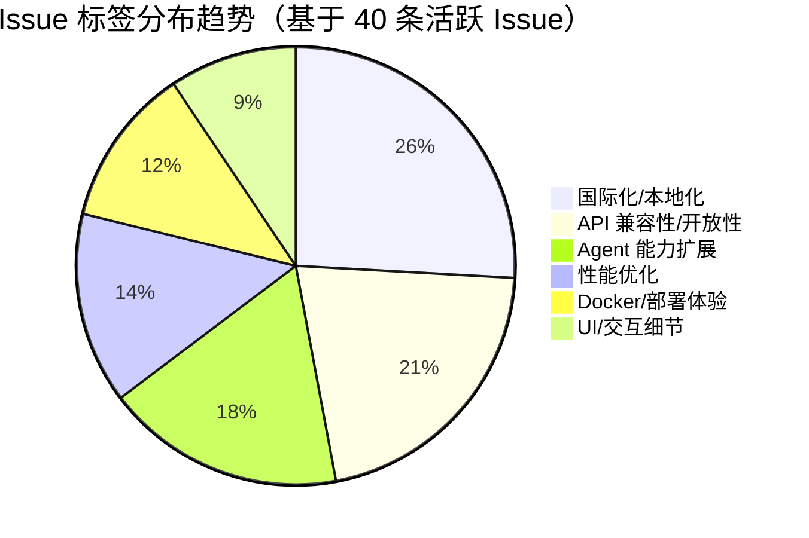

# AI CLI 工具社区动态日报 2026-05-16

> 生成时间: 2026-05-16 00:20 UTC | 覆盖工具: 9 个

- [Claude Code](https://github.com/anthropics/claude-code)
- [OpenAI Codex](https://github.com/openai/codex)
- [Gemini CLI](https://github.com/google-gemini/gemini-cli)
- [GitHub Copilot CLI](https://github.com/github/copilot-cli)
- [Kimi Code CLI](https://github.com/MoonshotAI/kimi-cli)
- [OpenCode](https://github.com/anomalyco/opencode)
- [Pi](https://github.com/badlogic/pi-mono)
- [Qwen Code](https://github.com/QwenLM/qwen-code)
- [DeepSeek TUI](https://github.com/Hmbown/DeepSeek-TUI)
- [Claude Code Skills](https://github.com/anthropics/skills)

---

## 横向对比

# AI CLI 工具生态横向对比分析报告 | 2026-05-16

---

## 1. 生态全景

当前 AI CLI 工具生态进入**"从功能竞赛转向可靠性攻坚"**的关键转折期。各工具在 Agent 自主性、MCP 插件扩展、远程/多设备工作流等核心能力上趋同，但社区反馈集中暴露**内存稳定性、弱网韧性、跨平台一致性**三大生产级瓶颈。与此同时，**推理内容（reasoning_content）格式兼容性**成为多模型支持的新痛点，而**成本透明度与计费可信度**正从"nice-to-have"变为用户留存的决定性因素。整体呈现"功能丰富但信任尚未建立"的特征。

---

## 2. 各工具活跃度对比

| 工具 | Issues (24h) | PRs (24h) | Releases | 版本特性 |
|:---|:---:|:---:|:---|:---|
| **Claude Code** | 50 | 3 | v2.1.143 | 插件依赖强制校验、上下文成本投影 |
| **OpenAI Codex** | ~15 | 13 | 3个 alpha (v0.131.0-α.19~22) | 远程控制上线、权限系统重构、TUI 状态同步 |
| **Gemini CLI** | 50 | 50 | v0.44.0-nightly | RAG 调试日志、企业网关认证修复 |
| **GitHub Copilot CLI** | 50 | 0 | v1.0.49-0/1 | MCP 搜索/延迟加载、"None" 推理选项 |
| **Kimi Code CLI** | 15 | 10 | — | 社区驱动修复（安全/Hook/快捷键） |
| **OpenCode** | 50 | 20 | v1.15.0 + v1.14.51 | Effect 事件系统、后台子代理实验 |
| **Pi** | ~15 | 13 | — | reasoning_content 兼容性修复、FirePass provider |
| **Qwen Code** | ~10 | ~10 | 3个 preview (v0.15.12-p.0~2) | 终端超链接、流式输出修复 |
| **DeepSeek TUI** | 40 | 24 | v0.8.38 | Docker 权限修复、系统提示词缓存优化、ACP 多轮工具 |

> **注**：Issues/PR 数为日报披露值，部分工具未精确统计；Codex/Gemini/Copilot 活跃度基于"50 条活跃 Issue"推断。

---

## 3. 共同关注的功能方向

| 功能方向 | 涉及工具 | 具体诉求 |
|:---|:---|:---|
| **MCP/插件生态稳定性** | Claude Code、Gemini CLI、Copilot CLI、DeepSeek TUI | 插件生命周期管理（#36800 幽灵实例）、连接池活性检测（#3257 TCP 死连接）、容器清理（#29058 Docker 残留）、认证状态同步 |
| **远程/多设备工作流** | Claude Code、OpenAI Codex | Remote Control 自动重连（#34255）、iOS-桌面配对（#9224/#22696）、SSH 密钥认证（#22857）、设备状态同步（#22700） |
| **成本与配额透明** | Claude Code、Kimi Code CLI、DeepSeek TUI、Qwen Code | 计数器准确性（#59572 异常归零）、上下文成本实时投影（v2.1.143）、Token 明细分解（#1666）、多货币支持（#1607） |
| **内存/性能稳定性** | OpenCode、Qwen Code、Gemini CLI | 内存泄漏根治（#20695 megathread）、堆压自动压缩（#4186）、V8 GC 失败（#4167）、缓存淘汰策略（#4188） |
| **推理内容兼容性** | Pi、DeepSeek TUI、Kimi Code CLI | Kimi K2.6/MiMo/Claude 的 reasoning_content 格式统一（#4251/#4514/#4505）、第三方 API thinking 模式防护（#1680） |
| **会话生命周期管理** | Claude Code、Kimi Code CLI、OpenCode、Copilot CLI | `/new` 命令（#59275）、rewind 回退（#2290/#11626）、Session forking（#1697 22👍）、Agent 归档非销毁（#58966） |

---

## 4. 差异化定位分析

| 工具 | 核心侧重 | 目标用户 | 技术路线特征 |
|:---|:---|:---|:---|
| **Claude Code** | 企业级 Agent 工作流、插件生态治理 | 中大型企业开发团队 | 闭源主导，MCP 作为官方扩展标准；依赖校验、成本投影显示**平台治理思维** |
| **OpenAI Codex** | 远程控制、多客户端同步、权限沙箱 | 跨设备/移动优先开发者 | 快速 alpha 迭代（24h 3 版本），Named Permission Profiles 架构重构**激进但阵痛明显** |
| **Gemini CLI** | 企业认证、RAG 调试、评估基础设施 | Google Cloud/Vertex 企业用户 |  nightly 发布节奏，AST-aware 代码理解**技术预研前瞻**，但 Agent 可靠性（#21409 挂起）拖累落地 |
| **GitHub Copilot CLI** | IDE 原生集成、MCP 市场、代理编排 | VS Code 生态深度用户 | 微软生态绑定，实验性功能（`/mcp search`）**保守推进**，企业策略引擎稳定性存疑 |
| **Kimi Code CLI** | 安全合规、Hook 扩展生态、跨工具互操作 | 中国本土开发者/企业 | **社区自组织修复**特征显著（ktwu01 等 3 人 9 PR），但 K2.6 过载（#2077）官方响应缺失 |
| **OpenCode** | 开源可扩展性、本地 LLM 支持、隐私优先 | 开源贡献者/隐私敏感用户 | Effect 函数式架构、后台子代理**技术激进**，内存泄漏（#20695）与 TUI 兼容性债务沉重 |
| **Pi** | 多模型统一接入、终端体验精细化 | 模型尝鲜者/终端重度用户 | 轻量架构，provider 扩展机制成熟（FirePass/LiteLLM），reasoning 抽象层**急需统一** |
| **Qwen Code** | 内存诊断体系、守护进程架构、弱网韧性 | 阿里云生态/中文开发者 | **`/doctor` `/stuck` 诊断工具链体系化**，守护进程设计文档（#3803）**工程规范突出**，但免费额度政策（#3203）冲击用户信任 |
| **DeepSeek TUI** | 中文原生体验、成本优化、Docker 部署 | 中国 C 端开发者/个人用户 | 视觉对标 Claude Code（#1697），Dual 双模型路由（#1676）**成本创新前沿**，容器化成熟度不足 |

---

## 5. 社区热度与成熟度

### 🔥 高活跃度 + 快速迭代

| 工具 | 证据 | 成熟度评估 |
|:---|:---|:---|
| **Gemini CLI** | 50 Issues + 50 PR / 24h，社区贡献密集 | ⭐⭐⭐☆☆ 活跃但 Agent 核心缺陷（挂起/假死）未根治 |
| **OpenCode** | 20 PR / 24h，双版本发布，contributor 占比高 | ⭐⭐⭐☆☆ 架构现代化中，内存/TUI 债务制约生产可用 |
| **DeepSeek TUI** | 40 Issues + 24 PR，v0.8.38 紧急修复 | ⭐⭐⭐☆☆ 社区响应快，但 Docker/Windows 基础体验波动大 |
| **OpenAI Codex** | 13 PR 含权限系统全栈重构，3 alpha / 24h | ⭐⭐⭐⭐☆ 功能激进，远程控制首日即规模化故障 |

### ⚖️ 中等活跃度 + 稳定演进

| 工具 | 证据 | 成熟度评估 |
|:---|:---|:---|
| **Claude Code** | 50 Issues 但仅 3 PR，Release 节奏稳健 | ⭐⭐⭐⭐☆ 平台治理成熟，Windows 质量滑坡（#47104）成新风险 |
| **GitHub Copilot CLI** | 50 Issues 但 0 PR，内部迭代为主 | ⭐⭐⭐⭐☆ 企业级稳定，但开源社区参与度低，创新依赖微软节奏 |
| **Pi** | 13 PR 含多个 provider 扩展，reasoning 修复密集 | ⭐⭐⭐⭐☆ 轻量成熟，多模型兼容层持续打磨 |

### ⚠️ 活跃度分化 + 信任危机

| 工具 | 证据 | 成熟度评估 |
|:---|:---|:---|
| **Kimi Code CLI** | 15 Issues + 10 PR，但 Critical #2077 3 周未回应 | ⭐⭐☆☆☆ **社区自组织 vs 官方缺位**，贡献流失风险高 |
| **Qwen Code** | ~10 Issues + ~10 PR，但 #3203 125 评论政策突变 | ⭐⭐⭐☆☆ 工程能力扎实，商业化决策冲击社区信任 |

---

## 6. 值得关注的趋势信号

| 趋势 | 信号来源 | 对开发者的参考价值 |
|:---|:---|:---|
| **"推理内容"成为新兼容性战场** | Pi #4251/#4514、DeepSeek #1680、Kimi #2077 | 多模型 CLI 工具需抽象 reasoning_content 生命周期（注入/回传/清理），避免硬编码 provider 逻辑 |
| **内存诊断从"日志猜测"走向"工具化"** | Qwen `/doctor memory` + `/stuck`、OpenCode #20695 megathread | 长会话 Agent 必备可观测性基建，建议提前规划堆压监控、自动压缩安全网 |
| **成本透明从功能变为信任基础设施** | Claude Code 上下文投影、DeepSeek Token 明细、Kimi usage --json | 企业采购决策关键指标，CLI 工具需支持程序化成本查询（JSON/API） |
| **"社区自组织修复"模式的双刃剑** | Kimi ktwu01 等 3 人 9 PR、OpenCode contributor 高占比 | 开源工具需建立 maintainer review 响应 SLA，否则贡献流失；企业选型需评估官方投入度 |
| **远程/异步工作流从"有"到"可靠"** | Codex 远程控制上线即故障、Claude #34255 长期未解 | 无人值守场景需自愈重连 + 状态同步 + 消息不丢失，架构设计需预设故障模式 |
| **审批模式从"YOLO"走向"精细化风险分级"** | Gemini `--full-access` 替代 `--yolo`、Qwen Auto 模式 LLM 分类器 | 安全术语专业化 + 动态风险评估成为标配，静态权限预设难以满足企业合规 |
| **Windows 平台集体"二等公民"化** | Claude #47104、Codex Gatekeeper、DeepSeek WSL 卡死、Gemini PTY 流误判 | 跨平台一致性仍是行业短板，企业 Windows 部署需预留额外适配成本 |

---

*报告基于 2026-05-16 各工具社区动态生成，数据截取自当日公开 GitHub 活动。*

---

## 各工具详细报告

<details>
<summary><strong>Claude Code</strong> — <a href="https://github.com/anthropics/claude-code">anthropics/claude-code</a></summary>

## Claude Code Skills 社区热点

> 数据来源: [anthropics/skills](https://github.com/anthropics/skills)

# Claude Code Skills 社区热点报告（2026-05-16）

---

## 1. 热门 Skills 排行（按社区关注度）

| 排名 | Skill | 功能概述 | 状态 | 链接 |
|:---|:---|:---|:---|:---|
| 1 | **document-typography** | AI 生成文档的排版质量控制：防止孤行、寡行、编号错位等常见排版问题 | 🔵 Open | [PR #514](https://github.com/anthropics/skills/pull/514) |
| 2 | **ODT** | OpenDocument 文本创建、模板填充及 ODT→HTML 转换，面向开源/ISO 标准文档工作流 | 🔵 Open | [PR #486](https://github.com/anthropics/skills/pull/486) |
| 3 | **frontend-design** | 前端设计 Skill 的清晰度与可执行性改进，确保单轮对话内可完成设计指令 | 🔵 Open | [PR #210](https://github.com/anthropics/skills/pull/210) |
| 4 | **skill-quality-analyzer / skill-security-analyzer** | 双元分析工具：Skill 质量评估（结构、文档、可维护性）与安全审计（依赖、注入、权限） | 🔵 Open | [PR #83](https://github.com/anthropics/skills/pull/83) |
| 5 | **testing-patterns** | 全栈测试体系：Testing Trophy 模型、React 组件测试、集成/端到端测试策略 | 🔵 Open | [PR #723](https://github.com/anthropics/skills/pull/723) |
| 6 | **ServiceNow platform** | 企业级 ServiceNow 平台助手，覆盖 ITSM/ITOM/SecOps/FSM/SPM/CSDM/IntegrationHub | 🔵 Open | [PR #568](https://github.com/anthropics/skills/pull/568) |
| 7 | **AURELION suite** | 四层认知框架：结构化思维模板（kernel）、顾问模式、Agent 编排、持久记忆系统 | 🔵 Open | [PR #444](https://github.com/anthropics/skills/pull/444) |
| 8 | **sensory** | 原生 macOS 自动化（AppleScript/osascript），替代截图式 computer use，分两级权限 | 🔵 Open | [PR #806](https://github.com/anthropics/skills/pull/806) |

**讨论热点**：document-typography 直击 AI 生成文档的"最后一公里"体验；AURELION 和 shodh-memory 代表社区对**持久化记忆与认知架构**的深度探索；ServiceNow 则反映企业 ITSM 集成的强需求。

---

## 2. 社区需求趋势（Issues 提炼）

| 方向 | 代表 Issue | 核心诉求 |
|:---|:---|:---|
| **组织级 Skill 共享** | [#228](https://github.com/anthropics/skills/issues/228) | 企业内直接共享 Skill 库，替代 Slack/Teams 手动传文件 + 逐人上传的繁琐流程 |
| **MCP 协议互通** | [#16](https://github.com/anthropics/skills/issues/16) | 将 Skills 暴露为 MCP 工具，标准化 AI 软件 API 边界 |
| **安全与信任边界** | [#492](https://github.com/anthropics/skills/issues/492) | 社区 Skill 滥用 `anthropic/` 命名空间，需防范钓鱼与权限提升攻击 |
| **测试与评估基础设施** | [#556](https://github.com/anthropics/skills/issues/556) | `run_eval.py` 0% 触发率暴露 Skill 评估体系的工程缺陷 |
| **Skill 生命周期管理** | [#62](https://github.com/anthropics/skills/issues/62), [#189](https://github.com/anthropics/skills/issues/189) | 防丢失、去重、版本控制——Skill 作为生产资产的可运维性 |
| **多云/企业部署** | [#29](https://github.com/anthropics/skills/issues/29), [#532](https://github.com/anthropics/skills/issues/532) | Bedrock 兼容、SSO 企业用户免 API Key 使用 |

---

## 3. 高潜力待合并 Skills（评论活跃 + 解决明确痛点）

| Skill | 合并潜力 | 关键判断依据 |
|:---|:---|:---|
| **document-typography** ⭐ | **极高** | 通用性强、零依赖、解决所有 AI 文档生成的共性痛点，作者持续更新 |
| **ODT** | 高 | 填补 LibreOffice/OpenDocument 生态空白，与现有 docx/pdf Skill 形成互补 |
| **testing-patterns** | 高 | 测试是代码生成后的高频刚需，PR 结构完整覆盖全栈 |
| **sensory** | 中高 | macOS 自动化是 computer use 的轻量替代，权限模型设计成熟 |
| **faf-context** | 中 | `.faf` 文件格式创新（package.json ↔ README.md 之间的项目上下文），但需社区采纳 |
| **AppDeploy** | 中 | 全栈部署闭环，但依赖外部服务 [appdeploy.ai](https://appdeploy.ai/) 的可持续性 |

> **值得关注的修复型 PR**：Lubrsy706 连续提交 [#538](https://github.com/anthropics/skills/pull/538)（PDF 大小写）、[#541](https://github.com/anthropics/skills/pull/541)（DOCX ID 冲突）、[#539](https://github.com/anthropics/skills/pull/539)（YAML 解析），显示文档类 Skill 的工程化细节正在快速打磨。

---

## 4. Skills 生态洞察

> **社区最集中的诉求：从"能生成"到"能协作"——Skill 需要具备组织级可共享、可审计、可评估的生产级属性，而非个人脚本集合。**

具体表现为三层跃迁：
- **个体层** → 记忆持久化（shodh-memory / AURELION）与认知结构化
- **团队层** → 组织内 Skill 市场与权限治理（#228 / #492）
- **工程层** → 可量化的触发率评估（#556）与标准化协议对接（MCP）

---

*报告基于 github.com/anthropics/skills 公开数据，截止 2026-05-16。*

---

# Claude Code 社区动态日报 | 2026-05-16

## 今日速览

Anthropic 发布 **v2.1.143**，重点强化插件依赖管理与成本透明度；社区持续聚焦 **MCP 插件稳定性**、**跨平台连接可靠性** 及 **TUI/IDE 体验优化**，Windows 平台问题报告显著增加。

---

## 版本发布

### [v2.1.143](https://github.com/anthropics/claude-code/releases/tag/v2.1.143)

| 更新项 | 说明 |
|--------|------|
| **插件依赖强制校验** | `claude plugin disable` 现在会阻止禁用被其他插件依赖的目标，并提供可复制的禁用链提示；`claude plugin enable` 自动强制启用传递依赖 |
| **上下文成本预估** | 新增单轮及累计上下文成本投影显示（摘要截断，完整内容见 Release） |

> 插件生态的依赖治理进入新阶段，对多插件协同场景至关重要。

---

## 社区热点 Issues（精选 10 项）

| # | 状态 | 标题 | 核心影响 | 社区反应 |
|---|------|------|---------|---------|
| [#34255](https://github.com/anthropics/claude-code/issues/34255) | 🔴 OPEN | Remote Control 自动重连失效（macOS/iOS） | 远程会话静默断线无恢复，严重影响移动端/远程工作流 | **37 评论 / 75 👍**，高票长期未解 |
| [#15631](https://github.com/anthropics/claude-code/issues/15631) | 🔴 OPEN | 跨会话命令历史无法禁用 | 隐私敏感场景（共享设备、演示）的合规风险 | **15 评论 / 17 👍**，duplicate 标签但持续活跃 |
| [#36800](https://github.com/anthropics/claude-code/issues/36800) | 🔴 OPEN | MCP 通道插件重复实例化导致 409 冲突 | Telegram 等插件运行中无端 spawn 副本，工具注册丢失 | **14 评论**，含详细复现与根因分析 |
| [#47104](https://github.com/anthropics/claude-code/issues/47104) | 🔴 OPEN | Windows 11 更新后 Cowork/Connectors/Claude Code 全崩溃 | ERR_CONNECTION_RESET + OAuthError，疑似更新兼容性问题 | **12 评论**，Windows 用户集中反馈 |
| [#14836](https://github.com/anthropics/claude-code/issues/14836) | 🔴 OPEN | `/skills` 不支持符号链接目录 | 开发者常用 symlink 组织技能库，功能残缺 | **8 评论 / 34 👍**，高票实用需求 |
| [#58597](https://github.com/anthropics/claude-code/issues/58597) | ✅ CLOSED | Agents View 可配置 git worktree 行为 | Agent Worker 强制创建 worktree 过重，需灵活控制 | **8 评论 / 9 👍**，已关闭但方案待观察 |
| [#29058](https://github.com/anthropics/claude-code/issues/29058) | 🔴 OPEN | Docker MCP 容器会话结束未停止 | 资源泄漏，长期运行机器磁盘/内存压力 | **7 评论**，基础设施运维痛点 |
| [#59163](https://github.com/anthropics/claude-code/issues/59163) | 🔴 OPEN | VS Code 集成终端长会话后 TUI 字符损坏 | 渲染 glyph 乱码，影响长时间编码会话 | **5 评论**，v2.1.141 回归问题 |
| [#53454](https://github.com/anthropics/claude-code/issues/53454) | 🔴 OPEN | 模型过度使用 "load-bearing" 词汇 | 模型行为异常，输出质量与风格问题 | **5 评论 / 8 👍**，趣味性高但反映微调问题 |
| [#59572](https://github.com/anthropics/claude-code/issues/59572) | 🔴 OPEN | Max 套餐周计数器周期中异常归零 | 计费透明度危机，用户信任受损 | **3 评论**，刚创建即获关注 |

---

## 重要 PR 进展（精选 3 项，实际更新仅 3 条）

| # | 状态 | 标题 | 技术价值 |
|---|------|------|---------|
| [#59508](https://github.com/anthropics/claude-code/pull/59508) | 🟡 OPEN | 修复 bash_command_validator 正则假阴性 | 解决 `grep` 管道命令与 `rm -rf` 路径匹配的验证绕过，安全 hook 示例的可靠性提升 |
| [#59495](https://github.com/anthropics/claude-code/pull/59495) | ✅ CLOSED | README GitHub 大小写修正 | 品牌规范修复，已合并 |
| [#59275](https://github.com/anthropics/claude-code/pull/59275) | 🟡 OPEN | 新增 `/new` 会话插件 | 填补 `/clear`（清上下文）与 `/branch`（fork 历史）之间的空白，支持真正的新会话启动，工作流语义更清晰 |

---

## 功能需求趋势

基于 50 条活跃 Issue 的聚类分析：

| 方向 | 热度 | 典型诉求 |
|------|------|---------|
| **MCP 生态稳定性** | 🔥🔥🔥🔥🔥 | 插件生命周期管理、容器清理、跨通道 API 一致性（AskUserQuestion 代理）、认证状态同步 |
| **IDE/编辑器集成** | 🔥🔥🔥🔥🔥 | VS Code 扩展的链接处理、流中断、终端渲染；Cowork 模式可靠性 |
| **远程与多设备工作流** | 🔥🔥🔥🔥 | Remote Control 重连、会话跨端同步、移动端体验 |
| **成本与配额透明** | 🔥🔥🔥🔥 | 计数器准确性、/goal 无限循环熔断、上下文成本实时反馈 |
| **TUI 交互细节** | 🔥🔥🔥 | 历史隔离、权限提示焦点窃取、通知内容丰富度、Markdown 渲染完备性 |
| **Agent 工作流治理** | 🔥🔥🔥 | Agent View 归档非销毁、worktree 策略可配置、后台模式逆向操作 |

---

## 开发者关注点

### 🔴 高频痛点

1. **Windows 平台质量滑坡** — #47104、#59559、#55021 等集中爆发，更新后认证/连接/性能三重故障，企业 Windows 部署信心受挫
2. **MCP "幽灵实例" 与资源泄漏** — #36800 的重复 spawn、#29058 的 Docker 容器残留，插件架构的健壮性成瓶颈
3. **计费系统可信度** — #59572 的计数器异常、#42616 的 429 误报，Max/Pro 用户对付费公平性敏感

### 🟡 待满足需求

4. **远程/异步工作流闭环** — #59245 要求 AskUserQuestion 支持 MCP 通道代理，#34255 要求 Remote Control 自愈，均指向"无人值守"场景
5. **会话生命周期精细化管理** — `/new` 命令（#59275）、Agent 归档（#58966）、跨会话历史隔离（#15631），用户需要比当前更细粒度的上下文控制

### 💡 积极信号

- v2.1.143 的**插件依赖强制校验**显示 Anthropic 正视生态复杂性
- **上下文成本投影**响应了长期呼吁的透明度需求，但完整实现待观察

---

*日报基于 GitHub 公开数据生成，不代表 Anthropic 官方立场。*

</details>

<details>
<summary><strong>OpenAI Codex</strong> — <a href="https://github.com/openai/codex">openai/codex</a></summary>

# OpenAI Codex 社区动态日报 | 2026-05-16

---

## 1. 今日速览

今日 Codex 社区聚焦**远程控制功能的大规模落地与修复**——iOS/桌面端远程连接、SSH 主机配对、授权流程等问题集中爆发，同时 CLI 推出 `v0.131.0-alpha` 系列三个快速迭代版本。权限系统架构重构加速，Windows 沙箱迁移与命名权限档案（Named Permission Profiles）成为核心工程方向。

---

## 2. 版本发布

| 版本 | 说明 |
|:---|:---|
| **rust-v0.131.0-alpha.22** | 快速迭代中的 Rust CLI 预发布版本，推测包含远程控制稳定性修复 |
| **rust-v0.131.0-alpha.21** | — |
| **rust-v0.131.0-alpha.19** | — |

> 注：三个 alpha 版本在 24 小时内连续发布，节奏极快，建议生产环境谨慎跟进。

---

## 3. 社区热点 Issues

### 🔴 远程控制：功能落地与故障并发

| # | Issue | 状态 | 核心问题 | 社区反应 |
|:---|:---|:---|:---|:---|
| **[#9224](https://github.com/openai/codex/issues/9224)** | Codex Remote Control | ✅ CLOSED | 手机 ChatGPT App 远程控制桌面 CLI 的需求，**已关闭意味着功能已上线** | 👍 **401** — 历史最高票需求之一，今日关闭标志里程碑 |
| **[#22696](https://github.com/openai/codex/issues/22696)** | Failed to authorize remote control | 🔴 OPEN | Pro 用户更新后无法完成远程控制授权，阻塞使用 | 26 评论，45 👍，紧急回归 |
| **[#22700](https://github.com/openai/codex/issues/22700)** | 撤销设备访问后 iOS 端残留连接记录，无法重新配对 | 🔴 OPEN | 设备管理状态同步缺陷，影响多设备用户 | 15 评论，iOS 远程控制可用性受损 |
| **[#22701](https://github.com/openai/codex/issues/22701)** | iOS Connections 编辑模式无删除选项 | 🔴 OPEN | 陈旧 CLI 连接无法清理，UI 缺失基础功能 | 4 评论，体验细节问题 |
| **[#22831](https://github.com/openai/codex/issues/22831)** | iOS 连接 Debian 远程主机反复断线 "Network connection was lost" | 🔴 OPEN | SSH 远程连接稳定性问题，跨平台兼容性 | 2 评论，Linux 服务器用户受阻 |
| **[#22857](https://github.com/openai/codex/issues/22857)** | SSH 远程连接需更好的密钥认证支持 | 🔴 OPEN | 当前仅支持密码，缺乏密钥/Agent 转发等企业级方案 | 1 评论，企业用户安全需求 |

### 🟡 平台与性能

| # | Issue | 状态 | 核心问题 | 社区反应 |
|:---|:---|:---|:---|:---|
| **[#11023](https://github.com/openai/codex/issues/11023)** | Codex desktop app for Linux | 🔴 OPEN | Linux 桌面端原生应用需求，Mac 功耗问题倒逼迁移 | 55 评论，**204 👍**，长期高票未解决 |
| **[#22694](https://github.com/openai/codex/issues/22694)** | Computer Use 硬依赖 macOS 26.0 | 🔴 OPEN | 未文档化的系统版本门槛，旧系统用户崩溃 | 12 评论，文档与兼容性缺陷 |
| **[#17447](https://github.com/openai/codex/issues/17447)** | CLI v0.120+ 在 macOS 26.4.1 被 Gatekeeper 阻断 | 🔴 OPEN | Homebrew Cask 分发缺少 Apple 公证，启动挂起 | 10 评论，安全策略与分发流程冲突 |
| **[#11626](https://github.com/openai/codex/issues/11626)** | CLI `/rewind` 需同时恢复对话与代码编辑 | 🔴 OPEN | 当前仅回滚对话，代码变更残留，破坏可逆性 | 29 评论，130 👍，核心交互设计缺陷 |

---

## 4. 重要 PR 进展

### 远程控制与执行架构

| # | PR | 作者 | 核心内容 |
|:---|:---|:---|:---|
| **[#22769](https://github.com/openai/codex/pull/22769)** | exec-server: support auth-backed remote executor registration | miz-openai | 远程执行服务器注册从注册表凭证切换至标准 Codex 认证，简化部署并增强安全性 |
| **[#22878](https://github.com/openai/codex/pull/22878)** | Improve `codex remote-control` CLI UX | owenlin0 | 远程控制默认前台运行，显示状态信息，Ctrl-C 退出；`--daemon` 保留后台模式 |
| **[#22510](https://github.com/openai/codex/pull/22510)** | [3/3] Sync TUI next-turn state | etraut-openai | 多客户端 TUI 状态同步终章：模型、计划模式、权限等变更实时广播 |
| **[#22509](https://github.com/openai/codex/pull/22509)** | [2/3] Add app-server next-turn state API | etraut-openai | 新增 v2 API 支持不启动 turn 即更新下轮默认设置 |

### 权限系统重构（Named Permission Profiles）

| # | PR | 作者 | 核心内容 |
|:---|:---|:---|:---|
| **[#22920](https://github.com/openai/codex/pull/22920)** | core: set permission profiles from snapshots | bolinfest | 快照恢复时正确重建 `ActivePermissionProfile`，避免匿名权限状态丢失身份 |
| **[#22924](https://github.com/openai/codex/pull/22924)** | app-server-protocol: remove PermissionProfile from API | bolinfest | ✅ **已合并** — API 仅暴露权限档案标识，隐藏底层运行时模型，降低客户端复杂度 |
| **[#22923](https://github.com/openai/codex/pull/22923)** | windows-sandbox: drive write roots from resolved permissions | bolinfest | Windows 沙箱 `SandboxPolicy` → `PermissionProfile` 迁移第三弹：写入路径解析 |
| **[#22896](https://github.com/openai/codex/pull/22896)** | windows-sandbox: add resolved permissions helper | bolinfest | 引入 `ResolvedWindowsSandboxPermissions` 桥接层，隔离遗留假设 |
| **[#22918](https://github.com/openai/codex/pull/22918)** | windows-sandbox: send permission profiles to elevated runner | bolinfest | 提升进程 IPC 边界迁移至 `PermissionProfile`，打通高权限执行通道 |
| **[#21559](https://github.com/openai/codex/pull/21559)** | tui: add named permission profile picker | viyatb-oai | TUI `/permissions` 支持命名档案模式，避免匿名预设覆盖用户配置 |

### 扩展能力与钩子系统

| # | PR | 作者 | 核心内容 |
|:---|:---|:---|:---|
| **[#22782](https://github.com/openai/codex/pull/22782)** | Add SubagentStart hook | abhinav-oai | 子代理创建后首条模型请求前触发，支持按 `agent_type` 匹配处理程序 |
| **[#22873](https://github.com/openai/codex/pull/22873)** | Add SubagentStop hook | abhinav-oai | 子代理 turn 结束前触发，补充 `agent_id` / `parent_turn_id` 等上下文 |
| **[#22679](https://github.com/openai/codex/pull/22679)** | Support audio input | fjord-oai | MCP 音频内容块转换为 Responses API 结构化输出，模型能力门控 |

---

## 5. 功能需求趋势

```
远程控制生态  ████████████████████████████████████████  爆发期
├── 手机端 ↔ 桌面/CLI 配对与授权
├── SSH 主机发现与密钥认证
├── 多设备状态同步与清理
└── 跨平台连接稳定性（iOS-Linux 断线）

权限与沙箱  ██████████████████████████████░░░░░░░░░░  架构升级期
├── Named Permission Profiles 全栈迁移
├── Windows 沙箱遗留债务清理
└── TUI/桌面端权限选择器统一

平台覆盖    ████████████████████████░░░░░░░░░░░░░░░░  长期诉求
├── Linux 桌面应用（204👍 历史最高）
├── Windows 代理 shell 可配置（Git Bash）
└── macOS 版本兼容性边界（Computer Use）

可逆性与信任 ██████████████████░░░░░░░░░░░░░░░░░░░░░░  体验深化
├── /rewind 全状态恢复（对话+代码）
├── 钩子系统扩展（SubagentStart/Stop）
└── IDE 安装器信任请求标准化
```

---

## 6. 开发者关注点

| 痛点 | 表现 | 影响面 |
|:---|:---|:---|
| **远程控制"能用但难用"** | 授权失败、设备残留、断线重连、密钥缺失 | 刚发布的核心功能，首日即遇规模化故障 |
| **macOS 分发安全策略摩擦** | Gatekeeper 公证缺失、dyld 符号未找到、版本硬门槛 | 阻碍升级意愿，企业部署合规风险 |
| **权限系统迁移阵痛** | API  Breaking Change、TUI 状态同步延迟、配置漂移 | 多客户端场景下用户体验不一致 |
| **Linux 二等公民地位** | 无桌面应用、沙箱 bubblewrap 参数溢出、远程连接优先适配 Debian | 服务器端主力用户群体被忽视 |
| **模型行为不可控** | GPT-5.3 无意义重复调用 web search、速率限制窗口标签混乱 | 消耗配额、输出质量下降 |

---

*日报基于 GitHub 公开数据生成，PR 评论数为 `undefined` 表示该字段未返回有效数值。*

</details>

<details>
<summary><strong>Gemini CLI</strong> — <a href="https://github.com/google-gemini/gemini-cli">google-gemini/gemini-cli</a></summary>

# Gemini CLI 社区动态日报 | 2026-05-16

## 今日速览

今日 Gemini CLI 发布 v0.44.0-nightly 版本，重点增强 RAG 调试能力与企業认证稳定性。社区活跃度高，50 个 Issues 和 50 个 PR 在过去 24 小时更新，核心聚焦于 Agent 可靠性、内存系统质量及 Windows/WSL 平台兼容性修复。

---

## 版本发布

### [v0.44.0-nightly.20260515.g928a311fb](https://github.com/google-gemini/gemini-cli/releases/tag/v0.44.0-nightly.20260515.g928a311fb)

| 更新类型 | 内容 |
|---------|------|
| **feat(core)** | 将 RAG snippets 暴露至本地日志文件，便于调试追踪检索增强生成的上下文来源 |
| **fix(acp/auth)** | 修复企业网关场景下的凭证冲突问题，原生支持可选 API Key 配置 |

---

## 社区热点 Issues

| # | Issue | 优先级 | 核心要点 | 社区反应 |
|---|-------|--------|---------|---------|
| [#22745](https://github.com/google-gemini/gemini-cli/issues/22745) | AST-aware 文件读取与代码库映射评估 | P2 | 探索通过 AST 精确读取方法边界、减少 token 浪费，可能显著提升 Agent 代码理解效率 | 7 评论，维护者深度参与的技术预研 |
| [#21409](https://github.com/google-gemini/gemini-cli/issues/21409) | Generalist Agent 无限挂起 | **P1** | 子代理委派后完全卡住，简单任务如文件夹创建也无法完成，严重影响基础可用性 | 7 评论，7 👍，用户反馈强烈 |
| [#24353](https://github.com/google-gemini/gemini-cli/issues/24353) | 组件级评估体系健壮化 | **P1** | 现有 76 个行为评估测试需从"能跑"进化到"可信"，建立可追踪的质量基线 | 6 评论，评估基础设施的关键债务 |
| [#22323](https://github.com/google-gemini/gemini-cli/issues/22323) | 子代理 MAX_TURNS 截断被误报为成功 | **P1** | `codebase_investigator` 达到最大轮次后仍返回 `GOAL` 成功，隐藏中断真相导致用户误判 | 6 评论，2 👍，可靠性核心缺陷 |
| [#21968](https://github.com/google-gemini/gemini-cli/issues/21968) | 模型不主动使用 Skills 和子代理 | **P1** | 即使用户配置了 gradle/git 等 Skills，模型也不会自动调用，需显式指令才生效 | 6 评论，Skill 生态 adoption 瓶颈 |
| [#21983](https://github.com/google-gemini/gemini-cli/issues/21983) | Browser 子代理 Wayland 环境崩溃 | **P1** | Linux Wayland 用户无法使用浏览器自动化功能，终止原因为 `GOAL` 但实际失败 | 4 评论，1 👍，Linux 桌面兼容性 |
| [#25166](https://github.com/google-gemini/gemini-cli/issues/25166) | Shell 命令执行后假死"等待输入" | **P1** | 简单命令完成后 UI 仍显示"Awaiting user input"，阻塞工作流 | 3 评论，3 👍，高频遇到的体验问题 |
| [#23571](https://github.com/google-gemini/gemini-cli/issues/23571) | 模型随机位置创建临时脚本 | P2 | 限制 Shell 执行后，模型在多处目录生成编辑脚本，清理困难影响代码提交 | 3 评论，工作区污染问题 |
| [#26525](https://github.com/google-gemini/gemini-cli/issues/26525) | Auto Memory 日志安全：确定性脱敏 | P2 | 模型脱敏发生在内容已进入上下文后，服务端仍可能记录敏感信息，需前置确定性脱敏 | 2 评论，企业安全合规关键 |
| [#22672](https://github.com/google-gemini/gemini-cli/issues/22672) | Agent 应阻止/劝阻破坏性操作 | P2 | `git reset --force` 等危险命令缺乏安全护栏，DB 修改等场景需风险感知 | 2 评论，1 👍，AI 安全边界设计 |

---

## 重要 PR 进展

| # | PR | 优先级 | 功能/修复内容 | 影响范围 |
|---|-----|--------|------------|---------|
| [#27131](https://github.com/google-gemini/gemini-cli/pull/27131) | 个人 OAuth 用户路由至稳定模型 | **P1** | 修复 `auto-gemini-3` 别名在个人 OAuth 下解析到无效模型导致的 404/400 错误 | 认证体系与模型路由 |
| [#27025](https://github.com/google-gemini/gemini-cli/pull/27025) | WSL 环境下 Windows 路径处理 | **P1** | 将 Windows 盘符路径自动转换为 WSL 挂载路径，保持非 WSL 环境行为不变 | 跨平台兼容性 |
| [#27123](https://github.com/google-gemini/gemini-cli/pull/27123) | 钥匙串凭证删除幂等化 | **P1** | 缺失凭证时视为已删除，避免 `clearAll()` 中途失败，修复 [#21768](https://github.com/google-gemini/gemini-cli/issues/21768) | 凭证管理稳定性 |
| [#27134](https://github.com/google-gemini/gemini-cli/pull/27134) | 跳过工具延续的 Hook 上下文 | P2 | 纯 functionResponse 延续不再重复应用 before-agent hook，保留混合请求行为 | Agent 执行效率 |
| [#27130](https://github.com/google-gemini/gemini-cli/pull/27130) | MCP 采样请求处理器（1/3） | P2 | 实现 MCP Client Sampling 核心处理器，为 [#10704](https://github.com/google-gemini/gemini-cli/issues/10704) 三步走的第一步 | MCP 生态扩展 |
| [#27128](https://github.com/google-gemini/gemini-cli/pull/27128) | 无效 Gemini 模型 ID 回退默认 | P2 | 持久化配置中的过期模型 ID（如 `gemini-pro-latest`）自动回退有效默认模型 | 配置鲁棒性 |
| [#27126](https://github.com/google-gemini/gemini-cli/pull/27126) | Vertex 认证启用自定义工具模型 | P2 | 解除 Vertex auth 的 `useCustomToolModel=false` 限制，统一 Gemini 3.1 启动路径 | 企业/Vertex 用户 |
| [#27026](https://github.com/google-gemini/gemini-cli/pull/27026) | 全权限审批控制（YOLO 替代） | P3 | `--full-access` 替代 `--yolo`，沙箱默认启用，消除非专业术语 | 用户体验与安全意识 |
| [#27091](https://github.com/google-gemini/gemini-cli/pull/27091) | 点击审批模式指示器切换 | P2 | 支持点击 UI 指示器循环切换审批模式，响应 [#27035](https://github.com/google-gemini/gemini-cli/issues/27035) | 交互效率 |
| [#26951](https://github.com/google-gemini/gemini-cli/pull/26951) | Issue-Fixer Bot Skill 实现 | - | 为 Gemini CLI Bot 实现 `issue-fixer` Skill，支持手动选择 mandate 模式 | 自动化工作流 |

---

## 功能需求趋势

基于今日 50 个活跃 Issues 分析，社区关注呈现三大集中方向：

| 趋势方向 | 代表 Issues | 紧迫性 |
|---------|-----------|--------|
| **Agent 自主性与可靠性** | #21409 挂起、#22323 错误成功报告、#21968 Skill 调用不足、#22672 破坏性操作防护 | 🔴 最高 |
| **AST/语义级代码理解** | #22745、#22746、#22747 系列探索 AST-aware 工具替代文本级文件操作 | 🟡 战略级 |
| **内存系统质量与安全** | #26525 脱敏、#26523 无效补丁隔离、#26522 低信号会话重试——5月集中爆发的 Auto Memory 债务 | 🟡 高 |

新兴信号：背景化子代理（#22741, Ctrl+B）和 Agent 自我认知（#21432, 准确描述自身 CLI 标志）开始浮现，指向"Agent 作为自身专家"的元能力需求。

---

## 开发者关注点

### 🔴 高频痛点

| 痛点 | 典型反馈 | 涉及 Issues |
|-----|---------|-----------|
| **Agent 挂起/假死** | "简单文件夹创建等一小时"、"命令完成后仍显示等待输入" | #21409, #25166 |
| **子代理状态误导** | "达到 MAX_TURNS 却报告 GOAL 成功，隐藏中断" | #22323 |
| **Skill 生态失效** | "配置了 gradle/git Skill，模型从不主动用" | #21968 |

### 🟡 平台特定摩擦

- **Windows/WSL**: 路径转换、PowerShell 版本偏好（[#25900](https://github.com/google-gemini/gemini-cli/pull/25900)）、PTY 流二进制误判（[#26565](https://github.com/google-gemini/gemini-cli/pull/26565)）
- **Linux 桌面**: Wayland 浏览器自动化断裂（[#21983](https://github.com/google-gemini/gemini-cli/issues/21983)）

### 🟢 安全与治理诉求

- **确定性脱敏** > 模型后脱敏（[#26525](https://github.com/google-gemini/gemini-cli/issues/26525)）
- **审批模式术语专业化**：YOLO → full-access（[#27026](https://github.com/google-gemini/gemini-cli/pull/27026)）
- **破坏性操作护栏**：git force、DB 修改等场景需显式确认（[#22672](https://github.com/google-gemini/gemini-cli/issues/22672)）

---

*日报基于 google-gemini/gemini-cli 公开 GitHub 数据生成*

</details>

<details>
<summary><strong>GitHub Copilot CLI</strong> — <a href="https://github.com/github/copilot-cli">github/copilot-cli</a></summary>

# GitHub Copilot CLI 社区动态日报 | 2026-05-16

---

## 1. 今日速览

GitHub Copilot CLI 今日连发 **v1.0.49-0/1** 两个版本，重点推进 **MCP 生态建设**（实验性 `/mcp search` 命令、工具延迟加载）并优化推理控制（新增 "None" 推理力度选项）。社区 Issues 活跃度极高，50 条更新中 MCP 连接稳定性、模型策略访问控制及代理编排成为讨论焦点。

---

## 2. 版本发布

### v1.0.49-1（补丁版本）
| 类型 | 更新内容 |
|:---|:---|
| **Improved** | Prompt 模式（`-p`）在当前文件夹已受信任时，自动加载工作区 MCP 源 |

### v1.0.49-0（功能版本）
| 类型 | 更新内容 |
|:---|:---|
| **Added** | **实验性 `/mcp search`**：从注册表搜索并安装 MCP 服务器 |
| | **实验性工具搜索**：支持 MCP 和外部工具的延迟加载，降低启动开销 |
| | **新增 "None" 推理力度选项**：可在推理力度选择器中完全禁用模型推理 |
| | **新增 `COPILOT_PLUGIN_DIR_ONLY` 环境变量**：插件目录隔离控制 |

> 🔗 Release 页面: `github.com/github/copilot-cli/releases`

---

## 3. 社区热点 Issues（精选 10 条）

| # | 状态 | 标题 | 核心看点 | 社区反应 |
|:---|:---|:---|:---|:---|
| **#2282** | ✅ CLOSED | [MCP] 无法连接 MCP 服务器 | Windows Winget 安装后 `github-mcp-server` 连接失败，属高频环境配置问题 | 9 评论，1 👍；已解决，反映 Windows 生态适配仍需打磨 |
| **#3101** | ✅ CLOSED | 模型加载被拒：Copilot 策略限制 | Pro+ 用户遭遇 `/model` 访问策略拦截，与 #2691 复发，暴露企业策略引擎的稳定性问题 | 6 评论，3 👍；企业/付费用户痛点 |
| **#3080** | ✅ CLOSED | `claude-opus-4.7-high` 因 `reasoning_effort=medium` 报 400 错误 | 模型变体与推理力度参数不匹配，导致高级模型完全不可用 | 3 评论，2 👍；直接影响 Claude Opus 4.7 可用性 |
| **#3257** | 🔴 OPEN | HTTP MCP 服务器空闲后 `fetch failed` — TCP 连接池复用死连接 | 长时间空闲后 NAT/防火墙超时导致 TCP 静默断开，CLI 未检测连接活性 | 2 评论；**生产级 MCP 集成的关键稳定性缺陷** |
| **#3318** | 🔴 OPEN | Copilot 突然拒绝有效请求 | 近期版本对测试、Bug 修复、目录查询等正常请求过度拒绝，疑似安全策略收紧过当 | 2 评论，2 👍；广泛影响日常开发体验 |
| **#3344** | 🔴 OPEN | 后台子代理运行时提交的消息滞留 `Queued (N)` 区域 | 多代理编排场景下的消息队列死锁，"再发一条"  workaround 实为安慰剂 | 0 评论；**新提交，代理并行架构的核心 UX 缺陷** |
| **#3330** | 🔴 OPEN | macOS `tls.getCACertificates("system")` 每次调用耗时 5+ 秒 | 同步 XPC 调用 `trustd` 遍历钥匙串，严重拖慢 CLI 冷启动 | 1 评论；macOS 性能瓶颈，影响大规模用户 |
| **#1697** | 🔴 OPEN | Session forking — 会话分支并行探索 | 长对话中需并行处理独立子问题时，当前只能二选一或丢失上下文 | 2 评论，**22 👍**；**长期高票需求，会话管理的核心功能缺口** |
| **#3343** | 🔴 OPEN | 支持机器级自定义 Slash 命令 | 跨项目一致工作流，避免每个仓库重复配置 | 0 评论；插件生态成熟度需求 |
| **#3331** | 🔴 OPEN | 插件自动更新机制（marketplace flag） | 团队插件分发场景下，无法保证用户版本一致性 | 1 评论，2 👍；企业/团队规模化部署刚需 |

> 🔗 全部 Issues: `github.com/github/copilot-cli/issues`

---

## 4. 重要 PR 进展

**今日无新增 PR 更新（0 条）**

> 注：过去 24 小时无 PR 活动，开发重心可能集中于内部版本迭代与 Issue 修复。

---

## 5. 功能需求趋势

基于 50 条活跃 Issue 分析，社区关注方向呈 **五大聚类**：

| 趋势方向 | 代表 Issue | 热度评估 |
|:---|:---|:---|
| **🔥 MCP 生态成熟化** | #2282 连接故障、#3257 TCP 死连接、#3344 多代理消息队列 | **最高** — 从"能用"到"生产可用"的临界点 |
| **模型策略与推理控制** | #3101 访问被拒、#3080/#3066 Opus 4.7 变体支持、v1.0.49 "None" 推理选项 | **高** — 模型矩阵扩张带来的配置复杂度 |
| **代理编排（Agent Orchestration）** | #2923 子代理通知丢失、#3344 消息滞留、#3327 状态指示器模糊 | **高** — 多代理并行是架构演进重点，但 UX 和可靠性滞后 |
| **性能与启动优化** | #3330 macOS TLS 证书加载 5s、工具延迟加载（v1.0.49 已部分解决） | **中高** — 企业用户规模化敏感 |
| **会话管理与上下文** | #1697 Session forking（22 👍）、#3128 恢复字母数字会话 ID | **中** — 高级用户效率工具，长期需求积压 |

---

## 6. 开发者关注点

### 🔴 高频痛点

| 痛点 | 具体表现 | 影响面 |
|:---|:---|:---|
| **MCP 连接"脆弱性"** | Windows 安装路径问题、空闲断连、SSH 场景下 HTTPS 强制、连接池无活性检测 | 全平台，阻断核心工作流 |
| **模型访问"黑箱化"** | 策略拦截错误信息模糊（仅 Request ID）、Pro/Pro+/Enterprise 权限边界不清 | 付费用户，信任损耗 |
| **代理状态"不可见"** | 无法区分"正在工作" vs "等待输入" vs "已完成"，多代理时消息流向混乱 | 高级用户，编排效率低 |
| **macOS 二等公民** | TLS 启动慢、图片粘贴不支持、Backspace 行为与 Windows 不一致 | macOS 主力开发者 |

### 🟡 新兴需求

- **插件生命周期管理**：自动更新、机器级配置、通知钩子可控性（#3331, #3343, #3341）
- **安全策略可解释性**：引用字符串被误判为路径（#3339）、过度拒绝正常请求（#3318）—— 需要更精细的权限边界

---

*日报基于 GitHub 公开数据生成，仅供参考。如有遗漏，以官方仓库为准。*

</details>

<details>
<summary><strong>Kimi Code CLI</strong> — <a href="https://github.com/MoonshotAI/kimi-cli">MoonshotAI/kimi-cli</a></summary>

# Kimi Code CLI 社区动态日报 | 2026-05-16

## 今日速览

今日社区活跃度极高，**15 个 Issue 和 10 个 PR 在 24 小时内更新**，核心矛盾集中在**安全漏洞修复**与**交互体验优化**两大主线。多位开发者（ktwu01、AkaCoder404、binichallein）密集提交 PR，形成"问题驱动"的协作节奏，但 K2.6 模型持续过载的稳定性危机仍未得到官方回应。

---

## 社区热点 Issues

| # | 标题 | 状态 | 核心要点 | 社区反应 |
|---|------|------|---------|---------|
| [#2077](https://github.com/MoonshotAI/kimi-cli/issues/2077) | **[Critical] K2.6 model overloaded – unusable under normal load** | 🔴 OPEN | K2.6 模型在正常负载下持续重试、完全不可用，影响 Allegretto 会员用户 | **13 条评论**，创近期热度峰值；用户质疑付费稳定性，官方尚未介入 |
| [#2273](https://github.com/MoonshotAI/kimi-cli/issues/2273) | **[Security] Auto-updater 无完整性校验 + 危险 tarfile.extractall** | 🔴 OPEN | 自动更新器下载二进制无 SHA256/签名验证，且使用未过滤的 `tarfile.extractall` 存在路径遍历风险 | 安全研究员级别报告，已触发 [#2298](https://github.com/MoonshotAI/kimi-cli/pull/2298) 部分修复 |
| [#2252](https://github.com/MoonshotAI/kimi-cli/issues/2252) | **增加 /goal 命令并支持 coding plan 导入 Codex** | 🔴 OPEN | 对标 Claude Code 138 版本的 /goal 功能，要求 Kimi 的 coding plan 与 Codex 生态互通 | **9 条评论**，跨工具工作流诉求强烈，反映用户被锁定在单一生态的焦虑 |
| [#2304](https://github.com/MoonshotAI/kimi-cli/issues/2304) | **UserPromptSubmit Hook stdout 被静默丢弃** | 🔴 OPEN | Hook 标准输出被丢弃，导致无法通过 Hook 机制注入 prompt 增强（如自动添加 context） | 阻断 Hook 扩展生态，影响自动化工作流构建 |
| [#2306](https://github.com/MoonshotAI/kimi-cli/issues/2306) | **APC 协议回放与会话历史丢失** | 🔴 OPEN | `kimi acp`（Zed 集成）和 `kimi web` 模式下会话历史均无法持久化 | 编辑器集成场景的核心阻断，影响专业开发者工作流 |
| [#2303](https://github.com/MoonshotAI/kimi-cli/issues/2303) | **UserPromptSubmit hook 接收空 prompt** | 🔴 OPEN | Shell UI 输入时 Hook payload 的 prompt 字段为空，与 [#2304](https://github.com/MoonshotAI/kimi-cli/issues/2304) 形成 Hook 系统双重故障 | 已关联修复 PR [#2305](https://github.com/MoonshotAI/kimi-cli/pull/2305) |
| [#1117](https://github.com/MoonshotAI/kimi-cli/issues/1117) | **Shell 工具交互式输入支持** | 🔴 OPEN | `npm init`、`read` 等需交互的命令因 PIPE stdin 无写入而阻塞至超时 | 长期悬停（2 月创建），基础功能缺失影响日常开发 |
| [#1623](https://github.com/MoonshotAI/kimi-cli/issues/1623) | **Kimi Web 频繁刷新网页** | 🔴 OPEN | Web 端不定时刷新导致体验中断，v1.26.0 至今未修复 | 3 月创建持续恶化，Web 端可用性受质疑 |
| [#2290](https://github.com/MoonshotAI/kimi-cli/issues/2290) | **增加 "rewind" 回退选项** | 🔴 OPEN | 对标 Claude Code 的 rewind 功能，允许回滚到指定操作节点 | 无评论但代表高频 UX 诉求，Agent 容错能力的关键补充 |
| [#2291](https://github.com/MoonshotAI/kimi-cli/issues/2291) | **移除持续刷新的 context usage 指示器** | 🔴 OPEN | 底部工具栏的实时 context 百分比闪烁造成视觉干扰 | 已有关联修复 PR [#2300](https://github.com/MoonshotAI/kimi-cli/pull/2300)，社区响应迅速 |

---

## 重要 PR 进展

| # | 标题 | 作者 | 功能/修复内容 | 关联 Issue |
|---|------|------|------------|-----------|
| [#2305](https://github.com/MoonshotAI/kimi-cli/pull/2305) | **fix(hook): 修复 UserPromptSubmit payload 空字符串问题** | AkaCoder404 | 捕获 Shell UI 输入文本替代空值，修复 Hook 系统核心数据流 | [#2303](https://github.com/MoonshotAI/kimi-cli/issues/2303) |
| [#2308](https://github.com/MoonshotAI/kimi-cli/pull/2308) | **feat(hook): Stop hook 增加 response 与 stop_reason** | AkaCoder404 | 扩展 Stop hook payload，支持外部系统基于 LLM 输出做决策 | [#2307](https://github.com/MoonshotAI/kimi-cli/issues/2307) |
| [#2302](https://github.com/MoonshotAI/kimi-cli/pull/2302) | **feat(shell): Shift+Enter 换行快捷键** | ktwu01 | 新增 `s-enter` 绑定，底部提示更新为 `shift-enter / ctrl-j: newline` | [#2254](https://github.com/MoonshotAI/kimi-cli/issues/2254) |
| [#2301](https://github.com/MoonshotAI/kimi-cli/pull/2301) | **feat(cli): 非交互式 usage 查询命令** | binichallein | 新增 `kimi usage` 子命令，支持 `--json` 输出供脚本/CI 使用 | [#2169](https://github.com/MoonshotAI/kimi-cli/issues/2169) |
| [#2300](https://github.com/MoonshotAI/kimi-cli/pull/2300) | **fix(shell): 低于阈值时隐藏 context usage** | binichallein | context 使用率 <80% 时隐藏底部指示器，保留右侧 toast 通知 | [#2291](https://github.com/MoonshotAI/kimi-cli/issues/2291) |
| [#2298](https://github.com/MoonshotAI/kimi-cli/pull/2298) | **fix(update): tarfile.extractall 增加 filter="data"** | ktwu01 | 防御性修复自动更新器的路径遍历风险，SHA256 校验需 CDN 配合 | [#2273](https://github.com/MoonshotAI/kimi-cli/issues/2273) |
| [#2297](https://github.com/MoonshotAI/kimi-cli/pull/2297) | **fix(install.sh): 安装后 source uv 环境脚本** | ktwu01 | 解决安装脚本执行后 `uv` 命令未生效问题，提升首次安装体验 | - |
| [#2299](https://github.com/MoonshotAI/kimi-cli/pull/2299) | **docs: 澄清 usage 配额估算逻辑** | binichallein | 说明请求次数为 token 消耗估算值，引导用户以 `/usage` 为准 | [#2278](https://github.com/MoonshotAI/kimi-cli/issues/2278) |
| [#2296](https://github.com/MoonshotAI/kimi-cli/pull/2296) | **docs(readme): Development 前置依赖说明** | ktwu01 | 补充 `make`、`uv` 等工具安装要求，降低新贡献者门槛 | - |
| [#2295](https://github.com/MoonshotAI/kimi-cli/pull/2295) | **docs(readme): 首页直接展示安装命令** | ktwu01 | 将 `curl \| bash` 命令前置至 Getting Started 首屏，减少跳转流失 | - |

---

## 功能需求趋势

```
┌─────────────────────────────────────────────────────────┐
│  🔧 交互体验优化    ████████████████████  最高密度       │
│     · Shift+Enter / Shift+Tab 快捷键                    │
│     · context 指示器降噪 · rewind 回退 · YOLO 模式切换   │
├─────────────────────────────────────────────────────────┤
│  🔒 安全与可信      ██████████████                       │
│     · 自动更新完整性校验 · tarfile 过滤 · 安装脚本可靠性   │
├─────────────────────────────────────────────────────────┤
│  🔌 Hook/扩展生态   ████████████                         │
│     · UserPromptSubmit/Stop payload 完善                 │
│     · stdout 捕获 · LLM response 透传                    │
├─────────────────────────────────────────────────────────┤
│  🌐 跨工具互操作    ██████████                           │
│     · /goal 命令 · coding plan ↔ Codex 导入导出          │
├─────────────────────────────────────────────────────────┤
│  💾 会话持久化      ████████                             │
│     · APC 协议回放 · Web 端历史 · Zed 集成状态保持        │
├─────────────────────────────────────────────────────────┤
│  ⚡ 模型稳定性      ██████                               │
│     · K2.6 过载问题（唯一 Critical，但官方响应缺失）      │
└─────────────────────────────────────────────────────────┘
```

---

## 开发者关注点

### 🔴 阻塞性痛点
| 问题 | 影响面 | 紧急度 |
|------|--------|--------|
| **K2.6 模型持续过载** | 付费核心用户 | P0 — 3 周未修复，信任危机 |
| **Hook 系统双重故障**（空 prompt + stdout 丢弃） | 自动化/集成开发者 | P1 — 扩展生态根基受损 |
| **APC/Web 会话历史丢失** | IDE 集成用户 | P1 — 专业场景不可用 |

### 🟡 高频体验诉求
- **快捷键对齐竞品**：Shift+Enter（换行）、Shift+Tab（YOLO 切换）直接对标 Claude Code，反映用户多工具切换时的肌肉记忆冲突
- **视觉降噪**：context 指示器、实时刷新元素的控制权交还用户
- **非交互式场景**：`kimi usage --json` 代表 CI/CD 和脚本化使用的成熟化需求

### 🟢 安全债务显现
- 自动更新器的**无签名验证 + 危险解压**组合被安全研究者点名，虽已有防御性 PR，但 CDN 侧的 SHA256 发布机制需官方推动
- 社区呈现"**自组织修复**"特征：ktwu01、AkaCoder404、binichallein 三位开发者单日贡献 9 个 PR，覆盖文档、安全、功能、Bugfix 全链路，但**缺乏官方 maintainer 的 review 与合并反馈**，存在贡献流失风险。

---

*日报基于 github.com/MoonshotAI/kimi-cli 公开数据生成*

</details>

<details>
<summary><strong>OpenCode</strong> — <a href="https://github.com/anomalyco/opencode">anomalyco/opencode</a></summary>

# OpenCode 社区动态日报 | 2026-05-16

## 今日速览

OpenCode 今日连发 **v1.15.0** 和 **v1.14.51** 两个版本，核心引入基于 Effect 的事件系统与实验性后台子代理功能。社区持续聚焦**内存泄漏**、**TUI 稳定性**与**IDE 集成**三大议题，VS Code 扩展与隐私默认设置成为功能讨论热点。

---

## 版本发布

### [v1.15.0](https://github.com/anomalyco/opencode/releases/tag/v1.15.0) — 核心事件系统重构
| 类别 | 内容 |
|:---|:---|
| **重大改进** | 新增基于 **Effect** 的核心事件系统，实现跨会话与集成的完整事件投递 |
| **Bug 修复** | 自定义工具模块的无效导出将被忽略（而非导致加载失败）；项目指令查找错误不再阻塞会话加载 |

### [v1.14.51](https://github.com/anomalyco/opencode/releases/tag/v1.14.51) — 后台子代理实验上线
| 类别 | 内容 |
|:---|:---|
| **重大改进** | **实验性后台子代理**（background subagents）：任务可在后台持续运行，用户同步继续操作；为 NVIDIA 端点补充必需的 billing origin header |
| **Bug 修复** | 修复省略 POST body 的 worktree 创建请求；修复会话相关问题 |

---

## 社区热点 Issues

| # | 议题 | 状态 | 评论 | 👍 | 核心看点 |
|:---|:---|:---|:---:|:---:|:---|
| [#20695](https://github.com/anomalyco/opencode/issues/20695) | **Memory Megathread** — 内存问题集中追踪 | 🔴 OPEN | 77 | 54 | **社区最高优先级**。官方明确拒绝 LLM 生成的解决方案，呼吁用户提交 heap snapshots。反映内存泄漏长期未根治，用户耐心承压。 |
| [#11176](https://github.com/anomalyco/opencode/issues/11176) | **官方 VS Code 扩展请求** | 🔴 OPEN | 17 | 81 | **点赞数最高的功能请求**。用户希望原生 IDE 集成而非终端 TUI，81 👍 显示需求强烈，与今日 PR #27662 形成呼应。 |
| [#26198](https://github.com/anomalyco/opencode/issues/26198) | 终端鼠标转义序列泄漏（SGR） | 🔴 OPEN | 15 | 2 | TUI 终端兼容性顽疾：鼠标追踪未正确关闭导致终端"假死"，打断工作流。 |
| [#26549](https://github.com/anomalyco/opencode/issues/26549) | `/exit` `/quit` 缺失自动补全 | 🔴 OPEN | 14 | 22 | v1.14.42 回归缺陷，命令仍存在但补全消失，与 #26684 形成关联讨论，反映 TUI 交互细节打磨不足。 |
| [#27589](https://github.com/anomalyco/opencode/issues/27589) | **Alpine Linux (musl) TUI 崩溃** — `getcontext` 符号未找到 | 🔴 OPEN | 13 | 2 | **1.14.50 回归缺陷**，影响容器/嵌入式场景。musl 与 glibc 兼容性问题，ncopa（Alpine 核心维护者）亲自上报，跨平台支持受质疑。 |
| [#27096](https://github.com/anomalyco/opencode/issues/27096) | **Dvorak 键盘快捷键错乱** — 扫描码 vs 键码 | 🔴 OPEN | 11 | 0 | 国际化/可访问性边缘案例：TUI 读取 scancode 而非 keycode，导致 Dvorak 布局用户快捷键完全错位。 |
| [#19947](https://github.com/anomalyco/opencode/issues/19947) | NVIDIA NIM kimi2.5 工具调用 ID 类型错误 | 🔴 OPEN | 11 | 0 | 第三方模型集成痛点：NVIDIA NIM 返回 numeric tool call ID 触发 Zod 校验失败，暴露多提供商兼容层脆弱性。 |
| [#15728](https://github.com/anomalyco/opencode/issues/15728) | Read 工具无法向视觉模型传递图像 | 🔴 OPEN | 9 | 6 | 多模态能力缺口：工具链未将图像转换为视觉输入格式，阻断 qwen3.5-plus 等模型的图像分析工作流。 |
| [#7659](https://github.com/anomalyco/opencode/issues/7659) | **禁止自动滚动聊天窗口** | 🔴 OPEN | 8 | 12 | 用户体验"死亡 by 一千刀"：生成过程中强制滚动导致无法阅读，与 #27792、#20600 形成滚动问题集群。 |
| [#17188](https://github.com/anomalyco/opencode/issues/17188) | **默认关闭分享 — 隐私优先** | 🔴 OPEN | 3 | 13 | 隐私合规敏感议题：当前默认启用分享存在"知情同意"缺陷，13 👍 显示社区对数据主权的关注升温。 |

---

## 重要 PR 进展

| # | PR | 作者 | 类型 | 核心内容 |
|:---|:---|:---|:---|:---|
| [#27802](https://github.com/anomalyco/opencode/pull/27802) | **fff search tools** | dmtrKovalenko | ✨ Feature | 为文件搜索、内容搜索、目录操作实现 `fff` picker 替代方案，提升大规模代码库检索效率 |
| [#27662](https://github.com/anomalyco/opencode/pull/27662) | **VS Code 扩展：实时推送编辑器选择** | Restodecoca | ✨ Feature | 通过 WebSocket + lock file 将 VS Code 活动编辑器的选择实时同步至 TUI，**直接回应 #11176 诉求** |
| [#27554](https://github.com/anomalyco/opencode/pull/27554) | **局域网提供商自动发现** | androidand | ✨ Feature | `/connect` 新增 Local (LAN) 发现：mDNS + 广播扫描自动发现本地 OpenAI-compatible 服务器并拉取模型列表 |
| [#27804](https://github.com/anomalyco/opencode/pull/27804) | `replaceAll` 字面量处理修复 | riftzen-bit | 🐛 Fix | 修复 `edit` 工具中 `$&` 等 JS 替换令牌被意外解释的问题，含回归测试 |
| [#27803](https://github.com/anomalyco/opencode/pull/27803) | 启动时展示配置错误详情 | kitlangton | 🐛 Fix | 配置验证错误穿透 HTTP 中间件，TUI 启动聚合时显示具体文件与路径，消除"黑屏启动失败" |
| [#26944](https://github.com/anomalyco/opencode/pull/26944) + [#26872](https://github.com/anomalyco/opencode/pull/26872) | **子会话缺失崩溃防护** | shalin-dev / WarGloom | 🐛 Fix | 双 PR 协同修复：任务引用已删除子会话时的 TUI 崩溃，忽略 stale task sessions |
| [#27800](https://github.com/anomalyco/opencode/pull/27800) | CLI 顶层命令懒加载 | danfry1 | 🔧 Refactor | `--help`/`--version`/补全路径延迟加载命令模块，降低冷启动耗时 |
| [#27797](https://github.com/anomalyco/opencode/pull/27797) | 模型级 temperature 优先于 agent 覆盖 | Alezander9 | 🐛 Fix | 修复 kimi-k2.* 等硬要求温度值被 agent 配置覆盖导致的请求失败 |
| [#27795](https://github.com/anomalyco/opencode/pull/27795) | TUI 会话滚动条可视化 | DaPrince2106 | ✨ Feature | 会话聊天区新增白色可见滚动条，改善长内容导航 |
| [#27794](https://github.com/anomalyco/opencode/pull/27794) | 侧边栏文件 diff 总计 | glinford | ✨ Feature | 修改文件旁显示新增/删除行数总计，与现有 diff 颜色主题统一 |

---

## 功能需求趋势

基于 50 条活跃 Issue 的聚类分析：

| 方向 | 热度 | 代表议题 | 趋势解读 |
|:---|:---|:---|:---|
| **IDE 深度集成** | 🔥🔥🔥 | #11176, #27662, #27787 | 从"终端工具"向"开发环境核心组件"进化，VS Code 扩展是突破口，vim/emacs 用户亦有潜在诉求 |
| **内存与性能治理** | 🔥🔥🔥 | #20695, #27778, #22422 | 长期技术债进入集中清偿期，Effect 架构迁移（v1.15.0）是基础设施层面的回应 |
| **TUI 稳定性与兼容性** | 🔥🔥🔥 | #26198, #27589, #27096, #27691 | 终端生态碎片化（musl/Dvorak/Windows 终端）持续暴露渲染与输入层脆弱性 |
| **隐私与数据主权** | 🔥🔥 | #17188, #21096 | 从"功能可用"到"信任可用"的范式转移，签名收据、默认关闭分享等提案涌现 |
| **多模态与模型适配** | 🔥🔥 | #15728, #19947, #27797 | 视觉输入、第三方提供商（NVIDIA/NIM）的兼容性成为差异化竞争点 |
| **会话与子代理 UX** | 🔥🔥 | #6491, #19252, #27791 | 后台任务（v1.14.51）、会话切换、防误关闭等异步工作流体验亟待完善 |

---

## 开发者关注点

### 🔴 高频痛点

| 痛点 | 影响面 | 社区情绪 |
|:---|:---|:---|
| **内存泄漏未根治** | 全平台长期运行场景 | 焦虑。官方 megathread 策略被认可，但"LLM 方案总是错的"措辞反映治理疲劳 |
| **TUI "滚动地狱"** | 桌面端 + 终端双端 | 烦躁。#7659、#27792、#20600 多 Issue 跨版本复现，自动滚动干扰阅读成为"每日摩擦" |
| **键盘/终端兼容性边缘案例** | 非 QWERTY、musl、Windows | 被忽视感。Dvorak (#27096)、Alpine (#27589) 用户遭遇回归缺陷，测试覆盖盲区暴露 |

### 🟡 新兴诉求

- **"防手滑"机制**：#27791 请求关闭前确认活跃任务，反映后台子代理引入后"隐形工作丢失"风险
- **配置可观测性**：#27803 改善启动错误展示，说明早期"配置即代码"阶段的调试体验仍是摩擦点
- **局域网自治**：#27554 的 LAN 发现 + #6231 相关讨论，显示本地模型部署（隐私/成本驱动）成为部署模式新选项

### 🟢 积极信号

- **架构升级见效**：Effect 事件系统（v1.15.0）与后台子代理（v1.14.51）显示核心引擎正在现代化
- **社区贡献活跃**：20 PR 中 contributor 标签占比高，fff picker、VS Code 同步等功能来自外部开发者
- **快速迭代节奏**：24 小时内双版本发布，主题持久化 (#27784) 等 Issue 当日关闭

---

*日报基于 github.com/anomalyco/opencode 公开数据生成 | 2026-05-16*

</details>

<details>
<summary><strong>Pi</strong> — <a href="https://github.com/badlogic/pi-mono">badlogic/pi-mono</a></summary>

# Pi 社区动态日报 | 2026-05-16

## 今日速览

今日社区活跃度极高，**推理内容（reasoning_content）相关 Bug 成为最大热点**——Kimi K2.6、MiMo 等模型的 thinking 模式与 API 消息格式不兼容导致大量 400 错误。同时，终端 TUI 稳定性（窗口缩放、窄终端崩溃）和本地 LLM 集成需求持续升温，13 个 PR 中有多个聚焦 provider 扩展和上下文压缩机制优化。

---

## 社区热点 Issues

| # | Issue | 状态 | 重要性 | 社区反应 |
|---|-------|------|--------|----------|
| [#4251](https://github.com/earendil-works/pi/issues/4251) | Kimi k2.6 工具调用时 `reasoning_content` 缺失错误 | 🟡 OPEN | **🔥 核心阻塞** | 17 评论，5 👍，标记 `inprogress` 和 `bigrefactor`，是推理内容兼容性的代表性问题 |
| [#3357](https://github.com/earendil-works/pi/issues/3357) | 官方本地 LLM provider 扩展（动态获取模型列表） | 🟡 OPEN | **长期需求** | 13 评论，23 👍，Hugging Face 创始人 julien-c 提出，社区呼声最高的功能之一 |
| [#4514](https://github.com/earendil-works/pi/issues/4514) | Kimi K2.6 错误：`messages[].reasoning` 字段不被允许 | 🔴 CLOSED | 已修复但具参考性 | 8 评论，7 👍，与 #4251 同源，因重构关闭，说明问题正在系统性处理 |
| [#4505](https://github.com/earendil-works/pi/issues/4505) | MiMo 模型多轮工具调用中 `reasoning_content` 未保留 | 🟡 OPEN | 国产模型支持关键 | 3 评论，2 👍，xiaomi-token-plan provider 的 thinking 模式断裂 |
| [#4522](https://github.com/earendil-works/pi/issues/4522) | Anthropic 流式响应在 Node.js v26 未解压 gzip | 🟡 OPEN | 运行时兼容性 | 4 评论，Node v26 的 Headers API 变更导致，影响未来升级路径 |
| [#4315](https://github.com/earendil-works/pi/issues/4315) | v0.74.0 起 package-lock.json 缺失 resolved/integrity | 🟡 OPEN | 构建可复现性 | 4 评论，6 👍，Nix 等离线构建场景断裂，标记 `bigrefactor` |
| [#4556](https://github.com/earendil-works/pi/issues/4556) | 极窄终端导致 TUI 崩溃（行宽超限） | 🔴 CLOSED | 边缘情况稳定性 | 4 评论，刚创建即关闭，快速响应但需关注根因 |
| [#4520](https://github.com/earendil-works/pi/issues/4520) | Mac Apple Silicon 上 Shift+Enter 失效 | 🔴 CLOSED | 输入体验 | 4 评论，与 Terminal.app/iTerm2 的键盘序列处理有关 |
| [#4501](https://github.com/earendil-works/pi/issues/4501) | pnpm 11 下每次启动重复全局安装 | 🟡 OPEN | 包管理性能 | 3 评论，1 👍，开发工作流摩擦，settings.json 包检测逻辑失效 |
| [#4532](https://github.com/earendil-works/pi/issues/4532) | `parseFrontmatter` 拒绝 Claude Code 兼容的 agent 文件 | 🟡 OPEN | 生态互操作性 | 3 评论，YAML 解析器对长未引用字符串含 `: ` 的处理过于严格 |

---

## 重要 PR 进展

| # | PR | 状态 | 功能/修复内容 |
|---|-----|------|-------------|
| [#4558](https://github.com/earendil-works/pi/pull/4558) | fix(ai): OpenAI completions 缺失 finish_reason 时抛错 | 🟡 OPEN | 增强 provider 兼容性检测，对不规范 API 响应提前失败而非静默错误 |
| [#4560](https://github.com/earendil-works/pi/pull/4560) | feat(ai): 添加 Fireworks FirePass provider | 🟡 OPEN | 支持 Fireworks 订阅制模型（含 Kimi K2.6），降低自定义 models.json 门槛 |
| [#4567](https://github.com/earendil-works/pi/pull/4567) | docs: 修复 extensions 示例中的无效 notify 类型 | 🟡 OPEN | 文档勘误，`"success"` → `"info"`，匹配实际 API 类型定义 |
| [#4541](https://github.com/earendil-works/pi/pull/4541) | Fix: 系统提示使用 XML 边界替代 `##` 标题 | 🟡 OPEN | 解决 SYSTEM.md/AGENT.md 合并时的边界歧义，提升提示工程可靠性 |
| [#4555](https://github.com/earendil-works/pi/pull/4555) | feat(ai): Claude 4.6+/4.7 添加 "adaptive" thinking 级别 | 🔴 CLOSED | 暴露 Anthropic 自适应思考模式，模型自主调节预算，因重构关闭 |
| [#4564](https://github.com/earendil-works/pi/pull/4564) | feat: 添加 `lockDefaults` 选项 | 🔴 CLOSED | 会话中切换模型/thinking 级别不持久化到 settings.json，避免配置漂移 |
| [#4562](https://github.com/earendil-works/pi/pull/4562) | Feat: 添加 LiteLLM provider | 🔴 CLOSED | 通过单一代理访问 100+ LLM 后端，复用 openai-completions 协议 |
| [#4550](https://github.com/earendil-works/pi/pull/4550) / [#4552](https://github.com/earendil-works/pi/pull/4552) | Fix auto-compact 行为 | 🔴 CLOSED | 引入 `shouldStopAfterTurn` 钩子，优化长会话上下文窗口自动压缩机制 |
| [#4547](https://github.com/earendil-works/pi/pull/4547) | UI 增强：Tokyo Night 主题、Unicode 进度条 | 🔴 CLOSED | 主题系统自动发现、现代化视觉风格，因 `possibly-openclaw-clanker` 标记关闭 |
| [#4543](https://github.com/earendil-works/pi/pull/4543) | fix: xiaomi provider 保留 reasoning_content | 🔴 CLOSED | 修复 MiMo thinking 模式必填字段回传问题，纠正 Anthropic/OpenAI 格式误配 |

---

## 功能需求趋势

基于 45 条活跃 Issue 分析，社区关注聚焦五大方向：

| 趋势方向 | 热度 | 代表 Issue |
|---------|------|-----------|
| **🧠 推理/Thinking 模式兼容性** | 🔥🔥🔥 | #4251, #4514, #4505, #4526, #4543 — Kimi、MiMo、Claude 的 reasoning_content 处理成重灾区 |
| **🏠 本地/私有 LLM 集成** | 🔥🔥🔥 | #3357, #4562 — 动态模型发现、LiteLLM/Ollama/lm-studio 无缝接入 |
| **🖥️ TUI 终端稳定性与体验** | 🔥🔥 | #4556, #4568, #4520, #3113, #3974 — 窗口缩放、键盘输入、窄终端、图像渲染 |
| **📦 包管理与构建可复现性** | 🔥🔥 | #4315, #4501 — npm/pnpm 锁文件完整性、重复安装 |
| **🔐 安全与密钥管理** | 🔥 | #4557 — 外部密码管理器集成（pass 等），apiKeyCommand 需求 |

---

## 开发者关注点

### 🔴 高频痛点

1. **"推理内容"格式地狱** — 多模型（Kimi K2.6、MiMo、Claude）的 thinking/reasoning_content 在消息历史中的注入、回传、清理逻辑混乱，导致 400 错误频发。开发者呼吁统一的 reasoning 抽象层。

2. **终端环境碎片化** — Konsole (`\x1bOM`)、Alacritty（双击键）、Terminal.app（Shift+Enter）、Termux（软键盘）各自有键盘序列或渲染特例，TUI 输入层缺乏足够的终端能力检测。

3. **配置持久化失控** — 会话中的临时切换（模型、thinking 级别）意外写入 `settings.json`，#4564 的 `lockDefaults` 是针对性修复，但根因在于配置生命周期设计。

### 🟡 新兴需求

- **模型别名系统**（#4569）—— 用 `SMALL_MODEL`/`BIG_MODEL` 等逻辑名解耦硬编码 ID
- **启动流程精简**（#4540）—— 30 秒 splash + 超时对 tmux 多 agent 场景极不友好
- **Claude Code 生态兼容**（#4532, #4466）—— agent 文件格式、.gitignore 与 @ 自动完成的互操作

### 🟢 积极信号

- 团队对 `closed-because-refactor`/`closed-because-bigrefactor` 的高频使用表明**底层架构正在大规模重构**，短期关闭是为长期统一修复铺路
- Provider 扩展机制日趋成熟：FirePass、LiteLLM 等 PR 显示社区贡献活跃，官方只需维护协议适配层

</details>

<details>
<summary><strong>Qwen Code</strong> — <a href="https://github.com/QwenLM/qwen-code">QwenLM/qwen-code</a></summary>

# Qwen Code 社区动态日报 | 2026-05-16

## 今日速览

今日社区聚焦**内存稳定性与诊断能力**：3个预览版本连发修复终端超链接与流式输出问题；同时出现5个关联 Issue 的 OOM 崩溃报告，推动社区快速响应，新增 `/doctor memory` 诊断命令与堆压自动压缩安全网。守护进程（`qwen serve`）架构进入 Stage 1.5b 规划期，TUI+HTTP 双模式成为下一个里程碑。

---

## 版本发布

### v0.15.12-preview.x 系列（preview.0 → preview.2）

| 版本 | 核心变更 |
|:---|:---|
| [v0.15.12-preview.2](https://github.com/QwenLM/qwen-code/releases/tag/v0.15.12-preview.2) | CLI 终端超链接 OSC 8 封装（长 URL 自动换行仍可点击） |
| | 修复 OpenAI 流式累积 delta 归一化为后缀的问题 |
| | 修复 CLI auto-restore 异常 |

> 三连发节奏表明该版本处于快速迭代验证阶段，预计近期进入 stable。

---

## 社区热点 Issues

| # | 标题 | 状态 | 评论 | 关键度 | 说明 |
|:---|:---|:---|:---:|:---|:---|
| [#3203](https://github.com/QwenLM/qwen-code/issues/3203) | Qwen OAuth 免费额度政策调整：1000→100请求/日，逐步关闭免费入口 | 🔴 OPEN | 125 | ⭐⭐⭐⭐⭐ | **社区最高热度**。阿里云百炼侧政策变动直接影响用户接入成本，125条评论反映大量开发者关切迁移路径 |
| [#3803](https://github.com/QwenLM/qwen-code/issues/3803) | 守护进程模式完整设计提案（6章系列） | 🔴 OPEN | 10 | ⭐⭐⭐⭐⭐ | wenshao 提交的系统性架构设计，`qwen serve` 的 source of truth，决定未来远程/headless 能力边界 |
| [#4167](https://github.com/QwenLM/qwen-code/issues/4167) | CLI 崩溃：V8 GC 失败 | 🔴 OPEN | 5 | ⭐⭐⭐⭐⭐ | 典型 OOM 现场，Mark-Compact 2000MB+ 堆压，与 #4149/#4116 形成集群，触发紧急修复 |
| [#4149](https://github.com/QwenLM/qwen-code/issues/4149) | FATAL ERROR: Ineffective mark-compacts near heap limit | 🔴 OPEN | 5 | ⭐⭐⭐⭐⭐ | 长会话 4GB 堆极限崩溃，附完整 GC 日志，成为 #4186 堆压安全网的直接动因 |
| [#4156](https://github.com/QwenLM/qwen-code/issues/4156) | `qwen --serve` Mode A 提案：TUI + 进程内 HTTP 守护进程 | 🔴 OPEN | 4 | ⭐⭐⭐⭐⭐ | 填补当前"有 TUI 则无 daemon"的架构缺口，3 阶段路线图清晰，与 #3803 互补 |
| [#3926](https://github.com/QwenLM/qwen-code/issues/3926) | 输入框文本编辑与选择能力增强 | 🟢 CLOSED | 9 | ⭐⭐⭐⭐☆ | Ctrl+Backspace、文本选择等基础编辑体验，9条评论显示交互细节打磨受关注 |
| [#3914](https://github.com/QwenLM/qwen-code/issues/3914) | API 连接成功但 fetch 失败（OpenRouter） | 🔴 OPEN | 5 | ⭐⭐⭐⭐☆ | 第三方代理兼容性问题，涉及认证与 base URL 配置，影响多提供商接入体验 |
| [#4178](https://github.com/QwenLM/qwen-code/issues/4178) | 强化 tool_use↔tool_result 不变量防御 | 🔴 OPEN | 2 | ⭐⭐⭐⭐☆ | 弱网场景下 SSE 中断导致的不可恢复死锁，#4176 的配套设计文档，体现"防御式编程"思维 |
| [#4179](https://github.com/QwenLM/qwen-code/issues/4179) | 新增 `/doctor memory` 基线内存诊断 | 🔴 OPEN | 2 | ⭐⭐⭐⭐☆ | #3000 内存诊断体系的首个落地切片，"粘贴即用"的基线报告设计降低 OOM 排查门槛 |
| [#4185](https://github.com/QwenLM/qwen-code/issues/4185) | 长会话 OOM：token 压缩前 V8 堆压超限 | 🔴 OPEN | 1 | ⭐⭐⭐⭐☆ | 系统性分析 OOM 根因，提出"堆压驱动压缩"替代"token 阈值驱动"，与 #4186 PR 直接对应 |

---

## 重要 PR 进展

| # | 标题 | 作者 | 状态 | 核心内容 |
|:---|:---|:---|:---|:---|
| [#4186](https://github.com/QwenLM/qwen-code/pull/4186) | fix(core): 堆压自动压缩安全网 | yiliang114 | 🟡 OPEN | **紧急修复**：`heapUsed/heap_limit ≥ 70%` 时绕过 token 阈值强制压缩，直接回应 #4149/#4167/#4185 集群崩溃 |
| [#4180](https://github.com/QwenLM/qwen-code/pull/4180) | feat(cli): `/doctor memory` 基线诊断 | qqqys | 🟡 OPEN | 轻量级内存诊断入口：进程内存、V8 堆统计、句柄计数，格式化输出便于粘贴到 Issue |
| [#4176](https://github.com/QwenLM/qwen-code/pull/4176) | fix(core,cli): 关闭 tool_use↔tool_result 全路径不变量 | wenshao | 🟡 OPEN | 修复弱网/火车场景 4 种失败模式的不可恢复死锁，SSE 中断后 partial turn 持久化保证匹配 |
| [#4123](https://github.com/QwenLM/qwen-code/pull/4123) | feat(cli): `/goal` 会话目标命令 + LLM judge 续轮 | qqqys | 🟡 OPEN | 会话级目标约束，Stop 边界自动判断条件满足与否，实现"条件达成即停，否则自动继续"的 agent 自控 |
| [#4120](https://github.com/QwenLM/qwen-code/pull/4120) | feat(cli): 内置状态栏预设 + 交互式对话框 | DragonnZhang | 🟡 OPEN | 终端 UX 增强，状态栏可配置预设切换，降低个性化设置门槛 |
| [#4188](https://github.com/QwenLM/qwen-code/pull/4188) | fix: 构建/测试缓存限防止 OOM | xmillogx-cmd | 🟡 OPEN | `crawlCache`/`fileReadCache` 有界 FIFO 淘汰 + `--max-old-space-size=3072`，解决 Vitest 并行 worker 内存泄漏 |
| [#4126](https://github.com/QwenLM/qwen-code/pull/4126) | feat(telemetry): 统一 span 创建路径实现层级追踪树 | doudouOUC | 🟡 OPEN | LLM/tool span 从 session root 的兄弟节点变为 interaction span 的子节点，追踪语义从扁平变层级 |
| [#4133](https://github.com/QwenLM/qwen-code/pull/4133) | feat(skills): `/stuck` 诊断技能 | doudouOUC | 🟡 OPEN | 冻结会话诊断：扫描高 CPU/异常状态进程、分析 debug 日志、macOS sample/Linux `/proc/stack` 采样 |
| [#4064](https://github.com/QwenLM/qwen-code/pull/4064) | feat(rewind): 文件恢复支持 | doudouOUC | 🟡 OPEN | `/rewind` 从纯对话回滚扩展至文件系统，基于 `~/.qwen/file-history/` 的备份机制，解决"代码改崩无法撤销"痛点 |
| [#4151](https://github.com/QwenLM/qwen-code/pull/4151) | feat(cli,core): Auto 审批模式 + LLM 分类器 | LaZzyMan | 🟡 OPEN | 第五级审批模式：LLM 评估工具调用风险，安全自动过、危险拦截，介于 Auto-Edit 与 YOLO 之间 |

---

## 功能需求趋势

```
┌─────────────────────────────────────────────────────────┐
│  🔥 内存稳定性与诊断        ████████████████████  最高优先级 │
│     (OOM、堆压、/doctor、/stuck、缓存淘汰)                  │
├─────────────────────────────────────────────────────────┤
│  🚀 守护进程架构 (qwen serve) ██████████████████░          │
│     (Mode A/B、TUI+HTTP、远程客户端、workspace隔离)         │
├─────────────────────────────────────────────────────────┤
│  🛡️ 弱网/容错韧性           ████████████████░░░           │
│     (SSE 空闲看门狗、tool 不变量、partial turn 持久化)      │
├─────────────────────────────────────────────────────────┤
│  🎛️ 终端交互体验            ██████████████░░░░░           │
│     (状态栏预设、readline 快捷键、历史折叠、输入编辑)        │
├─────────────────────────────────────────────────────────┤
│  📊 可观测性增强            ████████████░░░░░░░           │
│     (层级追踪、interaction span、敏感属性脱敏)              │
├─────────────────────────────────────────────────────────┤
│  🔧 审批与自治工作流         ██████████░░░░░░░░░          │
│     (Auto 模式、/goal 目标驱动、plan 目录配置)              │
└─────────────────────────────────────────────────────────┘
```

> 趋势洞察：社区正从"功能丰富"转向"生产可靠"。内存诊断体系（#3000 及其子 Issue #4179-#4184）形成完整 Epic，守护进程从"能用"进入"好用"阶段，弱网场景成为企业级落地的关键门槛。

---

## 开发者关注点

| 痛点/需求 | 典型表现 | 社区响应速度 |
|:---|:---|:---:|
| **长会话 OOM 集群爆发** | #4149/#4167/#4116/#2868 等多起崩溃，GC 日志显示 2-4GB 堆压 | ⚡ 24h 内：#4186 安全网 + #4180 诊断 + #4188 缓存限 |
| **免费额度政策突变** | #3203 125评论，100请求/日限制影响 CI/CD 与日常开发 | ⚠️ 待官方回应，社区自发讨论迁移方案 |
| **弱网/移动场景不可用** | 火车/飞行场景 SSE 中断导致死锁或 orphan tool_result | ⚡ 48h 内：#4176 修复 + #4177 空闲看门狗 + #4178 防御设计 |
| **Windows 键位冲突** | #4171 Tab 键同时触发预测与权限模式变更 | 🔄 已识别，待修复 |
| **第三方 API 兼容** | #3914 OpenRouter 连接异常、#4139 MiniMax tool ID 不匹配 | 🔄 进行中，需更多复现信息 |
| **诊断工具缺失** | 过去仅靠日志猜测，现 `/doctor memory`、`/stuck` 体系化建设 | ⚡ 快速推进，qqqys/doudouOUC 主导 |

---

*日报基于 GitHub 公开数据生成，Issues/PR 链接可直接点击追踪最新进展。*

</details>

<details>
<summary><strong>DeepSeek TUI</strong> — <a href="https://github.com/Hmbown/DeepSeek-TUI">Hmbown/DeepSeek-TUI</a></summary>

# DeepSeek TUI 社区动态日报 | 2026-05-16

## 今日速览

v0.8.38 紧急发布，修复 Docker 首跑权限错误、OpenAI 兼容流式工具调用丢失等关键问题；社区爆发 40 条 Issue 讨论，Docker 乱码、多语言推理链路、第三方 API 兼容性成为焦点。PR 侧迎来 24 项更新，涵盖 ACP 多轮工具执行、系统提示词缓存优化等重大架构改进。

---

## 版本发布

### v0.8.38 已发布
- **Docker 安装体验修复**：npm wrapper 自动下载双二进制文件，Docker/GHCR 镜像可用
- 包含关键修复：拒绝审批精确作用域限制（#1624）、循环守卫阻塞计为失败（#1658）、OpenAI batch 流式工具调用保留（#1686）
- [查看 Release](https://github.com/Hmbown/DeepSeek-TUI/releases/tag/v0.8.38)

---

## 社区热点 Issues

| # | 标题 | 状态 | 评论 | 核心看点 |
|---|------|------|------|---------|
| [#1615](https://github.com/Hmbown/DeepSeek-TUI/issues/1615) | Docker 拉取直接跑乱码 | 🟢 CLOSED | 91 | **今日最热**。用户情绪激烈，Docker 环境字符编码问题导致完全不可用，需强制重启服务器。反映容器化部署的基础体验缺陷，91 条评论显示大量用户踩坑。 |
| [#683](https://github.com/Hmbown/DeepSeek-TUI/issues/683) | 强制模型推理使用特定语言思考链路 | 🔴 OPEN | 15 | **国际化痛点**。DeepSeek v4 的 thinking 输出默认英文，与竞品中文思考体验形成差距，记忆修改无效。涉及底层模型行为控制，非简单 UI 层可解。 |
| [#1411](https://github.com/Hmbown/DeepSeek-TUI/issues/1411) | 文字不进行换行 | 🔴 OPEN | 9 | **阅读体验阻塞**。长文本（小说大纲场景）超出屏幕宽度后单行截断，TUI 渲染引擎的硬折行逻辑存在缺陷。 |
| [#1607](https://github.com/Hmbown/DeepSeek-TUI/issues/1607) | Token 成本估算新增人民币等货币单位 | 🔴 OPEN | 5 | **本地化需求**。成本估算仅支持美元，国内用户需手动换算，反映产品国际化适配不足。 |
| [#1293](https://github.com/Hmbown/DeepSeek-TUI/issues/1293) | 命名限制与 OpenAI 兼容 API 接入 | 🔴 OPEN | 5 | **架构开放性争议**。项目名 `deepseek-tui` 暗示品牌绑定，用户呼吁支持本地部署模型及其他平台（如 Coding Plan）的 OpenAI 兼容接入。 |
| [#891](https://github.com/Hmbown/DeepSeek-TUI/issues/891) | 支持 Codex /goal 长时任务模式 | 🔴 OPEN | 4 | **Agent 能力对标**。OpenAI Codex 的长时目标工作流成为行业标杆，社区要求 DeepSeek-TUI 支持多轮持续执行而非单轮响应即停。 |
| [#1620](https://github.com/Hmbown/DeepSeek-TUI/issues/1620) | 思考过程巨慢无比 | 🔴 OPEN | 4 | **性能焦虑**。推理输出逐字延迟，用户难以定位瓶颈（网络/API/本地渲染），需诊断工具辅助。 |
| [#1565](https://github.com/Hmbown/DeepSeek-TUI/issues/1565) | 创建新会话快捷键缺失 | 🔴 OPEN | 3 | **交互效率**。当前仅支持 `/session` 查看历史，无直接新建会话快捷方式，高频操作路径过长。 |
| [#1685](https://github.com/Hmbown/DeepSeek-TUI/issues/1685) | diagnostics tool 传 null 导致 400 错误 | 🟢 CLOSED | 2 | **运行时稳定性**。每次对话触发 API 400，函数 schema 类型校验失败，影响所有模式的基础可用性。 |
| [#1676](https://github.com/Hmbown/DeepSeek-TUI/issues/1676) | 提案：Dual 双模型路由模式 | 🔴 OPEN | 1 | **成本优化创新**。Pro 推理 + Flash 执行的混合模式，可降低 ~6x Token 成本，代表社区对经济性架构的前沿探索。 |

---

## 重要 PR 进展

| # | 标题 | 状态 | 功能/修复内容 |
|---|------|------|--------------|
| [#1699](https://github.com/Hmbown/DeepSeek-TUI/pull/1699) | fix(docker): 预创建目录避免首跑权限错误 | 🔵 OPEN | 解决 #1684 Docker 首跑 `Permission denied (os error 13)`，非 root 用户写入失败问题 |
| [#1702](https://github.com/Hmbown/DeepSeek-TUI/pull/1702) | fix(core): Runtime API 覆盖 system_prompt 时同步哈希 | 🔵 OPEN | 修复 #1688 `POST /v1/threads` 的 `system_prompt` 被存储但丢弃的 bug，确保自定义系统提示生效 |
| [#1701](https://github.com/Hmbown/DeepSeek-TUI/pull/1701) | chore(deps): 升级 portable-pty 至 0.9.0 | 🔵 OPEN | 解决 #1531，新增龙芯 loongarch64 支持，消除 nix 0.25.1 重复依赖 |
| [#1697](https://github.com/Hmbown/DeepSeek-TUI/pull/1697) | fix(tui): 对齐 Claude Code 风格配色 | 🔵 OPEN | UI 视觉重构：中性白灰主调 + DeepSeek 蓝点缀，去除 Claude 琥珀色泄漏 |
| [#1680](https://github.com/Hmbown/DeepSeek-TUI/pull/1680) | fix(tui): 第三方 API reasoning_content 显示错乱防护 | 🔵 OPEN | 解决 #1673，对非官方 API 的 `reasoning_content` 字段做 provider 校验，防止逐 token 渲染为 thinking 块 |
| [#1693](https://github.com/Hmbown/DeepSeek-TUI/pull/1693) | feat(acp): ACP 服务器多轮工具执行支持 | 🔵 OPEN | 重大架构：11 个内置工具 + 多轮执行循环，支持权限请求处理，对标 MCP/ACP 协议生态 |
| [#1640](https://github.com/Hmbown/DeepSeek-TUI/pull/1640) | perf(cache): 系统提示词会话级快照与 KV 缓存共享 | 🔵 OPEN | **性能核心优化**。消除每轮磁盘重读导致的 KV prefix-cache 失效，子 Agent 共享前缀，显著降低长会话延迟 |
| [#1692](https://github.com/Hmbown/DeepSeek-TUI/pull/1692) | feat: 面向 Playwright/Tauri 的本地 API 桥接 | 🔵 OPEN | 统一 runtime API(7878) + Python 扩展(3000) + Playwright 注入 + Tauri IPC，为 GUI 化铺路 |
| [#1689](https://github.com/Hmbown/DeepSeek-TUI/pull/1689) | feat(subagents): 可配置每步 API 超时 | 🔵 OPEN | 将硬编码 120s `STEP_API_TIMEOUT` 暴露为 `api_timeout_secs` 配置，解决大 prompt/深度推理超时 |
| [#1666](https://github.com/Hmbown/DeepSeek-TUI/pull/1666) | feat: 页脚会话 Token 明细分解 | 🔵 OPEN | 实时显示 input / cache-hit / output 三维度 Token 消耗，提升成本透明度 |

---

## 功能需求趋势



1. **多语言原生支持**：从 UI 文本到模型思考链路的全链路中文/多语言适配（#683, #1607, #1675）
2. **开放生态接入**：OpenAI 兼容 API、本地模型、第三方平台解耦（#1293, #1673, #1680）
3. **企业级 Agent 工作流**：长时任务 /goal 模式、双模型路由、子 Agent 超时控制（#891, #1676, #1689）
4. **部署与运维体验**：Docker 权限、WSL 兼容、Windows 终端适配、自动更新（#1615, #1596, #1678, #1684）
5. **成本可观测性**：多货币估算、Token 明细追踪、缓存命中率可视化（#1607, #1666, #1640）

---

## 开发者关注点

| 痛点类别 | 具体表现 | 代表 Issue |
|---------|---------|-----------|
| **容器化成熟度不足** | Docker 首跑权限错误、乱码、WSL 卡死，生产环境信任度低 | #1615, #1684, #1596 |
| **Windows 终端二等公民** | SSH 失效、Git-Bash 多行输入失效、PowerShell 色彩崩坏、子进程泄漏 | #1604, #1687, #1690 |
| **第三方 API 兼容性裂缝** | `reasoning_content` 字段处理、SSE 超时、schema 校验严格 | #1673, #1679, #1685 |
| **模型行为控制黑盒** | 思考语言不可控、系统提示覆盖失效、诊断工具参数传递异常 | #683, #1688, #1685 |
| **配置管理粗糙** | 项目级与全局配置冲突、无版本检查更新、会话管理入口深 | #1565, #1664, #1678 |

**今日行动建议**：v0.8.38 的 Docker 修复和 OpenAI 兼容流式修复值得优先验证；关注 #1640 系统提示词缓存优化对长会话性能的实质性提升；Dual 模式提案（#1676）代表社区成本优化方向，建议维护者评估架构可行性。

</details>

---
*本日报由 [agents-radar](https://github.com/duanyytop/agents-radar) 自动生成。*